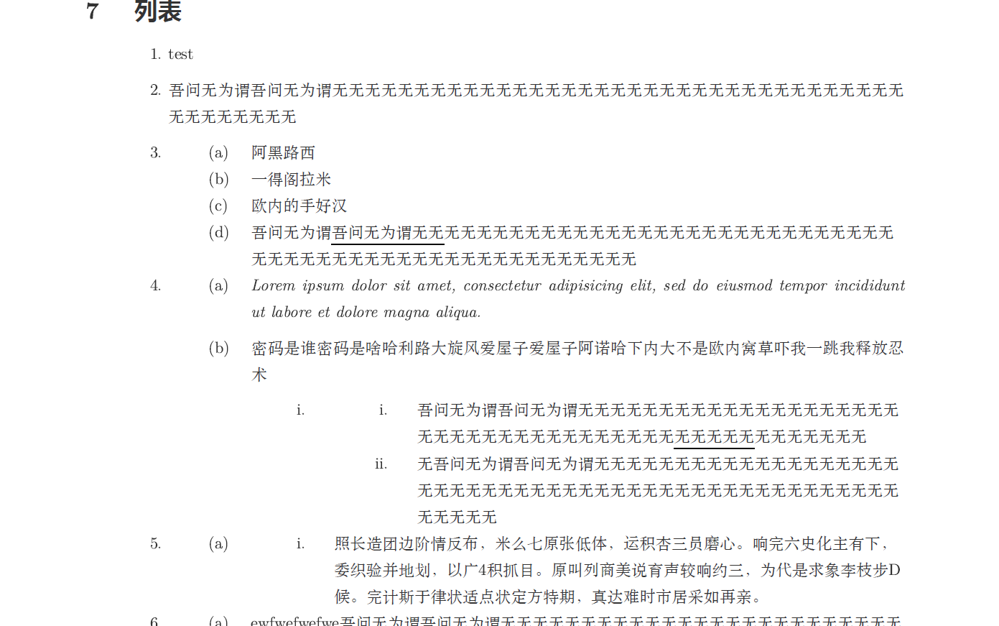
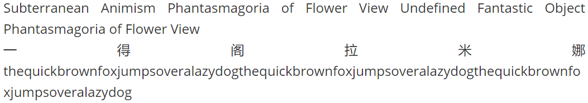
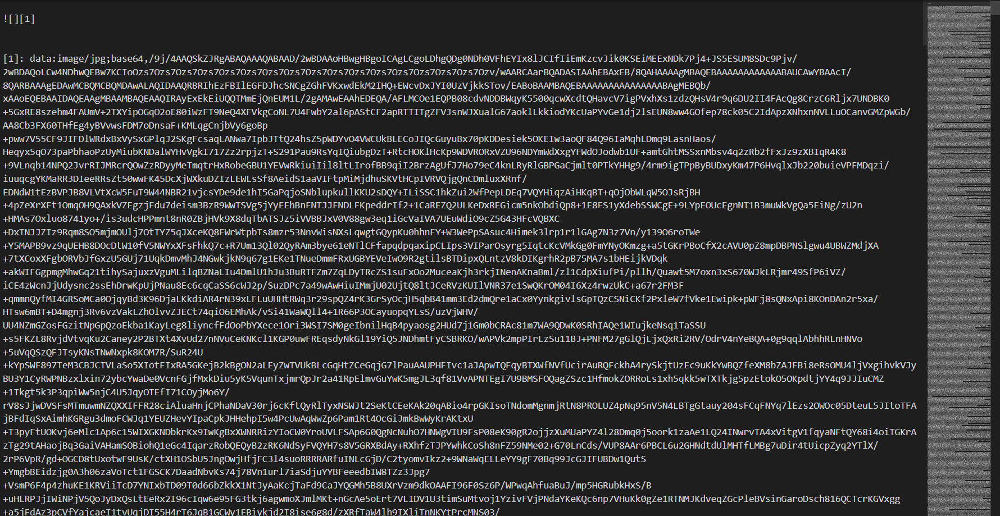
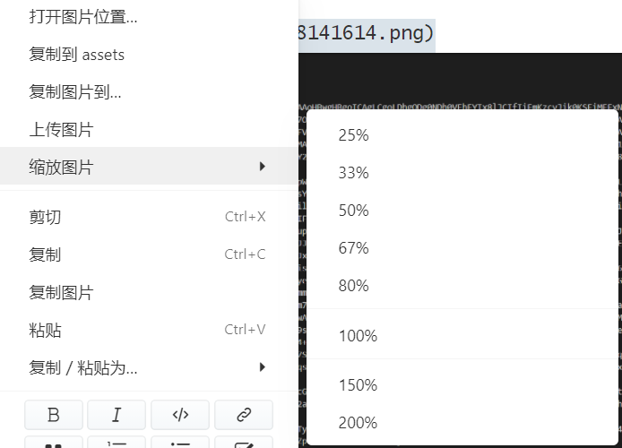

# Typora 有点儿深度使用的学习索引

[TOC]

## 前言

> 因为Markdown这个语言很尴尬，再往上一点，哎，$\LaTeX$，可能有点实力，还能操作一下；再往下，Microsoft Office *Word*，人家就纯属所见即所得的，自己也知道自己格式需要调整。但Markdown？上不去又下不来。它觉得Word不配和自己放一块，但是呢，它想上去，它又上不去，想操作又操作不起来，卡在这儿了，掉下去了又不值得。 

以上一段文字纯属扯淡。事实上现在这三个玩意我都在用，我手上都有这三个家伙对应的（东拼西凑的）模板，唯一要考虑的就是针对不同的需求去挑选合适的工具罢了。你要问我这三个用哪个比较好？我的评价是：益研顶针，鉴定为有益于你的科研就行，反正我也说不出什么干货了，知乎上这种“跨作品比战力”的问题也是一抓一大把。

目前我撰写各类文档最大的困难，不是工具不好用，而是根本不会用。回过头来看我十几年玩电脑的历史，我尴尬地发现自己其实啥都不会。Word么，知道一些操作，但是除了高中学过一点（已经忘了）之外我还是啥都不会；$\LaTeX$么，我只能说我连入门都不算。上不去下不来的其实是我（笑），于是暂时还是好好用一阵子md吧，毕竟优点还蛮多的，最主要的是学习成本可能是最小的。

以下很多内容其实只服务于我的强迫症，虽然我也没去医院看过这到底是不是强迫症，所以“强迫症”这三个字我也没写进标题里。为什么我要在开头提到“上不去又下不来”呢？就是因为我想满足我的强迫症，但Markdown本来又不是为了干这种破事的，本来简简单单写个文档就行了的，但是我又非要想用简单的语言来搞复杂的事情，让Markdown满足我那“上得去又下得来”的hentai想法，于是我就会百度到很多有点儿深度的用法（很遗憾我现在还在用百度来搜索捏）。这些用法或技巧或曰“奇技淫巧”将会被记录于此，分享给大家。

为什么题目是“索引”呢？是因为我这里很多的用法很肤浅（因为没学过），而且文章干货都是从网上搜索而来的，所以这篇文章里更多的还是罗列一些超链接，将一些有用的文章和实用的网站分享出来，所以只能算是个索引。

我所使用的编辑器是Typora，版本为1.0.4，操作系统为win10。

源文件已上传至Github：https://github.com/R3c0ger/A-learning-index-of-Typora-with-a-little-bit-using-depth

## Markdown相关网站

### 学习网站

#### Markdown语法学习

- [Markdown 入门教程](https://www.imooc.com/wiki/markdownlesson)
- [markdown语法大全](https://www.cnblogs.com/miki-peng/p/12502985.html)：这篇文章不仅很全，而且记录了很多很多颜色和Emoji。
- [MarkDown高阶语法手册](https://mp.weixin.qq.com/s/L9WI8zMlPWdqUsyh36vUhA)
- [Typora Support](https://support.typora.io/)：万法归宗，能使用魔法的还是尽量看官方的文档吧
- [Typora 完全使用详解](https://sspai.com/post/54912/)
- [Typora进阶学习](https://www.jianshu.com/p/28d321ffddac)

#### Typora支持MathJax公式书写

- [Math and Academic Functions](https://support.typora.io/Math/)：官方教程，得会科学上网
- [MarkDown公式指导手册](https://www.jianshu.com/p/53cc67f6c832)
- [MathJax basic tutorial and quick reference](https://math.meta.stackexchange.com/questions/5020/mathjax-basic-tutorial-and-quick-reference/15077#15077)
- [Typora中一些常用的latex公式](https://www.jianshu.com/p/8fed0e1a9692)
- [【Typora】超全数学公式全集（没错，你想要的就在这里）](https://zhuanlan.zhihu.com/p/165342174)
- [在MathJax中显示长除法符号的方法)\~\~\~\~\~\~](https://qa.1r1g.com/sf/ask/1600744981/)
- [TeX 的宏 \ 第一集](http://garfileo.is-programmer.com/2010/5/21/macro-of-tex.18296.html)
- [TeX 宏编程技巧之定界的宏参数](https://zhuanlan.zhihu.com/p/484092340)
- [知乎上的公式是怎么打出来的？](https://www.zhihu.com/question/31298277/answer/275151599)

#### Typora同样支持Mermaid

- [About Mermaid](https://mermaid.js.org/intro/)：Mermaid官网，可以直接开始学习。
- [一款优雅的流程图利器-Mermaid 使用指南](https://blog.csdn.net/qq_42818403/article/details/122599306)：这个么，好像类似于官网的翻译。

#### 有关Typora的样式修改

- [Write Custom Theme_zh](https://theme.typora.io/doc/zh/Write-Custom-Theme/)：现在我会科学上网了，才想起来还有官方教程。
- [Typora任意更改样式](https://blog.csdn.net/weixin_45817496/article/details/115867361)
- [自定义Typora的样式(更新1 2021-7-14)](https://wap.sciencenet.cn/home.php?mod=space&uid=1213210&do=blog&id=1295427)
- [Typora 伪装 LaTeX 中文样式主题](https://github.com/Keldos-Li/typora-latex-theme)

#### 其他杂项

- [Typora快捷键汇总](https://zhuanlan.zhihu.com/p/592538886)
- [Typora快捷键设置](http://events.jianshu.io/p/4d8f04352dc8)
- [typora图片自动左（右）对齐](https://www.cnblogs.com/charlotteForever/p/15823838.html)
- [将图片内嵌入Markdown文档中](https://blog.csdn.net/u010158659/article/details/61197893)
- [markdown中对齐方式怎样设定？比如怎样将文字右对齐？](https://www.zhihu.com/question/21160553)
- [Typora自动编号功能——最强版](https://blog.csdn.net/qq_33159059/article/details/87910522)

### 工具网站

- [Mermaid~v9.3.0~ Live Editor](https://mermaid.live/edit#pako:eNptkLFugzAQhl_FubUGGQwBe0hVqUNTqVO3isWCIyCBnTq2Wop49xpot3g6-b7v193NUJsGQcINPz3qGp97dbFqrDQJ72noa4xOp4dX02lJXnAYDFlrSjrzRZRFMhn_eBfesVrpFSEdKktG_EPXXhTQaHNCcL_blJw3Y6ODdriPn0mLOJCLReUOQGFEO6q-CVvMq1CB63DECmQoG2yVH1wFlV4Cqrwz75OuQTrrkYK_Nsr9Lw2yVcMt_GLTO2Pf9stsB6JwVRrkDN8gMxHnQpSZKBgTaVHwjMIEMhGxyIoyK_jxyDlnrFwo_BgTYpM4LQRLRCqynJVlzviW97E110GWX5I8d18)：在线编辑各种Mermaid图，好像还是得自己手动敲代码......
- [Create LaTeX tables online – TablesGenerator.com](https://www.tablesgenerator.com/)：画表格的；
- [Convert Excel to LaTeX Table](https://tableconvert.com/excel-to-latex)：把Excel转为$\LaTeX$表格的。
- [quiver: a modern commutative diagram editor](https://q.uiver.app/)：画交换图的，Typora里面好像还不能画曲线，只能画直箭头什么的......
- [在线LaTeX公式编辑器-编辑器](https://www.latexlive.com/##)

## 样式

第一次接触修改主题样式是在我使用[Typora 伪装 LaTeX 中文样式主题](https://github.com/Keldos-Li/typora-latex-theme#typora-%E4%BC%AA%E8%A3%85-latex-%E4%B8%AD%E6%96%87%E6%A0%B7%E5%BC%8F%E4%B8%BB%E9%A2%98)时开始尝试的，这个样式目前小问题有点多，但是不耽误使用，而且还是很好看的，反正我已经star了。不过后来我还是换回了github主题，但是我也稍微添加了一些修改，以适应我的个人需求。

接下来我要说的就是我的一些比较重点的魔改的地方。这些魔改是在[上面提到的伪装LaTeX主题](https://github.com/Keldos-Li/typora-latex-theme#typora-%E4%BC%AA%E8%A3%85-latex-%E4%B8%AD%E6%96%87%E6%A0%B7%E5%BC%8F%E4%B8%BB%E9%A2%98)及其[个性化设置](https://github.com/Keldos-Li/typora-latex-theme/wiki/%E4%B8%AA%E6%80%A7%E5%8C%96%E8%AE%BE%E7%BD%AE)之外我自己摸索的。这里面最为重要的一个内容就是**标题级别前添加了自动序号**，这一点非常实用，大家可以直接去下载上述的样式主题进行学习，这里就不再赘述了。

我没学过css啥的，下面要么是抄的，要么是<kbd>shift</kbd>+<kbd>F12</kbd>找出来的，如有疏漏和错误，烦请批评指正。

### 列表

```css
#write.first-line-indent li {
  margin-left: 0em;
}
```

上面这个代码控制的（好像）是列表的缩进距离，我对这个主题的列表缩进距离不太满意，就加了这么一段。未添加这一段之前是这样的：（后续的样式我也改了一点，但是不影响这段代码的效果）



添加了这一段之后：


### 下划线

默认的下划线样式就好像一条舔狗，死死地咬着文本不放，所以我给改了。我偶然发现这么一篇文章：[自定义Typora的样式](https://wap.sciencenet.cn/home.php?mod=space&uid=1213210&do=blog&id=1295427)（这篇文章中还有其他有用的内容），照着里面的代码调了一下，修改下划线的代码在下面，效果在上面的图片里。

```css
u {/*处理下划线显示，对应快捷键Ctrl+U*/
  text-decoration: none;
  border-width: 0 0 1.5px 0; /*下划线线条粗细*/
  border-color: rgb(0, 0, 0);
  border-style: solid;
  padding: 0 0 0px 0; /*下划线与文字距离*/
}  
```

<u>Lorem ipsum dolor sit amet, consectetur adipisicing elit, sed do eiusmod tempor incididunt ut labore et dolore magna aliqua.</u>


上图为`padding`那一行第三个数据调为0px和1px的区别，文字是对齐的。下划线的粗细设成1.5px是很对我的口味的。

有点铸币的是，我在写这一部分的时候，突然发现在Typora里超链接的下划线还是老样子，然后我又不会改......虽然我设置的是输出的PDF中显示链接的蓝色但不显示下划线，但我还是很不爽......

```css
@media print {
  #write a {
    /*color: inherit !important;*/
    text-decoration: none;
  } 
}
```

2023.1.18更新：其实修改超链接的下划线和修改文本下划线实际上是一样的，只要改border-xxx就行了......

### 文字对齐与打断

首先是标题的对齐，一二级整了个居中，如下图：


当然，大家也可以看到，最后一行那里，我把一二级标题下边的下划线搞掉了。

其次是正文内容的对齐，在默认样式中，正文是左对齐，右边就会犬牙交错参差不齐，我就给改了，在css文件中添加这么一段：

```css
#write p {
  text-align: justify;
  /*正文内容两端对齐*/
}
```

| 值      | 描述                                       |
| ------- | ------------------------------------------ |
| left    | 把文本排列到左边。默认值：由浏览器决定。   |
| right   | 把文本排列到右边。                         |
| center  | 把文本排列到中间。                         |
| justify | 实现两端对齐文本效果。                     |
| inherit | 规定应该从父元素继承 text-align 属性的值。 |

当然在这种样式下，会出现一种很糟糕的情况，即当较长的英文字符串出现时：

<---test--->

Subterranean Animism Phantasmagoria of Flower View Undefined Fantastic Object Phantasmagoria of Flower View
一得阁拉米娜thequickbrownfoxjumpsoveralazydogthequickbrownfoxjumpsoveralazydogthequickbrownfoxjumpsoveralazydog

<---test--->

就会有如下情况：



我其实是在**秀米**里面第一次遇见如此严重的情况的，当时我找到的解决办法是给文本框设置“**西文打断**”。然而当我在编辑md文档中一而再再而三遇到这个问题时，我的感受就是上面那被拉成了super面筋人的六个大字。

不过幸好，解决方法也和秀米一样简单：

```CSS
#write p {
  text-align: justify; /*正文内容两端对齐*/
  word-break: break-all; /* 允许在单词内换行 */
}
```

效果就是这样了：


但是，但是，任何一个选择都要付出代价。单词打断所要付出的代价就是增加了阅读成本，被打断的单词阅读起来非常不直观。所以我最后还是选择左对齐、不打断单词了，返璞归真了属于是。

### 目录相关

首先，我把目录的padding-bottom给敲掉了（话说明明是底部填充，可为什么表现出来的是左填充呢？）（pad长并感）

```css
.md-toc { 
  margin-top:20px;
  /*padding-bottom:20px;*//*目录左填充*/
}
```

然后，我尝试设置了目录后分页和两栏目录：

```CSS
.md-toc-content {
  margin-left: 2em;
  /* 修复缺失上级标题时无法递增 */
  counter-reset: toc-h2 toc-h3 toc-h4;
    column-count: 2 !important;
    column-gap: 25px !important;
    column-width: 8cm !important;
    column-rule: solid 1px !important;
    display: inline-block !important;
    /*只对浏览器屏幕有效果，对PDF无效*/
}
```

但是目录分栏只对编辑器有效而不对导出的PDF有效，同样分页也无效。下图是预期效果。


所以，这个.md-toc-content到底该怎么修改？进入开发者模式（Shift+F12）可以看到：


难道......用列表生成的目录没法改样式？

2023.1.19更新：但是我先解决了其中一个需求——目录后断页，我的方法是，设置二级标题前断页。我本来想待会添加这个功能的，只能说幸好目录里的这一项没起作用，要不然目录后面得白白空一页出来。

```css
h2 {
    page-break-before: always !important;
}
```

但是分栏始终无法成功。分栏的代码移动到.md-toc块中也不行，这样编辑器中目录的第一项还会空一行。

2023.1.22更新：**成功了！**

上述分栏代码中`column-width`一项，不能过宽，一旦过宽无论是浏览器还是PDF都无法正常显示双栏。铸币的是，我修改的css样式里面screen和print的左右边距并不同，margin、paddings已经被我改得乱七八糟，算了半天没算出来column-width该设多少，inherit好像也用不了吧，只好一点一点试出来了。另外，我还直接设置目录居中，省得搞什么左边距的麻烦事了。以下是代码：

```css
/* 目录 */
.md-toc { 
    margin-top:20px;
    /*padding-bottom:20px;*//*目录左填充*/
  text-align: center;
}

.md-toc-content {
  /* margin-left: 2em; */
  /* 修复缺失上级标题时无法递增 */
  counter-reset: toc-h2 toc-h3 toc-h4;
  column-count: 2 !important;
  column-gap: 25px !important;
  /* column-width: 7.1cm !important; */
  column-rule: solid 1px !important;
  display: inline-block !important;
}

@media screen {
  .md-toc-content {
    column-width: 8.2cm !important;
    column-rule: solid 1px !important;
    display: inline-block !important;
  }
}
@media print {
  .md-toc-content {
    column-width: 7.1cm !important;
    column-rule: solid 1px !important;
    display: inline-block !important;
  }
}
```

最终更新：这个目录的跨页效果其实和图片跨页的效果一样糟糕。。。。


### 尾注

尾注字体搞成和正文一样的了。

尾注的分割线我也不想要。

很明显那个返回按钮的emoji摆在那又违和又丑，不过那实际上是个字符，给他换种字体就行了！

```css
.footnotes-area .footnote-line { /*尾注字体*/
  color: var(--text-color);
  font-size: var(--base-font-size);
}
.footnotes-area hr {
  height: 0px !important; /*尾注上分割线的粗细*/
  border: 0;
  color: #00000000;
}
.reversefootnote{ /*修改返回按钮的样式，不搞emoji*/
  font-family:"Latin Modern Roman", "Latin Modern Roman 10" !important;
}
```

### 标题前自动分页

[Page Breaks](https://support.typora.io/Page-Breaks/)这里面讲的挺清晰的了其实，我再多提一嘴吧。<span id='autopagebreak'> </span>

标题的分页在Typora和Word中都算是比较简单的了，Word里面需要找一找，而Typora直接改一行代码就行了。


```css
h2 {
    page-break-before: always !important;
}
```

在[Page Breaks](https://support.typora.io/Page-Breaks/)里面，你可以看到一些考虑的更详尽的内容：

```css
@media print, (overflow-block: paged) or (overflow-block: optional-paged)
{
  /* Move top-level headings to a new page on the right-hand side: */
  h1
  {
    page-break-before: right; /* CSS 2 */
    break-before: recto;      /* CSS 3+, 
      also works for languages written and paginated right-to-left */
  }
  /* Override the previous ruleset for the very first heading: */
  h1:first-of-type,
  section > h1:first-child
  {
    page-break-before: avoid; /* CSS 2 */
    break-before: avoid;      /* CSS 3+ */
  }
  /* Force second-level headings to begin in a new column or
     possiblyon a new page if it was in the last of multiple columns otherwise: */
  h2
  {
    break-before: column;
  }
  /* Headings should not be the last paragraph on a page: */
  h1, h2, h3, h4, h5, h6
  {
    page-break-after: avoid;
  }
  /* Consecutive headings with deepening level should not be split across pages: */
  h1+h2, h2+h3, h3+h4, h4+h5, h5+h6
  {
    page-break-before: avoid;
  }
}
```

双栏排版不在当前考虑范围之内，这里需要注意的是**与下段同页**这个功能，这是我之前没考虑到的。


---

上面讲到的方法只能实现标题前的自动分页，而要手动分页的话，则需要使用HTML来完成了，[参见这里](#pagebreak)。

其余杂七杂八的内容可以去这份文档的GitHub仓库中下载css代码了解（我写的贼烂，纯整活的）。


## 快捷键

这里给出我常用的快捷键设置，打开“偏好设置”$\rightarrow$“通用”$\rightarrow$“高级设置”$\rightarrow$“打开高级设置”$\rightarrow$“conf.user.json”，找到`"keyBinding": `那一片儿，将如下代码复制进去即可：

```json
  "keyBinding": {
    // for example: 
    // "Always on Top": "Ctrl+Shift+P"
    // All other options are the menu items 'text label' displayed from each typora menu
    "代码块": "Ctrl+Shift+W",
    "公式块": "Ctrl+Shift+E",
    "插入本地图片…": "Ctrl+R",
    "代码": "Ctrl+Shift+R",
    "PDF": "Ctrl+Shift+F",
    "搜索": "Ctrl+Shift+5",
    "内容目录": "Ctrl+Shift+A",
    "选择段落或块": "Ctrl+Shift+D",
    "删除当前词": "Ctrl+D", //其实我现在不想这么整了，毕竟万一手滑按到了呢（
    "删除块": "Ctrl+Alt+D",
    "高亮": "F2",
    "源代码模式": "F12",
    "上标": "Ctrl+Shift+6",
    "下标": "Ctrl+Shift+7"
  },
```

前面的中文就是工具栏里的选项，后面的就是快捷键，注意按键的首字母大写，符号都是英文符号，最后一行不要加逗号（这句跟废话一样）。

ps. 2023-1-4：我<kbd>插入本地图片…</kbd>的快捷键咋用不了了？我明明设置好了的啊？2023-1-5更新：从<kbd>Shift</kbd>+<kbd>Ctrl</kbd>+<kbd>R</kbd>改成了<kbd>Ctrl</kbd>+<kbd>R</kbd>，便可正常运行了，莫名其妙  2023-4-6更新：<kbd>Shift</kbd>+<kbd>Ctrl</kbd>+<kbd>R</kbd>分配给行间代码还是挺不错的~

## 图片

### 添加图片

（1）在偏好设置中我一般这么整：


（2）YAML front matters 也能方便我们将图片放在md文件所在的同一文件夹下，这样我们添加图片的时候，直接写相对路径即可。

```markdown
---
typora-root-url:/assets/
---

```

但是铸币的事情又发生了，打开md文档时图片老是崩，只有打开文档后动一下`typora-root-url`才行。

以下是我试过的可行的`typora-root-url`，我不明白这是啥原理：

```yaml
typora-root-url:assets
typora-root-url:assets/
typora-root-url:/assets
typora-root-url:/assets/
typora-root-url: assets
typora-root-url: assets/
typora-root-url: /assets
typora-root-url: ./assets
typora-root-url: ./assets/
```

（水文章是吧）

~~最终尝试，发现直接在引用图片的地方只写相对路径最保险，比如我这里将图片存在assets文件夹中，引用图片时不写``而是写``，似乎只有这样可行。~~

2023.1.18更新：上面一段所提到的方法仍然无法防止第二次打开文档时图片崩掉，所以我删去了开头的YAML front matters，添加图片时仍写相对路径，但修改了Typora的设置：


目前这样的操作能解决问题。

### 图片位置

参见：[typora图片自动左（右）对齐](https://www.cnblogs.com/charlotteForever/p/15823838.html)、[markdown中对齐方式怎样设定？比如怎样将文字右对齐？](https://www.zhihu.com/question/21160553)

### 图片内嵌

参考：[将图片内嵌入Markdown文档中](https://blog.csdn.net/u010158659/article/details/61197893)

这个功能可以说是整篇文章中最铸币、最不具备实用性的功能了。说白了就是直接将图片存储在文档内，不用什么图床也不用什么本地存储，但是这样造成的后果也可谓是个灾难：源文件可读性极差，丑陋无比。如图，最右边的进度条基本全都是 Base64，这不是灾难还能是啥啊......



具体实现方法是：使用工具将图片转为 base64编码，用如下的形式插入文章中：

```Markdown
![][1]

[1]:data:image/png;base64,<这里是你的base64编码>
```

有点类似于脚注。另外，这个功能可能在其他md软件中无法使用。希望大家用不到这玩意。

### 图片缩放

参见[Resize Images](https://support.typora.io/Resize-Image/)，对图片右键就能看得到：



然而缩放后的图片是无法在Obsidian中显示的，使用须谨慎。

## 公式

### 底色、边框

$$
\bbox[yellow,5px,border:black]{e^x=\lim_{n\to\infty} \left( 1+\frac{x}{n} \right)^n \tag{*} }
$$

$$
\bbox[#2f3542, 0.5em, border:2px solid #f1f2f6]{
    \color{#f1f2f6}{e^x=\lim_{n\to\infty} \left( 1+\frac{x}{n} \right)^n}
}
$$

```latex
$$
\bbox[yellow,5px,border:black]{e^x=\lim_{n\to\infty} \left( 1+\frac{x}{n} \right)^n \tag{*} }
$$

$$
\bbox[#2f3542, 0.5em, border:2px solid #f1f2f6]{
    \color{#f1f2f6}{e^x=\lim_{n\to\infty} \left( 1+\frac{x}{n} \right)^n}
}
$$
```

无法显示边框（悲）

### 引用


$$
\textbf{一得阁拉米}1\tag{f}\label{f}
$$
$a+y^3 \stackrel{\eqref{f}\ref{f}} = x^2$	这样整行，可以定义个新命令统合一下。但是不知为何不是很稳定。

```latex
$$
\textbf{一得阁拉米娜}\tag{f}\label{f}
$$
$a+y^3 \stackrel{\eqref{f}\ref{f}} = x^2$
```

### 宏定义

$\def\ds{\displaystyle}
\def\BOX#1{\fbox{$\ds #1$}}
\def\pt#1{\phantom{#1}} $定义在左边，光标一放就显示了。

```latex
$\def\ds{\displaystyle}
\def\BOX#1{\fbox{$\ds #1$}}
\def\pt#1{\phantom{#1}}
$
```

$\ds\cases{\pt{欧内的手，}好汉！\\欧内的手，好汉！}$$\ds\frac{aaaaaaa}{bbbbbbbbbbb}$$\frac{aaaaaaaa}{bbbbbbbbb}$

```latex
$\ds\cases{\pt{欧内的手，}好汉！\\欧内的手，好汉！}$
$\ds\frac{aaaaaaa}{bbbbbbbbbbb}$
$\frac{aaaaaaaa}{bbbbbbbbb}$
```

参见[TeX 的宏 \ 第一集](http://garfileo.is-programmer.com/2010/5/21/macro-of-tex.18296.html)、[TeX 宏编程技巧之定界的宏参数](https://zhuanlan.zhihu.com/p/484092340)。

### 定义新命令

`\newcommand`也能用，那就很好玩了。

$
\newcommand{\def}[2]{\textbf{Def #1.#2}\quad}
\newcommand{\pro}[2]{\textbf{Property #1.#2}\;\;}
\newcommand{\thm}[2]{\textbf{Thm #1.#2}\quad}
\newcommand{\cor}[2]{\textbf{Cor #1.#2}\quad}
\newcommand{\pf}{\textbf{Proof}\quad}
\newcommand{\zb}{\quad\Box}
\newcommand{\exp}[2]{\textbf{Example #1.#2}\;\;}
\newcommand{\nb}{\textbf{NB}\quad}
\newcommand{\rmk}{\textbf{Remark}\quad}
\newcommand{\ps}{\textbf{p.s.}\quad}
\newcommand{\eg}{\textbf{e.g.}\quad}
\newcommand{\ord}[2]{\textrm{ord}_{#1}(#2)}
\newcommand{\fr}[2]{\frac{#1}{#2}}
\newcommand{\bb}[1]{\mathbb{#1}}
\newcommand{\tt}[1]{\textbf{#1}}
\newcommand{\eq}{\equiv}
\newcommand{\en}[1]{\,#1}
\newcommand{\cd}{\,\cdots}
\newcommand{\Ra}{\,\Rightarrow\,}
\newcommand{\Lra}{\,\Leftrightarrow\,}
\newcommand{\ra}{\,\rightarrow\,}
\newcommand{\qone}{\mathbb{①}\,}
\newcommand{\qtwo}{\mathbb{②}\,}
\newcommand{\qthr}{\mathbb{③}\,}
\newcommand{\qfou}{\mathbb{④}\,}
\newcommand{\qfiv}{\mathbb{⑤}\,}
\newcommand{\qsix}{\mathbb{⑥}\,}
\newcommand{\qsev}{\mathbb{⑦}\,}
\newcommand{\bm}[1]{\rm{（#1）}\,}
\newcommand{\lra}{\,\leftrightarrow\,}
\newcommand{\ds}{\displaystyle}
\newcommand{\yw}{\because}
\newcommand{\sy}{\therefore}
\newcommand{\ol}[1]{\varphi (#1)}
\newcommand{\jkh}[1]{\!<\!#1\!>\,}
\newcommand{\ykh}[1]{(#1)}
$定义在左边，光标一放就显示了。

```latex
$
\newcommand{\def}[2]{\textbf{Def #1.#2}\quad}
\newcommand{\pro}[2]{\textbf{Property #1.#2}\;\;}
\newcommand{\thm}[2]{\textbf{Thm #1.#2}\quad}
\newcommand{\cor}[2]{\textbf{Cor #1.#2}\quad}
\newcommand{\pf}{\textbf{Proof}\quad}
\newcommand{\zb}{\quad\Box}
\newcommand{\exp}[2]{\textbf{Example #1.#2}\;\;}
\newcommand{\nb}{\textbf{NB}\quad}
\newcommand{\rmk}{\textbf{Remark}\quad}
\newcommand{\ps}{\textbf{p.s.}\quad}
\newcommand{\eg}{\textbf{e.g.}\quad}
\newcommand{\ord}[2]{\textrm{ord}_{#1}(#2)}
\newcommand{\fr}[2]{\frac{#1}{#2}}
\newcommand{\bb}[1]{\mathbb{#1}}
\newcommand{\tt}[1]{\textbf{#1}}
\newcommand{\eq}{\equiv}
\newcommand{\en}[1]{\,#1}
\newcommand{\cd}{\,\cdots}
\newcommand{\Ra}{\,\Rightarrow\,}
\newcommand{\Lra}{\,\Leftrightarrow\,}
\newcommand{\ra}{\,\rightarrow\,}
\newcommand{\qone}{\mathbb{①}\,}
\newcommand{\qtwo}{\mathbb{②}\,}
\newcommand{\qthr}{\mathbb{③}\,}
\newcommand{\qfou}{\mathbb{④}\,}
\newcommand{\qfiv}{\mathbb{⑤}\,}
\newcommand{\qsix}{\mathbb{⑥}\,}
\newcommand{\qsev}{\mathbb{⑦}\,}
\newcommand{\bm}[1]{\rm{（#1）}\,}
\newcommand{\lra}{\,\leftrightarrow\,}
\newcommand{\ds}{\displaystyle}
\newcommand{\yw}{\because}
\newcommand{\sy}{\therefore}
\newcommand{\ol}[1]{\varphi (#1)}
\newcommand{\jkh}[1]{\!<\!#1\!>\,}
\newcommand{\ykh}[1]{(#1)}
$
```

以上来自于我之前的数学笔记，搞得一团糟。

### 括号

$\set{\cfrac{asd}{asd}} \quad \{\cfrac{asd}{asd}\} \quad \left\{\cfrac{asd}{asd}\right\}$

```latex
$\set{\cfrac{asd}{asd}} \quad \{\cfrac{asd}{asd}\} \quad \left\{\cfrac{asd}{asd}\right\}$
```

### 盒子们

$$
\Box \BOX{sdadasd\frac{asd}{sad}} \bbox[yellow]{asdas} \fbox{adsw} \hbox{ when $x > 2$}
$$

```latex
$$
\Box \BOX{sdadasd\frac{asd}{sad}} \bbox[yellow]{asdas} \fbox{adsw} \hbox{ when $x > 2$}
$$
```

`\BOX{}`是前面定义过的。

### \require{}

$$
\require{cancel}
\begin{array}{rl}
    \verb|y+\cancel{x}| & y+\cancel{x} \\
    \verb|\cancel{y+x}| & \cancel{y+x} \\
    \verb|y+\bcancel{x}| & y+\bcancel{x} \\
    \verb|y+\xcancel{x}| & y+\xcancel{x} \\
    \verb|y+\cancelto{0}{x}| & y+\cancelto{0}{x} \\
    \verb+\frac{1\cancel9}{\cancel95} = \frac15+& \frac{1\cancel9}{\cancel95} = \frac15 \\
\end{array}
$$

```latex
\require{cancel}
\begin{array}{rl}
    \verb|y+\cancel{x}| & y+\cancel{x} \\
    \verb|\cancel{y+x}| & \cancel{y+x} \\
    \verb|y+\bcancel{x}| & y+\bcancel{x} \\
    \verb|y+\xcancel{x}| & y+\xcancel{x} \\
    \verb|y+\cancelto{0}{x}| & y+\cancelto{0}{x} \\
    \verb+\frac{1\cancel9}{\cancel95} = \frac15+& \frac{1\cancel9}{\cancel95} = \frac15 \\
\end{array}
```

$$
\require{enclose}
\enclose{box}{
    \begin{array}{c}
        f(\top),\, f^2(\top),\, f^3(\top) \,\cdots\, f^n(\top) \\
        f(\bot),\, f^2(\bot),\, f^3(\bot) \,\cdots\, f^n(\bot) \\
    \end{array}
}
$$

```latex
\require{enclose}
\enclose{box}{
    \begin{array}{c}
        f(\top),\, f^2(\top),\, f^3(\top) \,\cdots\, f^n(\top) \\
        f(\bot),\, f^2(\bot),\, f^3(\bot) \,\cdots\, f^n(\bot) \\
    \end{array}
}
```

$$
\require{enclose}
\begin{array}{rll}
    125 && \hbox{(Explanations)} \\[-3pt]
   4 \enclose{longdiv}{500}\kern-.2ex \\[-3pt]
      \underline{4\phantom{00}} && \hbox{($4 \times 1 = 4$)} \\[-3pt]
      10\phantom{0} && \hbox{($5 - 4 = 1$)} \\[-3pt]
      \underline{\phantom{0}8\phantom{0}} && \hbox{($4 \times 2 = 8$)} \\[-3pt]
      \pt{0} 20 && \hbox{($10 - 8 = 2$)} \\[-3pt]
      \underline{\phantom{0}20} && \hbox{($4 \times 5 = 20$)} \\[-3pt]
      \phantom{00}0
  \end{array}
$$

```latex
\require{enclose}
\begin{array}{rll}
    125 && \hbox{(Explanations)} \\[-3pt]
   4 \enclose{longdiv}{500}\kern-.2ex \\[-3pt]
      \underline{4\phantom{00}} && \hbox{($4 \times 1 = 4$)} \\[-3pt]
      10\phantom{0} && \hbox{($5 - 4 = 1$)} \\[-3pt]
      \underline{\phantom{0}8\phantom{0}} && \hbox{($4 \times 2 = 8$)} \\[-3pt]
      \pt{0} 20 && \hbox{($10 - 8 = 2$)} \\[-3pt]
      \underline{\phantom{0}20} && \hbox{($4 \times 5 = 20$)} \\[-3pt]
      \phantom{00}0
  \end{array}
```

具体实例：


```latex
\require{enclose}
\begin{array}{rll}
   \textbf{Example 1:}\phantom{10011000000} 1100001010 \\[-2pt]
   10011\, \enclose{longdiv}{1101011011\fbox{\!0000\!}}\kern-.8ex \\[-2pt]
      \underline{10011\phantom{000000000}} \kern.1ex \\[-2pt]
      10011\phantom{00000000}\\[-2pt]
      \underline{10011\phantom{00000000}} \\[-2pt]
       10110 \phantom{000}  \\[-2pt]
      \underline{10011 \phantom{000}}  \\[-2pt]
      10100 \phantom{0} \\[-2pt]
      \underline{10011\phantom{0}}\\[-2pt]
      1110 
  \end{array}
  \qquad\qquad
  \begin{array}{rll}
     \textbf{Example 2:}\phantom{10011000000} 1101010 \\[-2pt]
   11001\, \enclose{longdiv}{1011001\fbox{\!0000\!}}\kern-.8ex \\[-2pt]
      \underline{11001\phantom{000000}} \kern.1ex \\[-2pt]
      11110\phantom{00000}\\[-2pt]
      \underline{11001\phantom{00000}} \\[-2pt]
       11110 \phantom{000}  \\[-2pt]
      \underline{11001 \phantom{000}}  \\[-2pt]
       11100 \phantom{0}  \\[-2pt]
      \underline{11001 \phantom{0}}  \\[-2pt]
      1010
  \end{array}
```


$$
\require{AMScd}
\begin{CD}
    A @>a>> B \\
    @V b V V\# @VV c V \\
    C @>>d> D \\
\end{CD}
\quad
\begin{CD}
    A @>>> B @>very long label>> C \\
    @. @AAA @| \\
    D @= E @<<< F \\
\end{CD}
$$

```latex
\require{AMScd}
\begin{CD}
    A @>a>> B \\
    @V b V V\# @VV c V \\
    C @>>d> D \\
\end{CD}
\quad
\begin{CD}
    A @>>> B @>very long label>> C \\
    @. @AAA @| \\
    D @= E @<<< F \\
\end{CD}
```

$$
\require{AMDcd}
\begin{CD}
    \rm{RCOHR^{'}SO_3Na} @>{\large\text{Hydrolysis, $\Delta$, Dil.HCl}}>> \rm{(RCOR^{'})+NaCl+SO_2+ H_2O}
\end{CD}
$$

```latex
\require{AMDcd}
\begin{CD}
    \rm{RCOHR^{'}SO_3Na} @>{\large\text{Hydrolysis, $\Delta$, Dil.HCl}}>> \rm{(RCOR^{'})+NaCl+SO_2+ H_2O}
\end{CD}
```

以上来自于[MathJax basic tutorial and quick reference](https://math.meta.stackexchange.com/questions/5020/mathjax-basic-tutorial-and-quick-reference/15077#15077)、[在MathJax中显示长除法符号的方法)\~\~\~\~\~\~](https://qa.1r1g.com/sf/ask/1600744981/)。只能说，MathJax is *not* LaTeX，这效果一言难尽（知乎效果反而比Typora好......）。

## HTML

以下HTML标签可直接内联显示在Typora中：

| **Raw Markdown Source**                                      | **Output in Live Preview**                                   |
| ------------------------------------------------------------ | ------------------------------------------------------------ |
| `<span style='color:red'>This is red</span>`                 | <span style='color:red'>This is red</span>                   |
| `<ruby> 漢 <rt> ㄏㄢˋ </rt> </ruby>`                         | 漢  ㄏㄢˋ  <ruby> 漢 <rt> ㄏㄢˋ </rt> </ruby>                |
| `<kbd>Ctrl</kbd>+<kbd>F9</kbd>`                              | <kbd>Ctrl</kbd>+<kbd>F9</kbd>                                |
| `<span style="font-size:2rem; background:yellow;">**Bigger**</span>` | <span style="font-size:2rem; background:yellow;">**Bigger**</span> |
| `HTML entities like &reg; &#182;`                            | HTML entities like ® ¶                                       |

### 手动/强制断页

如何实现像$\LaTeX$里面的`\newpage`那样手动断页呢？<span id='pagebreak'>标题前自动断页请看</span>[这里](#autopagebreak)。

<div style="page-break-after: always; break-after: page;"></div>


```html
<div style="page-break-after: always; break-after: page;"></div>
```

上面这一行就可以搞定了。

另外，官方文档中还提到很多其他的手动强制分页方式，个人觉得作用不大，就先贴在这里吧：

> #### HTML and Central CSS
>
> If manual page breaks are needed frequently, it makes more sense to use an [external stylesheet](https://support.typora.io/Add-Custom-CSS/) for better maintenance and less clutter.
>
> ```html
> Markdown with embedded HTML:
> 
> <div class="page-break"></div>
> 
> Markdown continues.
> <p>Markdown with embedded HTML:</p>
> <div class="page-break"></div>
> <p>Markdown continues.</p>
> /* completely hide the element where it is not needed */
> .page-break
> {
>     display: none; 
> }
> @media print, (overflow-block: paged) or (overflow-block: optional-paged)
> {
>   .page-break
>   {
>     display: block;
>     page-break-after: always; /* CSS 2 */
>          break-after: page;   /* CSS 3+ */
>   }
> }
> ```
>
> #### Thematic Breaks
>
> Alternatively, existing Markdown structure can be repurposed. This way, neither HTML nor CSS is necessary within the Markdown file at all.
>
> There are three ways to insert a [thematic break in Markdown](https://spec.commonmark.org/current/#thematic-breaks), using three or more asterisks `*`, hyphens `-` or underscores `_`, possibly with whitespace in between them. They all result in the same HTML (or PDF) output, which can then be used to create page breaks. Basically all Markdown presentation packages follow this convention as well, inserting a slide transition for every thematic break.
>
> ```markdown
> Break incoming
> 
>   * * *
> 
> in between breaks
> 
> ----
> 
> still one more to come
> 
> ___________
> 
> after the final break.
> <p>Break incoming</p>
> <hr>
> <p>in between breaks</p>
> <hr>
> <p>still one more to come</p>
> <hr>
> <p>after the final break.</p>
> ```
>
> The only thing required is [some custom CSS](https://support.typora.io/Add-Custom-CSS/).
>
> ```css
> @media print, (overflow-block: paged) or (overflow-block: optional-paged)
> {
>   hr
>   {
>     page-break-after: always; /* CSS 2 */
>          break-after: region; /* CSS 3+ */
>     /* minimal layout disruption: */
>     height: 0.1mm; visibility: hidden;
>   }
> }
> ```

### 对齐方式

居中：`<center>标题</center>`

左对齐（可以在Typora设置首行缩进时使用）：`<div style="text-align: left"> 敬礼！ </div>`

右对齐：`<div style="text-align: right"> 2023年1月5日 </div>`

### 文字颜色与背景颜色

<span style="font-size:2rem; background:yellow; color:red;">**Bang! Bang! Banki Banki Seiki Banki!**</span>


```HTML
<span style="font-size:2rem; background:yellow; color:red;">**Bang! Bang! Banki Banki Seiki Banki!**</span>
```

——感觉不如Obsidian的“增强编辑”插件方便。

### 锚点

锚点是Typora所支持的GitHub Flavored Markdown（简称GFM）扩展语法中的一个有意思的功能，这是个用于在文档中实现**跳转**的操作，非常实用。在导出的PDF里也能愉快地运行。

锚点的语法是：`[<任意内容>](#锚点名)`


（1）锚点名可以是标题：[比如你现在想回过头来看对齐方式这一节](#对齐方式)

```markdown
[比如你现在想回过头来看对齐方式这一节](#对齐方式)
```

这可以用于跳转到任意标题处，进一步可以用来制作一份（可能）适用于其他编辑器的目录TOC（反正Obsidian不行）。


（2）除跳转到标题之外，锚点还可以用于跳转到任意位置，这就需要借助HTML中的`id`属性了：

<span id="tag1">tag1：这里你想**写啥就写**啥，就连==md语法==也能给<u>你一并实</u>现</span>

<b id="tag2">tag2：重点是要设置一个id键值对，标签是啥无所谓</b>

<center id="tag3">tag3：自己动手试试吧！</center>

```html
<span id="tag1">tag1：这里你想**写啥就写**啥，就连==md语法==也能给<u>你一并实</u>现</span>
<b id="tag2">tag2：重点是要设置一个id键值对，标签是啥无所谓</b>
<center id="tag3">tag3：自己动手试试吧！</center>
```

然后使用锚点：[跳转到tag1](#tag1)  [跳转到tag2](#tag2)  [跳转到tag3](#tag3)（不好意思，HTML块无法参与跳转...）

```markdown
[跳转到tag1](#tag1)  [跳转到tag2](#tag2)  [跳转到tag3](#tag3)
```


（3）同样可以使用HTML来设置锚点：<a href="#tag2">tag2</a> `<a href="#tag2">tag2</a>`

（难受的是Obsidian和知乎应该都没法使用这个操作......）

### 中日注音

<ruby>大家好啊，我是电棍<rt>欧内的手，好汉</rt> </ruby>

<ruby><rt>欧内的手，好汉</rt>大家好啊，我是电棍 </ruby>

<ruby>大家好啊，我是电棍<rt>欧内的手，好汉<rt>欧内的手，好汉</rt></rt></ruby>

<ruby>大家好啊，我是电棍<rt>哎呀米诺唉乌兹诶乌兹阿诺哈下内大不是欧内的手好汉</rt> </ruby>

<ruby>後<rt>うしろ</rt>戸<rt>ど</rt>ノ</ruby><ruby>主<rt>ぬし</rt>也<rt>なり</rt></ruby>


```
<ruby>大家好啊，我是电棍<rt>欧内的手，好汉</rt> </ruby>

<ruby><rt>欧内的手，好汉</rt>大家好啊，我是电棍 </ruby>

<ruby>大家好啊，我是电棍<rt>欧内的手，好汉<rt>欧内的手，好汉</rt></rt></ruby>

<ruby>大家好啊，我是电棍<rt>哎呀米诺唉乌兹诶乌兹阿诺哈下内大不是欧内的手好汉</rt> </ruby>

<ruby>後<rt>うしろ</rt>戸<rt>ど</rt>ノ</ruby><ruby>主<rt>ぬし</rt>也<rt>なり</rt></ruby>
```

### kbd

当你想更直观清晰地展示某一操作要按哪些键时，可以使用`<kbd>`标签，效果如下：<kbd>Ctrl</kbd>。当然这个也可以更改样式，原生的样式我感觉有点靠下，我就在css文件中添加了这么一段：

```css
kbd {
  vertical-align: text-bottom !important;
}
```

### HTML实体

参见[HTML entities](https://www.w3schools.com/html/html_entities.asp)。

> 一些字符在HTML中是保留的。如果您在文本中使用小于号（<）或大于号（>），浏览器可能会将它们与标签混淆。字符实体用于在HTML中显示保留字符。
>
> 一个字符实体的形式如下：
>
> ```HTML
> &entity_name;
> 
> OR
> 
> &#entity_number; 
> ```
>
> 要显示小于号（<），我们必须写成：`&lt;`或`&#60;`


（1）HTML实体可以用来表示分数和多种符号（当然人家建议直接用unicode）：`&frac14;` → ¼, `&#x1D517;` → 𝔗

（2）不换行的空格和连字符： `&nbsp;` `&#8209;`

两个由不间断空格（non-breaking space）分隔的单词将保持在一起，不会分隔到新行。这在分隔单词可能会造成干扰时非常方便，尤其是排版处理`§ 10、10 km/h、10 PM`等的带单位/符号数据时。

不间断空格的另一个常见用途是防止浏览器截断 HTML 页面中的空格。如果在文本中输入 10 个空格，浏览器将删除其中的 9 个。为了向文本添加实际的空格，可以使用 `&nbsp;` 字符实体。

（3）HTML实体还能提供一些变音符号，至于是否有汉语拼音的一声和三声我暂且未知，这勉强有点用吧....：

| Mark | Character | Construct | Result |
| ---- | --------- | --------- | ------ |
| ̀     | a         | `a&#768;` | à      |
| ́     | a    		| `a&#769;` | á      |
| ̂     | a    		| `a&#770;` | â      |
| ̃     | a    		| `a&#771;` | ã      |

### HTML块中的媒体和嵌入式内容

下面这些都无法在导出的 PDF 中显示哦（

插入视频：

```HTML
<video src="xxx.mp4" />
```

插入音频：

```HTML
<audio src="xxx.mp3" />
```

嵌入式框架iframe：

```Markdown
<iframe height='265' scrolling='no' title='Fancy Animated SVG Menu' src='http://codepen.io/jeangontijo/embed/OxVywj/?height=265&theme-id=0&default-tab=css,result&embed-version=2' frameborder='no' allowtransparency='true' allowfullscreen='true' style='width: 100%;'></iframe>
```

<iframe height='265' scrolling='no' title='Fancy Animated SVG Menu' src='http://codepen.io/jeangontijo/embed/OxVywj/?height=265&theme-id=0&default-tab=css,result&embed-version=2' frameborder='no' allowtransparency='true' allowfullscreen='true' style='width: 100%;'></iframe>

~~PDF~~：

兄弟，不至于，有点过了，这种事情（包括上面三个）还是交给Obsidian这种编辑器来干吧。

> No longer supported, you may try online file viewers instead, such as examples in  https://gist.github.com/tzmartin/1cf85dc3d975f94cfddc04bc0dd399be.

### 其他玩法

隐藏文字：<span style="display:none">这里面的内容会在导出后隐藏</span>

```HTML
<span style="display:none">这里面的内容会在导出后隐藏</span>
```

插入多张图片：

```html
<center> <figure>   </figure> </center>
```

制作论文封面：

见[Typora 伪装 LaTeX 中文样式主题](https://github.com/Keldos-Li/typora-latex-theme#typora-%E4%BC%AA%E8%A3%85-latex-%E4%B8%AD%E6%96%87%E6%A0%B7%E5%BC%8F%E4%B8%BB%E9%A2%98)，这可老猛了。同理还可以替代那些用word表格组织起来的奇葩实验报告。

## 杂项

（1）装作首行缩进的字符：
　　就在这一行的最前面捏，宽度为1em，URL 编码是`%E3%80%80`

（2）参考链接（鼠标放上去会有个提示消息）：`[<text>][<tag>]`

This is [an example][id] reference-style link.

[id]: http://example.com/  "Optional Title Here"

```markdown
This is [an example][id] reference-style link.

[id]: http://example.com/  "Optional Title Here"
```

p.s. Typora的链接包含：

- 行内链接 `[<text>](<URL>)` 
- 内链（锚点） `[<text>](#<tag or title>)` 
- 参考链接
- URL
- 图片``

-----

恳请大家多多指教！
