# Typora 有点儿深度使用的学习索引

[TOC]

## 前言

> 因为Markdown这个语言很尴尬，再往上一点，哎，$\LaTeX$，可能有点实力，还能操作一下；再往下，Microsoft Office *Word*，人家就纯属所见即所得的，自己也知道自己格式需要调整。但Markdown？上不去又下不来。它觉得Word不配和自己放一块，但是呢，它想上去，它又上不去，想操作又操作不起来，卡在这儿了，掉下去了又不值得。 

以上一段文字纯属扯淡。事实上现在这三个玩意我都在用，我手上都有这三个家伙对应的（东拼西凑的）模板，唯一要考虑的就是针对不同的需求去挑选合适的工具罢了。你要问我这三个用哪个比较好？我的评价是：益研顶针，鉴定为有益于你的科研就行，反正我也说不出什么干货了，知乎上这种“跨作品比战力”的问题也是一抓一大把。

目前我撰写各类文档最大的困难，不是工具不好用，而是根本不会用。回过头来看我十几年玩电脑的历史，我尴尬地发现自己其实啥都不会。Word么，知道一些操作，但是除了高中学过一点（已经忘了）之外我还是啥都不会；$\LaTeX$么，我只能说我连入门都不算。上不去下不来的其实是我（笑），于是暂时还是好好用一阵子md吧，毕竟优点还蛮多的，最主要的是学习成本可能是最小的。

以下很多内容其实只服务于我的强迫症，虽然我也没去医院看过这到底是不是强迫症，所以“强迫症”这三个字我也没写进标题里。为什么我要在开头提到“上不去又下不来”呢？就是因为我想满足我的强迫症，但Markdown本来又不是为了干这种破事的，本来简简单单写个文档就行了的，但是我又非要想用简单的语言来搞复杂的事情，让Markdown满足我那“上得去又下得来”的hentai想法，于是我就会百度到很多有点儿深度的用法（很遗憾我现在还在用百度来搜索捏）。这些用法或技巧或曰“奇技淫巧”将会被记录于此，分享给大家。

为什么题目是“索引”呢？是因为我这里很多的用法很肤浅（因为没学过），而且文章干货都是从网上搜索而来的，所以这篇文章里更多的还是罗列一些超链接，将一些有用的文章和实用的网站分享出来，所以只能算是个索引。

我所使用的编辑器是Typora，版本为1.0.4，操作系统为win10。

源文件已上传至Github：https://github.com/R3c0ger/A-learning-index-of-Typora-with-a-little-bit-using-depth

## Markdown相关网站

### 学习网站

#### Markdown语法学习

- [Markdown 入门教程](https://www.imooc.com/wiki/markdownlesson)
- [markdown语法大全](https://www.cnblogs.com/miki-peng/p/12502985.html)：这篇文章不仅很全，而且记录了很多很多颜色和Emoji。
- [MarkDown高阶语法手册](https://mp.weixin.qq.com/s/L9WI8zMlPWdqUsyh36vUhA)
- [Typora Support](https://support.typora.io/)：万法归宗，能使用魔法的还是尽量看官方的文档吧
- [GFM’s spec](https://github.github.com/gfm/)：~~Github风味降价~~不是，GitHub风格的Markdown语法规范文档，文档明确（unambiguously）指定Markdown语法，这也正是Typora严格模式所支持的语法。
- [Typora 完全使用详解](https://sspai.com/post/54912/)
- [Typora进阶学习](https://www.jianshu.com/p/28d321ffddac)

#### Typora支持MathJax公式书写

- [Math and Academic Functions](https://support.typora.io/Math/)：官方教程，得会科学上网
- [Supported TeX/LaTeX commands](https://docs.mathjax.org/en/latest/input/tex/macros/index.html)：MathJax所支持的语法是$\LaTeX$的子集，可以在这里查找得到。
- [MarkDown公式指导手册](https://www.jianshu.com/p/53cc67f6c832)
- [MathJax basic tutorial and quick reference](https://math.meta.stackexchange.com/questions/5020/mathjax-basic-tutorial-and-quick-reference/15077#15077)
- [Typora中一些常用的latex公式](https://www.jianshu.com/p/8fed0e1a9692)
- [【Typora】超全数学公式全集（没错，你想要的就在这里）](https://zhuanlan.zhihu.com/p/165342174)
- [在MathJax中显示长除法符号的方法)\~\~\~\~\~\~](https://qa.1r1g.com/sf/ask/1600744981/)
- [TeX 的宏 \ 第一集](http://garfileo.is-programmer.com/2010/5/21/macro-of-tex.18296.html)
- [TeX 宏编程技巧之定界的宏参数](https://zhuanlan.zhihu.com/p/484092340)
- [知乎上的公式是怎么打出来的？](https://www.zhihu.com/question/31298277/answer/275151599)
- [mhchem](https://mhchem.github.io/MathJax-mhchem/)：Typora所支持的mhchem for MathJax化学表达式手册

#### Typora同样支持Mermaid

- [About Mermaid](https://mermaid.js.org/intro/)：Mermaid官网，可以直接开始学习。
- [一款优雅的流程图利器-Mermaid 使用指南](https://blog.csdn.net/qq_42818403/article/details/122599306)：这个么，好像类似于官网的翻译。

#### 有关Typora的样式修改

- [CSS 教程](https://www.w3school.com.cn/css/index.asp)：改样式的话，肯定得学一点前端三剑客的知识啦~
- [Write Custom Theme_zh](https://theme.typora.io/doc/zh/Write-Custom-Theme/)：官方教程
- [Typora任意更改样式](https://blog.csdn.net/weixin_45817496/article/details/115867361)
- [自定义Typora的样式(更新1 2021-7-14)](https://wap.sciencenet.cn/home.php?mod=space&uid=1213210&do=blog&id=1295427)
- [Typora 伪装 LaTeX 中文样式主题](https://github.com/Keldos-Li/typora-latex-theme)
- [Typora自动编号功能——最强版](https://blog.csdn.net/qq_33159059/article/details/87910522)

#### 规范化Markdown写作参考

- [《中文文案排版指北》](https://sspai.com/link?target=https%3A%2F%2Fgithub.com%2Fmzlogin%2Fchinese-copywriting-guidelines)、[少数派写作排版指南](https://sspai.com/post/37815)：写MD可以参照的较为通用的排版方式（加空格那种还是Obsidian加个插件方便一点）
- [中华人民共和国国家标准GB/T15834-2011标点符号用法](https://openstd.samr.gov.cn/bzgk/gb/newGbInfo?hcno=22EA6D162E4110E752259661E1A0D0A8)：为什么不参照国家的标准呢？（尽管我这篇文章也没遵循什么标准……）
- [教育部：夹用英文的中文文本的标点符号用法（草案）](http://www.moe.gov.cn/ewebeditor/uploadfile/2015/01/13/20150113092346124.pdf)
- [【译】Google Markdown书写风格指南](https://www.jianshu.com/p/3beac9fd6496)
- [《中文技术文档写作规范》](https://github.com/ruanyf/document-style-guide)
- [中文文案排版指北](https://github.com/sparanoid/chinese-copywriting-guidelines)
- [Markdown 简体中文与西文混排要点](https://github.com/selfteaching/markdown-writing-with-mixed-cn-en)
- [W3C：中文排版需求 ](https://w3c.github.io/clreq/)

---

个人对直角引号与弯引号之争的看法

个人坚决反对 **大陆地区** 除文科领域之外，在 **横排中文写作** 中使用 **直角引号**（除非迫不得已才使用），原因如下（靠前的原因优先级较高）：

1. 输入不够便利，即便是在移动端也至少会多出一步操作；
2. 在绝大部分领域、绝大部分日常生活当中，传统的直角引号并不常用。
3. 直角引号的内引号『』、外引号「」对于较少接触者而言，并不容易辨别其正确的使用方式，从而出现乱用错用，甚至会出现有人不认识直角引号的情况。
4. 2011年12月30日公布的最新国家标准《标点符号用法》规定，引号有双引号和单引号两种，在竖排文稿中，分别变为“﹃”“﹄”和“﹁”“﹂”。《标点符号用法》中没有“方引号（「」）”。规范比美丑重要。
5. 横排使用直角引号不伦不类，且与其他标点风格不一致。
6. 现代标点符号与所谓“方块字”几无关系。讨论标点符号与汉字之间的适配度是毫无意义的。
7. 任何字体、平台与编辑器显示丑陋的中文引号，是字体、平台与编辑器的责任。
   在 Unicode 中，中文和西文的弯引号使用相同码位而造成的问题，不应由用户来主动改变。
   低分辨率屏幕显示不佳同样是低分辨率屏幕的责任。
   识别前后引号，对于计算机领域相关人员而言是基本素养。
8. 直角引号难以手写。这一点与第一点在追求便利上是一致的。
9. 这里使用“坚决反对”而非“不建议”一词，虽然语气上更为强硬，与在此列举的部分规范冲突，但是本质上仍然是要追求中文写作规范的统一，甚至进一步规范在所有场景之下的中文写作（不强迫）。

当然，要表示任何专有内容，或者是非正式场景时，个人也还是极其赞成保留直角引号的。平面设计当中两种引号我也都支持使用。

这一争论为老生常谈，实在不宜再次提起。

**参考内容：**

- [中华人民共和国国家标准GB/T15834-2011标点符号用法](https://openstd.samr.gov.cn/bzgk/gb/newGbInfo?hcno=22EA6D162E4110E752259661E1A0D0A8)
- [知乎应如何尊重用户对弯引号的使用习惯？公共编辑区域应该使用哪种引号？](https://www.zhihu.com/question/20595340)（知乎的问题修改规范中，正式规范使用直角引号代替弯引号的行为，在我眼中是一种倒退。）
- [如何输入直角引号（「」和『』 ）？](https://www.zhihu.com/question/19755746)（再怎么设置也很麻烦好吧。）

#### 其他杂项

- [Typora快捷键汇总](https://zhuanlan.zhihu.com/p/592538886)
- [Typora快捷键设置](http://events.jianshu.io/p/4d8f04352dc8)
- [typora图片自动左（右）对齐](https://www.cnblogs.com/charlotteForever/p/15823838.html)
- [将图片内嵌入Markdown文档中](https://blog.csdn.net/u010158659/article/details/61197893)
- [markdown中对齐方式怎样设定？比如怎样将文字右对齐？](https://www.zhihu.com/question/21160553)
- [YAML 入门教程](https://www.runoob.com/w3cnote/yaml-intro.html)：学习YAML语法

### 工具网站

#### 服务Markdown写作

- [Mermaid~v9.3.0~ Live Editor](https://mermaid.live/edit#pako:eNptkLFugzAQhl_FubUGGQwBe0hVqUNTqVO3isWCIyCBnTq2Wop49xpot3g6-b7v193NUJsGQcINPz3qGp97dbFqrDQJ72noa4xOp4dX02lJXnAYDFlrSjrzRZRFMhn_eBfesVrpFSEdKktG_EPXXhTQaHNCcL_blJw3Y6ODdriPn0mLOJCLReUOQGFEO6q-CVvMq1CB63DECmQoG2yVH1wFlV4Cqrwz75OuQTrrkYK_Nsr9Lw2yVcMt_GLTO2Pf9stsB6JwVRrkDN8gMxHnQpSZKBgTaVHwjMIEMhGxyIoyK_jxyDlnrFwo_BgTYpM4LQRLRCqynJVlzviW97E110GWX5I8d18)：在线编辑各种Mermaid图，好像还是得自己手动敲代码......
- [Create LaTeX tables online – TablesGenerator.com](https://www.tablesgenerator.com/)：画$\LaTeX$、HTML等的表格的；
- [Convert Excel to LaTeX Table](https://tableconvert.com/excel-to-latex)：把Excel转为$\LaTeX$、HTML、SQL等表格的。
- [quiver: a modern commutative diagram editor](https://q.uiver.app/)：画交换图的，Typora里面好像还不能画曲线，只能画直箭头什么的......
- [在线LaTeX公式编辑器-编辑器](https://www.latexlive.com/##)
- [论文工具](https://laorange.github.io/paper-assistant/)：可以处理从PDF复制的文本，去除多余换行，中英文标点转换，规范中文排版，功能强大
- [Copy++](https://copyplusplus.tk)：提供一个软件，可以去除从PDF、CAJ复制的内容的换行与空格，还可以进行翻译，未来还有更多功能
- [carbon](https://carbon.now.sh/)：代码美化

#### Markdown其他应用

**1. 微信公众号等推文**

- [使用 Typora 一次性搞定公众号写作与排版](https://sspai.com/post/40524)
- [微信 Markdown 编辑器 | Doocs 开源社区](https://doocs.github.io/md/)

- [墨滴](https://product.mdnice.com/membership/product/)

- [Md2All](http://md.aclickall.com/)

- [Markdown Here](http://markdown-here.com/index.html)

- [Markdown 在线编辑器· 开发者工具箱](https://markdown.devtool.tech/app)

- [可能吧公众号排版器](https://knb.im/mp/)

**2. 写PPT**

- https://marp.app/：VSCode也有这个插件

- https://sli.dev/


**3. 写简历**

- [Markdown简历](https://resume.mdnice.com/)：简洁且开源
- [木及简历](https://www.mujicv.com/)：功能丰富，模板众多，年VIP不过两顿食堂午餐的价钱。[只用 Markdown 就写出好看的简历，在线简历应用闪亮登场！](https://mdnice.com/writing/2783144790f94c429f90379e7adf78d7#writing-title)

## 样式

第一次接触修改主题样式是在我使用[Typora 伪装 LaTeX 中文样式主题](https://github.com/Keldos-Li/typora-latex-theme#typora-%E4%BC%AA%E8%A3%85-latex-%E4%B8%AD%E6%96%87%E6%A0%B7%E5%BC%8F%E4%B8%BB%E9%A2%98)时开始尝试的，这个样式目前小问题有点多，但是不耽误使用，而且还是很好看的，反正我已经star了。不过后来我还是换回了github主题，但是我也稍微添加了一些修改，以适应我的个人需求。

接下来我要说的就是我的一些比较重点的魔改的地方。这些魔改是在[上面提到的伪装LaTeX主题](https://github.com/Keldos-Li/typora-latex-theme#typora-%E4%BC%AA%E8%A3%85-latex-%E4%B8%AD%E6%96%87%E6%A0%B7%E5%BC%8F%E4%B8%BB%E9%A2%98)及其[个性化设置](https://github.com/Keldos-Li/typora-latex-theme/wiki/%E4%B8%AA%E6%80%A7%E5%8C%96%E8%AE%BE%E7%BD%AE)之外我自己摸索的。这里面最为重要的一个内容就是**标题级别前添加了自动序号**，这一点非常实用，大家可以直接去下载上述的样式主题进行学习。

我没学过css啥的，下面要么是抄的，要么是<kbd>shift</kbd>+<kbd>F12</kbd>找出来的，如有疏漏和错误，烦请批评指正。

### 标题自动序号

参见[Auto Numbering for Headings](https://support.typora.io/Auto-Numbering/)。我在这贴一下代码。

请注意，下面的代码可能并不完善，尽量使标题符合层级次序，否则会有bug。

#### 文本内容中

```css
/** initialize css counter */
#write {
    counter-reset: h1
}

h1 {
    counter-reset: h2
}

h2 {
    counter-reset: h3
}

h3 {
    counter-reset: h4
}

h4 {
    counter-reset: h5
}

h5 {
    counter-reset: h6
}

/** put counter result into headings */
#write h1:before {
    counter-increment: h1;
    content: counter(h1) ". "
}

#write h2:before {
    counter-increment: h2;
    content: counter(h1) "." counter(h2) ". "
}

#write h3:before,
h3.md-focus.md-heading:before /** override the default style for focused headings */ {
    counter-increment: h3;
    content: counter(h1) "." counter(h2) "." counter(h3) ". "
}

#write h4:before,
h4.md-focus.md-heading:before {
    counter-increment: h4;
    content: counter(h1) "." counter(h2) "." counter(h3) "." counter(h4) ". "
}

#write h5:before,
h5.md-focus.md-heading:before {
    counter-increment: h5;
    content: counter(h1) "." counter(h2) "." counter(h3) "." counter(h4) "." counter(h5) ". "
}

#write h6:before,
h6.md-focus.md-heading:before {
    counter-increment: h6;
    content: counter(h1) "." counter(h2) "." counter(h3) "." counter(h4) "." counter(h5) "." counter(h6) ". "
}

/** override the default style for focused headings */
#write>h3.md-focus:before,
#write>h4.md-focus:before,
#write>h5.md-focus:before,
#write>h6.md-focus:before,
h3.md-focus:before,
h4.md-focus:before,
h5.md-focus:before,
h6.md-focus:before {
    color: inherit;
    border: inherit;
    border-radius: inherit;
    position: inherit;
    left:initial;
    float: none;
    top:initial;
    font-size: inherit;
    padding-left: inherit;
    padding-right: inherit;
    vertical-align: inherit;
    font-weight: inherit;
    line-height: inherit;
}
```

#### TOC中

```css
/* No link underlines in TOC */
.md-toc-inner {
    text-decoration: none;
}
 
.md-toc-content {
    counter-reset: h1toc
}
 
.md-toc-h1 {
    margin-left: 0;
    font-size: 1.5rem;
    counter-reset: h2toc
}
 
.md-toc-h2 {
    font-size: 1.1rem;
    margin-left: 2rem;
    counter-reset: h3toc
}
 
.md-toc-h3 {
    margin-left: 3rem;
    font-size: .9rem;
    counter-reset: h4toc
}
 
.md-toc-h4 {
    margin-left: 4rem;
    font-size: .85rem;
    counter-reset: h5toc
}
 
.md-toc-h5 {
    margin-left: 5rem;
    font-size: .8rem;
    counter-reset: h6toc
}
 
.md-toc-h6 {
    margin-left: 6rem;
    font-size: .75rem;
}
 
.md-toc-h1:before {
    color: black;
    counter-increment: h1toc;
    content: counter(h1toc) ". "
}
 
.md-toc-h1 .md-toc-inner {
    margin-left: 0;
}
 
.md-toc-h2:before {
    color: black;
    counter-increment: h2toc;
    content: counter(h1toc) ". " counter(h2toc) ". "
}
 
.md-toc-h2 .md-toc-inner {
    margin-left: 0;
}
 
.md-toc-h3:before {
    color: black;
    counter-increment: h3toc;
    content: counter(h1toc) ". " counter(h2toc) ". " counter(h3toc) ". "
}
 
.md-toc-h3 .md-toc-inner {
    margin-left: 0;
}
 
.md-toc-h4:before {
    color: black;
    counter-increment: h4toc;
    content: counter(h1toc) ". " counter(h2toc) ". " counter(h3toc) ". " counter(h4toc) ". "
}
 
.md-toc-h4 .md-toc-inner {
    margin-left: 0;
}
 
.md-toc-h5:before {
    color: black;
    counter-increment: h5toc;
    content: counter(h1toc) ". " counter(h2toc) ". " counter(h3toc) ". " counter(h4toc) ". " counter(h5toc) ". "
}
 
.md-toc-h5 .md-toc-inner {
    margin-left: 0;
}
 
.md-toc-h6:before {
    color: black;
    counter-increment: h6toc;
    content: counter(h1toc) ". " counter(h2toc) ". " counter(h3toc) ". " counter(h4toc) ". " counter(h5toc) ". " counter(h6toc) ". "
}
 
.md-toc-h6 .md-toc-inner {
    margin-left: 0;
}
```

来自http://pastebin.com/NYugSbXk。

#### 侧边栏大纲中

```css
.sidebar-content {
    counter-reset: h1
}
 
.outline-h1 {
    counter-reset: h2
}
 
.outline-h2 {
    counter-reset: h3
}
 
.outline-h3 {
    counter-reset: h4
}
 
.outline-h4 {
    counter-reset: h5
}
 
.outline-h5 {
    counter-reset: h6
}
 
.outline-h1>.outline-item>.outline-label:before {
    counter-increment: h1;
    content: counter(h1) ". "
}
 
.outline-h2>.outline-item>.outline-label:before {
    counter-increment: h2;
    content: counter(h1) "." counter(h2) ". "
}
 
.outline-h3>.outline-item>.outline-label:before {
    counter-increment: h3;
    content: counter(h1) "." counter(h2) "." counter(h3) ". "
}
 
.outline-h4>.outline-item>.outline-label:before {
    counter-increment: h4;
    content: counter(h1) "." counter(h2) "." counter(h3) "." counter(h4) ". "
}
 
.outline-h5>.outline-item>.outline-label:before {
    counter-increment: h5;
    content: counter(h1) "." counter(h2) "." counter(h3) "." counter(h4) "." counter(h5) ". "
}
 
.outline-h6>.outline-item>.outline-label:before {
    counter-increment: h6;
    content: counter(h1) "." counter(h2) "." counter(h3) "." counter(h4) "." counter(h5) "." counter(h6) ". "
}
```

来自https://pastebin.com/XmYgBbaz。

### 列表

#### 列表缩进（未明确，可能有误）

```css
#write.first-line-indent li {
  margin-left: 0em;
}
```

上面这个代码控制的（好像）是列表的缩进距离，我对这个主题的列表缩进距离不太满意，就加了这么一段。未添加这一段之前是这样的：（后续的样式我也改了一点，但是不影响这段代码的效果）


添加了这一段之后：

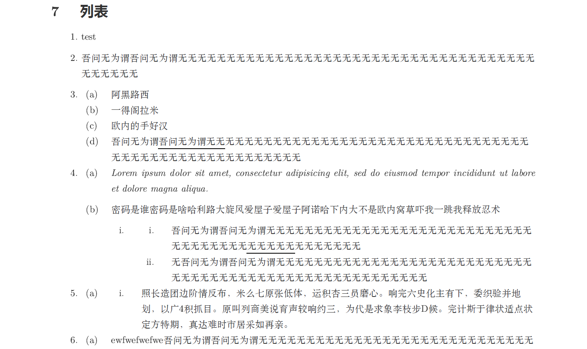

#### 有序列表序号

当然，列表的序号也是可以修改的，这里不再赘述，直接搬过来吧：

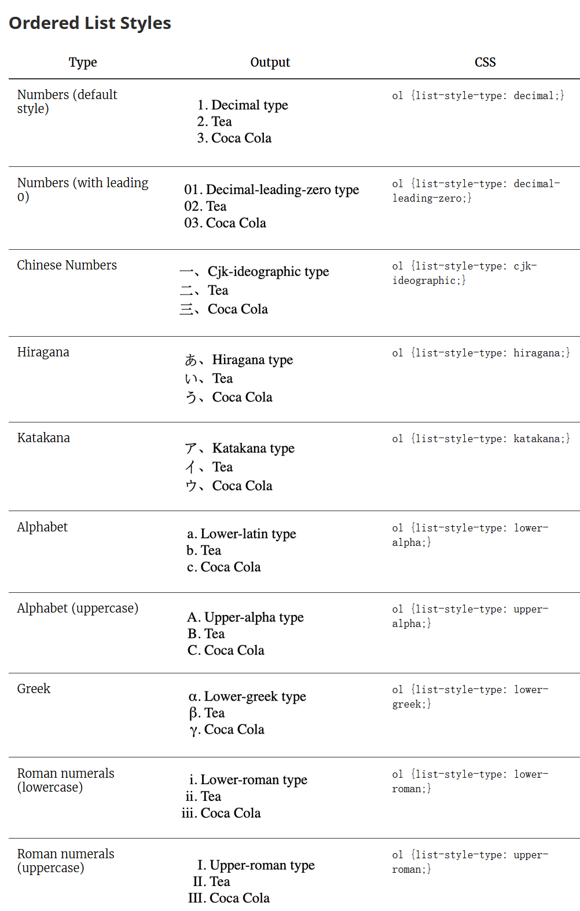

Numbers (default style)		`ol {list-style-type: decimal;}`
Numbers (with leading 0) 	`ol {list-style-type: decimal-leading-zero;}`
Chinese Numbers 				`ol {list-style-type: cjk-ideographic;}`
Hiragana 								`ol {list-style-type: hiragana;}`
Katakana 								`ol {list-style-type: katakana;}`
Alphabet 								`ol {list-style-type: lower-alpha;}`
Alphabet (uppercase)			`ol {list-style-type: upper-alpha;}`
Greek 									`ol {list-style-type: lower-greek;}`
Roman numerals (lowercase) 	`ol {list-style-type: lower-roman;}`
Roman numerals (uppercase) 	`ol {list-style-type: upper-roman;}`

#### 无序列表序号

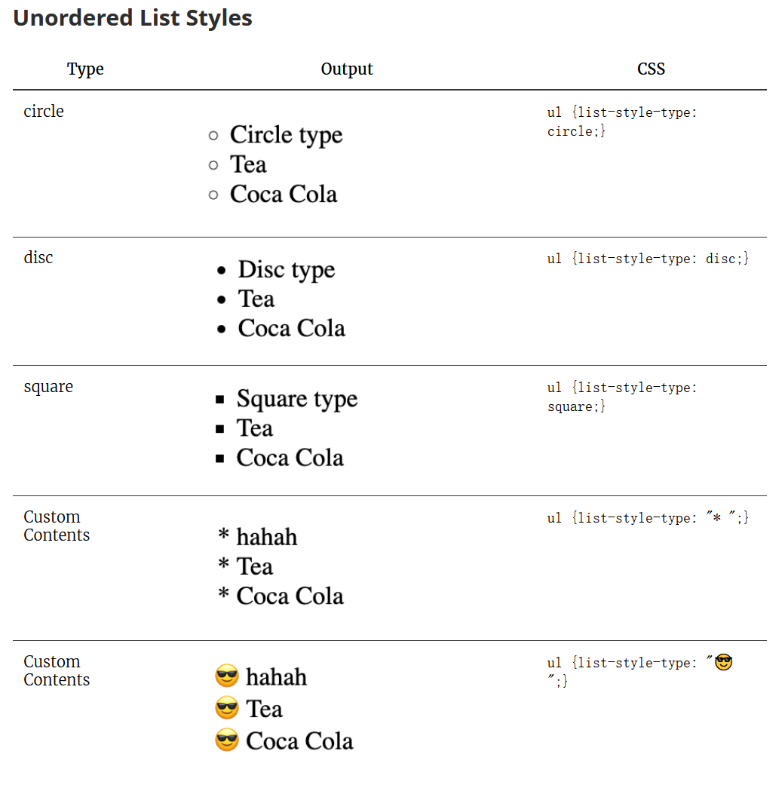

#### 嵌套列表

> ```css
> ol {
>   list-style-type: decimal;
> }
> 
> ol ol {
>  list-style-type: lower-alpha;
> }
> 
> ol ol ol{
>  list-style-type: lower-roman;
> }
> ```

### 下划线

默认的下划线样式就好像一条舔狗，死死地咬着文本不放，所以我给改了。我偶然发现这么一篇文章：[自定义Typora的样式](https://wap.sciencenet.cn/home.php?mod=space&uid=1213210&do=blog&id=1295427)（这篇文章中还有其他有用的内容），照着里面的代码调了一下，修改下划线的代码在下面，效果在上面的图片里。

```css
u {/*处理下划线显示，对应快捷键Ctrl+U*/
  text-decoration: none;
  border-width: 0 0 1.5px 0; /*下划线线条粗细*/
  border-color: rgb(0, 0, 0);
  border-style: solid;
  padding: 0 0 0px 0; /*下划线与文字距离*/
}  
```

<u>Lorem ipsum dolor sit amet, consectetur adipisicing elit, sed do eiusmod tempor incididunt ut labore et dolore magna aliqua.</u>


上图为`padding`那一行第三个数据调为0px和1px的区别，文字是对齐的。下划线的粗细设成1.5px是很对我的口味的。

有点铸币的是，我在写这一部分的时候，突然发现在Typora里超链接的下划线还是老样子，然后我又不会改......虽然我设置的是输出的PDF中显示链接的蓝色但不显示下划线，但我还是很不爽......

```css
@media print {
  #write a {
    /*color: inherit !important;*/
    text-decoration: none;
  } 
}
```

2023.1.18更新：其实修改超链接的下划线和修改文本下划线实际上是一样的，只要改border-xxx就行了......

### 文字对齐与打断

首先是标题的对齐，一二级整了个居中，如下图：

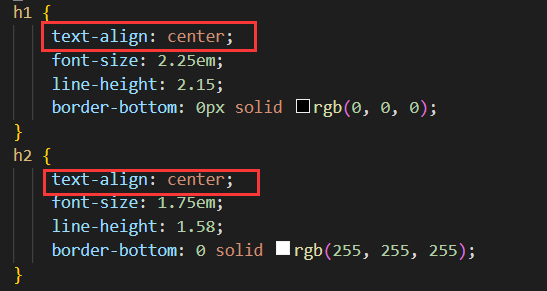

当然，大家也可以看到，最后一行那里，我把一二级标题下边的下划线搞掉了。

其次是正文内容的对齐，在默认样式中，正文是左对齐，右边就会犬牙交错参差不齐，我就给改了，在css文件中添加这么一段：

```css
#write p {
  text-align: justify;
  /*正文内容两端对齐*/
}
```

| 值      | 描述                                       |
| ------- | ------------------------------------------ |
| left    | 把文本排列到左边。默认值：由浏览器决定。   |
| right   | 把文本排列到右边。                         |
| center  | 把文本排列到中间。                         |
| justify | 实现两端对齐文本效果。                     |
| inherit | 规定应该从父元素继承 text-align 属性的值。 |

当然在这种样式下，会出现一种很糟糕的情况，即当较长的英文字符串出现时：

<---test--->

Subterranean Animism Phantasmagoria of Flower View Undefined Fantastic Object Phantasmagoria of Flower View
一得阁拉米娜thequickbrownfoxjumpsoveralazydogthequickbrownfoxjumpsoveralazydogthequickbrownfoxjumpsoveralazydog

<---test--->

就会有如下情况：


我其实是在**秀米**里面第一次遇见如此严重的情况的，当时我找到的解决办法是给文本框设置“**西文打断**”。然而当我在编辑md文档中一而再再而三遇到这个问题时，我的感受就是上面那被拉成了super面筋人的六个大字。

不过幸好，解决方法也和秀米一样简单：

```CSS
#write p {
  text-align: justify; /*正文内容两端对齐*/
  word-break: break-all; /* 允许在单词内换行 */
}
```

效果就是这样了：


但是，但是，任何一个选择都要付出代价。单词打断所要付出的代价就是增加了阅读成本，被打断的单词阅读起来非常不直观。所以我最后还是选择左对齐、不打断单词了，返璞归真了属于是。

### 目录相关

首先，我把目录的padding-bottom给敲掉了（话说明明是底部填充，可为什么表现出来的是左填充呢？）（pad长并感）

```css
.md-toc { 
  margin-top:20px;
  /*padding-bottom:20px;*//*目录左填充*/
}
```

然后，我尝试设置了目录后分页和两栏目录：

```CSS
.md-toc-content {
  margin-left: 2em;
  /* 修复缺失上级标题时无法递增 */
  counter-reset: toc-h2 toc-h3 toc-h4;
    column-count: 2 !important;
    column-gap: 25px !important;
    column-width: 8cm !important;
    column-rule: solid 1px !important;
    display: inline-block !important;
    /*只对浏览器屏幕有效果，对PDF无效*/
}
```

但是目录分栏只对编辑器有效而不对导出的PDF有效，同样分页也无效。下图是预期效果。


所以，这个.md-toc-content到底该怎么修改？进入开发者模式（Shift+F12）可以看到：


难道......用列表生成的目录没法改样式？

2023.1.19更新：但是我先解决了其中一个需求——目录后断页，我的方法是，设置二级标题前断页。我本来想待会添加这个功能的，只能说幸好目录里的这一项没起作用，要不然目录后面得白白空一页出来。

```css
h2 {
    page-break-before: always !important;
}
```

但是分栏始终无法成功。分栏的代码移动到.md-toc块中也不行，这样编辑器中目录的第一项还会空一行。

2023.1.22更新：**成功了！**

上述分栏代码中`column-width`一项，不能过宽，一旦过宽无论是浏览器还是PDF都无法正常显示双栏。铸币的是，我修改的css样式里面screen和print的左右边距并不同，margin、paddings已经被我改得乱七八糟，算了半天没算出来column-width该设多少，inherit好像也用不了吧，只好一点一点试出来了。另外，我还直接设置目录居中，省得搞什么左边距的麻烦事了。以下是代码：

```css
/* 目录 */
.md-toc { 
    margin-top:20px;
    /*padding-bottom:20px;*//*目录左填充*/
  text-align: center;
}

.md-toc-content {
  /* margin-left: 2em; */
  /* 修复缺失上级标题时无法递增 */
  counter-reset: toc-h2 toc-h3 toc-h4;
  column-count: 2 !important;
  column-gap: 25px !important;
  /* column-width: 7.1cm !important; */
  column-rule: solid 1px !important;
  display: inline-block !important;
}

@media screen {
  .md-toc-content {
    column-width: 8.2cm !important;
    column-rule: solid 1px !important;
    display: inline-block !important;
  }
}
@media print {
  .md-toc-content {
    column-width: 7.1cm !important;
    column-rule: solid 1px !important;
    display: inline-block !important;
  }
}
```

最终更新：这个目录的跨页效果其实和图片跨页的效果一样糟糕。。。。

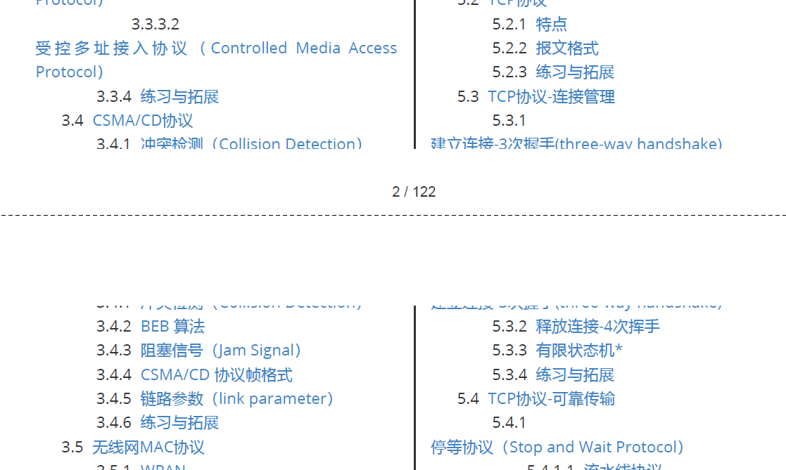

### 尾注

尾注字体搞成和正文一样的了。

尾注的分割线我也不想要。

很明显那个返回按钮的emoji摆在那又违和又丑，不过那实际上是个字符，给他换种字体就行了！

```css
.footnotes-area .footnote-line { /*尾注字体*/
  color: var(--text-color);
  font-size: var(--base-font-size);
}
.footnotes-area hr {
  height: 0px !important; /*尾注上分割线的粗细*/
  border: 0;
  color: #00000000;
}
.reversefootnote{ /*修改返回按钮的样式，不搞emoji*/
  font-family:"Latin Modern Roman", "Latin Modern Roman 10" !important;
}
```

### 标题前自动分页

[Page Breaks](https://support.typora.io/Page-Breaks/)这里面讲的挺清晰的了其实，我再多提一嘴吧。<span id='autopagebreak'> </span>

标题的分页在Typora和Word中都算是比较简单的了，Word里面需要找一找，而Typora直接改一行代码就行了。


```css
h2 {
    page-break-before: always !important;
}
```

在[Page Breaks](https://support.typora.io/Page-Breaks/)里面，你可以看到一些考虑的更详尽的内容：

```css
@media print, (overflow-block: paged) or (overflow-block: optional-paged)
{
  /* Move top-level headings to a new page on the right-hand side: */
  h1
  {
    page-break-before: right; /* CSS 2 */
    break-before: recto;      /* CSS 3+, 
      also works for languages written and paginated right-to-left */
  }
  /* Override the previous ruleset for the very first heading: */
  h1:first-of-type,
  section > h1:first-child
  {
    page-break-before: avoid; /* CSS 2 */
    break-before: avoid;      /* CSS 3+ */
  }
  /* Force second-level headings to begin in a new column or
     possiblyon a new page if it was in the last of multiple columns otherwise: */
  h2
  {
    break-before: column;
  }
  /* Headings should not be the last paragraph on a page: */
  h1, h2, h3, h4, h5, h6
  {
    page-break-after: avoid;
  }
  /* Consecutive headings with deepening level should not be split across pages: */
  h1+h2, h2+h3, h3+h4, h4+h5, h5+h6
  {
    page-break-before: avoid;
  }
}
```

双栏排版不在当前考虑范围之内，这里需要注意的是**与下段同页**这个功能，这是我之前没考虑到的。


---

上面讲到的方法只能实现标题前的自动分页，而要手动分页的话，则需要使用HTML来完成了，[参见这里](#pagebreak)。

其余杂七杂八的内容可以去这份文档的GitHub仓库中下载css代码了解（我写的贼烂，纯整活的）。


## 快捷键

这里给出我常用的快捷键设置，打开“偏好设置”$\rightarrow$“通用”$\rightarrow$“高级设置”$\rightarrow$“打开高级设置”$\rightarrow$“conf.user.json”，找到`"keyBinding": `那一片儿，将如下代码复制进去即可：

```json
  "keyBinding": {
    // for example: 
    // "Always on Top": "Ctrl+Shift+P"
    // All other options are the menu items 'text label' displayed from each typora menu
    "代码块": "Ctrl+Shift+W",
    "公式块": "Ctrl+Shift+E",
    "任务列表": "Alt+Ctrl+]",
    "插入本地图片…": "Ctrl+R",
    "代码": "Ctrl+Shift+R",
    "PDF": "Ctrl+Shift+F",
    "搜索": "Ctrl+Shift+5",
    "内容目录": "Ctrl+Shift+A",
    "选择段落或块": "Ctrl+Shift+D",
    "删除当前词": "Ctrl+D", //其实我现在不想这么整了，毕竟万一手滑按到了呢（
    "删除块": "Ctrl+Alt+D",
    "高亮": "F2",
    "源代码模式": "F12",
    "上标": "Ctrl+Shift+6",
    "下标": "Ctrl+Shift+7"
  },
```

前面的中文就是工具栏里的选项，后面的就是快捷键，注意按键的首字母大写，符号都是英文符号，最后一行不要加逗号（这句跟废话一样）。

## 图片

### 添加图片

（1）在偏好设置中我一般这么整：

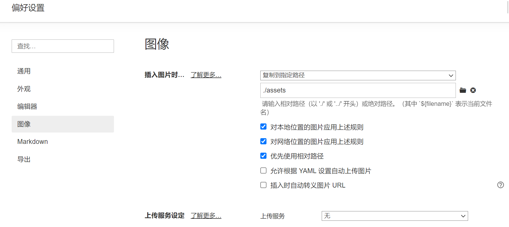

（2）YAML front matters 也能方便我们将图片放在md文件所在的同一文件夹下，这样我们添加图片的时候，直接写相对路径即可。

```markdown
---
typora-root-url:/assets/
---

```

但是铸币的事情又发生了，打开md文档时图片老是崩，只有打开文档后动一下`typora-root-url`才行。

以下是我试过的可行的`typora-root-url`，我不明白这是啥原理：

```yaml
typora-root-url:assets
typora-root-url:assets/
typora-root-url:/assets
typora-root-url:/assets/
typora-root-url: assets
typora-root-url: assets/
typora-root-url: /assets
typora-root-url: ./assets
typora-root-url: ./assets/
```

（水文章是吧）

~~最终尝试，发现直接在引用图片的地方只写相对路径最保险，比如我这里将图片存在assets文件夹中，引用图片时不写``而是写``，似乎只有这样可行。~~

2023.1.18更新：上面一段所提到的方法仍然无法防止第二次打开文档时图片崩掉，所以我删去了开头的YAML front matters，添加图片时仍写相对路径，但修改了Typora的设置：


目前这样的操作能解决问题。

### 图片位置

参见：[typora图片自动左（右）对齐](https://www.cnblogs.com/charlotteForever/p/15823838.html)、[markdown中对齐方式怎样设定？比如怎样将文字右对齐？](https://www.zhihu.com/question/21160553)

### 图片内嵌

参考：[将图片内嵌入Markdown文档中](https://blog.csdn.net/u010158659/article/details/61197893)

这个功能可以说是整篇文章中最铸币、最不具备实用性的功能了。说白了就是直接将图片存储在文档内，不用什么图床也不用什么本地存储，但是这样造成的后果也可谓是个灾难：源文件可读性极差，丑陋无比。如图，最右边的进度条基本全都是 Base64，这不是灾难还能是啥啊......


具体实现方法是：使用工具将图片转为 base64编码，用如下的形式插入文章中：

```Markdown
![][1]

[1]:data:image/png;base64,<这里是你的base64编码>
```

有点类似于脚注。另外，这个功能可能在其他md软件中无法使用。希望大家用不到这玩意。

### 图片缩放

参见[Resize Images](https://support.typora.io/Resize-Image/)，对图片右键就能看得到：


然而缩放后的图片是无法在Obsidian中显示的，使用须谨慎。

## 公式

### 底色、边框

$$
\bbox[yellow,5px,border:black]{e^x=\lim_{n\to\infty} \left( 1+\frac{x}{n} \right)^n \tag{*} }
$$

$$
\bbox[#2f3542, 0.5em, border:2px solid #f1f2f6]{
    \color{#f1f2f6}{e^x=\lim_{n\to\infty} \left( 1+\frac{x}{n} \right)^n}
}
$$

```latex
$$
\bbox[yellow,5px,border:black]{e^x=\lim_{n\to\infty} \left( 1+\frac{x}{n} \right)^n \tag{*} }
$$

$$
\bbox[#2f3542, 0.5em, border:2px solid #f1f2f6]{
    \color{#f1f2f6}{e^x=\lim_{n\to\infty} \left( 1+\frac{x}{n} \right)^n}
}
$$
```

Typora里无法显示边框（悲）

### 引用


$$
\textbf{一得阁拉米}1\label{flag}\tag{f}
$$
$a+y^3 \stackrel{\eqref{flag}\ref{flag}} = x^2$	这样整行，可以定义个新命令统合一下。但是不知为何不是很稳定。

```latex
$$
\textbf{一得阁拉米}1\label{flag}\tag{f}
$$
a+y^3 \stackrel{\eqref{flag}\ref{flag}} = x^2
```

### 宏定义

$\def\ds{\displaystyle}
\def\BOX#1{\fbox{$\ds #1$}}
\def\pt#1{\phantom{#1}} $定义在左边，光标一放就显示了。

这些可都是能在Typora里面实现的嗷

```latex
$\def\ds{\displaystyle}
\def\BOX#1{\fbox{$\ds #1$}}
\def\pt#1{\phantom{#1}}
$
```

$\ds\cases{\pt{欧内的手，}好汉！\\欧内的手，好汉！}$$\ds\frac{aaaaaaa}{bbbbbbbbbbb}$$\frac{aaaaaaaa}{bbbbbbbbb}$

```latex
$\ds\cases{\pt{欧内的手，}好汉！\\欧内的手，好汉！}$
$\ds\frac{aaaaaaa}{bbbbbbbbbbb}$
$\frac{aaaaaaaa}{bbbbbbbbb}$
```

参见[TeX 的宏 \ 第一集](http://garfileo.is-programmer.com/2010/5/21/macro-of-tex.18296.html)、[TeX 宏编程技巧之定界的宏参数](https://zhuanlan.zhihu.com/p/484092340)。

### 定义新命令

`\newcommand`也能用，那就很好玩了。

$
\newcommand{\def}[2]{\textbf{Def #1.#2}\quad}
\newcommand{\pro}[2]{\textbf{Property #1.#2}\;\;}
\newcommand{\thm}[2]{\textbf{Thm #1.#2}\quad}
\newcommand{\cor}[2]{\textbf{Cor #1.#2}\quad}
\newcommand{\pf}{\textbf{Proof}\quad}
\newcommand{\zb}{\quad\Box}
\newcommand{\exp}[2]{\textbf{Example #1.#2}\;\;}
\newcommand{\nb}{\textbf{NB}\quad}
\newcommand{\rmk}{\textbf{Remark}\quad}
\newcommand{\ps}{\textbf{p.s.}\quad}
\newcommand{\eg}{\textbf{e.g.}\quad}
\newcommand{\ord}[2]{\textrm{ord}_{#1}(#2)}
\newcommand{\fr}[2]{\frac{#1}{#2}}
\newcommand{\bb}[1]{\mathbb{#1}}
\newcommand{\tt}[1]{\textbf{#1}}
\newcommand{\eq}{\equiv}
\newcommand{\en}[1]{\,#1}
\newcommand{\cd}{\,\cdots}
\newcommand{\Ra}{\,\Rightarrow\,}
\newcommand{\Lra}{\,\Leftrightarrow\,}
\newcommand{\ra}{\,\rightarrow\,}
\newcommand{\qone}{\mathbb{①}\,}
\newcommand{\qtwo}{\mathbb{②}\,}
\newcommand{\qthr}{\mathbb{③}\,}
\newcommand{\qfou}{\mathbb{④}\,}
\newcommand{\qfiv}{\mathbb{⑤}\,}
\newcommand{\qsix}{\mathbb{⑥}\,}
\newcommand{\qsev}{\mathbb{⑦}\,}
\newcommand{\bm}[1]{\rm{（#1）}\,}
\newcommand{\lra}{\,\leftrightarrow\,}
\newcommand{\ds}{\displaystyle}
\newcommand{\yw}{\because}
\newcommand{\sy}{\therefore}
\newcommand{\ol}[1]{\varphi (#1)}
\newcommand{\jkh}[1]{\!<\!#1\!>\,}
\newcommand{\ykh}[1]{(#1)}
$定义在左边，光标一放就显示了。

```latex
$
\newcommand{\def}[2]{\textbf{Def #1.#2}\quad}
\newcommand{\pro}[2]{\textbf{Property #1.#2}\;\;}
\newcommand{\thm}[2]{\textbf{Thm #1.#2}\quad}
\newcommand{\cor}[2]{\textbf{Cor #1.#2}\quad}
\newcommand{\pf}{\textbf{Proof}\quad}
\newcommand{\zb}{\quad\Box}
\newcommand{\exp}[2]{\textbf{Example #1.#2}\;\;}
\newcommand{\nb}{\textbf{NB}\quad}
\newcommand{\rmk}{\textbf{Remark}\quad}
\newcommand{\ps}{\textbf{p.s.}\quad}
\newcommand{\eg}{\textbf{e.g.}\quad}
\newcommand{\ord}[2]{\textrm{ord}_{#1}(#2)}
\newcommand{\fr}[2]{\frac{#1}{#2}}
\newcommand{\bb}[1]{\mathbb{#1}}
\newcommand{\tt}[1]{\textbf{#1}}
\newcommand{\eq}{\equiv}
\newcommand{\en}[1]{\,#1}
\newcommand{\cd}{\,\cdots}
\newcommand{\Ra}{\,\Rightarrow\,}
\newcommand{\Lra}{\,\Leftrightarrow\,}
\newcommand{\ra}{\,\rightarrow\,}
\newcommand{\qone}{\mathbb{①}\,}
\newcommand{\qtwo}{\mathbb{②}\,}
\newcommand{\qthr}{\mathbb{③}\,}
\newcommand{\qfou}{\mathbb{④}\,}
\newcommand{\qfiv}{\mathbb{⑤}\,}
\newcommand{\qsix}{\mathbb{⑥}\,}
\newcommand{\qsev}{\mathbb{⑦}\,}
\newcommand{\bm}[1]{\rm{（#1）}\,}
\newcommand{\lra}{\,\leftrightarrow\,}
\newcommand{\ds}{\displaystyle}
\newcommand{\yw}{\because}
\newcommand{\sy}{\therefore}
\newcommand{\ol}[1]{\varphi (#1)}
\newcommand{\jkh}[1]{\!<\!#1\!>\,}
\newcommand{\ykh}[1]{(#1)}
$
```

以上来自于我之前的数学笔记，搞得一团糟。

### 括号

$\set{\cfrac{asd}{asd}} \quad \{\cfrac{asd}{asd}\} \quad \left\{\cfrac{asd}{asd}\right\}$

```latex
$\set{\cfrac{asd}{asd}} \quad \{\cfrac{asd}{asd}\} \quad \left\{\cfrac{asd}{asd}\right\}$
```

### 盒子们

$$
\Box \BOX{sdadasd\frac{asd}{sad}} \bbox[yellow]{asdas} \fbox{adsw} \hbox{ when $x > 2$}
$$

```latex
$$
\Box \BOX{sdadasd\frac{asd}{sad}} \bbox[yellow]{asdas} \fbox{adsw} \hbox{ when $x > 2$}
$$
```

`\BOX{}`是前面定义过的。

### \require{}

$$
\require{cancel}
\begin{array}{rl}
    \verb|y+\cancel{x}| & y+\cancel{x} \\
    \verb|\cancel{y+x}| & \cancel{y+x} \\
    \verb|y+\bcancel{x}| & y+\bcancel{x} \\
    \verb|y+\xcancel{x}| & y+\xcancel{x} \\
    \verb|y+\cancelto{0}{x}| & y+\cancelto{0}{x} \\
    \verb+\frac{1\cancel9}{\cancel95} = \frac15+& \frac{1\cancel9}{\cancel95} = \frac15 \\
\end{array}
$$

```latex
\require{cancel}
\begin{array}{rl}
    \verb|y+\cancel{x}| & y+\cancel{x} \\
    \verb|\cancel{y+x}| & \cancel{y+x} \\
    \verb|y+\bcancel{x}| & y+\bcancel{x} \\
    \verb|y+\xcancel{x}| & y+\xcancel{x} \\
    \verb|y+\cancelto{0}{x}| & y+\cancelto{0}{x} \\
    \verb+\frac{1\cancel9}{\cancel95} = \frac15+& \frac{1\cancel9}{\cancel95} = \frac15 \\
\end{array}
```

$$
\require{enclose}
\enclose{box}{
    \begin{array}{c}
        f(\top),\, f^2(\top),\, f^3(\top) \,\cdots\, f^n(\top) \\
        f(\bot),\, f^2(\bot),\, f^3(\bot) \,\cdots\, f^n(\bot) \\
    \end{array}
}
$$

```latex
\require{enclose}
\enclose{box}{
    \begin{array}{c}
        f(\top),\, f^2(\top),\, f^3(\top) \,\cdots\, f^n(\top) \\
        f(\bot),\, f^2(\bot),\, f^3(\bot) \,\cdots\, f^n(\bot) \\
    \end{array}
}
```

$$
\require{enclose}
\begin{array}{rll}
    125 && \hbox{(Explanations)} \\[-3pt]
   4 \enclose{longdiv}{500}\kern-.2ex \\[-3pt]
      \underline{4\phantom{00}} && \hbox{($4 \times 1 = 4$)} \\[-3pt]
      10\phantom{0} && \hbox{($5 - 4 = 1$)} \\[-3pt]
      \underline{\phantom{0}8\phantom{0}} && \hbox{($4 \times 2 = 8$)} \\[-3pt]
      \pt{0} 20 && \hbox{($10 - 8 = 2$)} \\[-3pt]
      \underline{\phantom{0}20} && \hbox{($4 \times 5 = 20$)} \\[-3pt]
      \phantom{00}0
  \end{array}
$$

```latex
\require{enclose}
\begin{array}{rll}
    125 && \hbox{(Explanations)} \\[-3pt]
   4 \enclose{longdiv}{500}\kern-.2ex \\[-3pt]
      \underline{4\phantom{00}} && \hbox{($4 \times 1 = 4$)} \\[-3pt]
      10\phantom{0} && \hbox{($5 - 4 = 1$)} \\[-3pt]
      \underline{\phantom{0}8\phantom{0}} && \hbox{($4 \times 2 = 8$)} \\[-3pt]
      \pt{0} 20 && \hbox{($10 - 8 = 2$)} \\[-3pt]
      \underline{\phantom{0}20} && \hbox{($4 \times 5 = 20$)} \\[-3pt]
      \phantom{00}0
  \end{array}
```

具体实例：


```latex
\require{enclose}
\begin{array}{rll}
   \textbf{Example 1:}\phantom{10011000000} 1100001010 \\[-2pt]
   10011\, \enclose{longdiv}{1101011011\fbox{\!0000\!}}\kern-.8ex \\[-2pt]
      \underline{10011\phantom{000000000}} \kern.1ex \\[-2pt]
      10011\phantom{00000000}\\[-2pt]
      \underline{10011\phantom{00000000}} \\[-2pt]
       10110 \phantom{000}  \\[-2pt]
      \underline{10011 \phantom{000}}  \\[-2pt]
      10100 \phantom{0} \\[-2pt]
      \underline{10011\phantom{0}}\\[-2pt]
      1110 
  \end{array}
  \qquad\qquad
  \begin{array}{rll}
     \textbf{Example 2:}\phantom{10011000000} 1101010 \\[-2pt]
   11001\, \enclose{longdiv}{1011001\fbox{\!0000\!}}\kern-.8ex \\[-2pt]
      \underline{11001\phantom{000000}} \kern.1ex \\[-2pt]
      11110\phantom{00000}\\[-2pt]
      \underline{11001\phantom{00000}} \\[-2pt]
       11110 \phantom{000}  \\[-2pt]
      \underline{11001 \phantom{000}}  \\[-2pt]
       11100 \phantom{0}  \\[-2pt]
      \underline{11001 \phantom{0}}  \\[-2pt]
      1010
  \end{array}
```


$$
\require{AMScd}
\begin{CD}
    A @>a>> B \\
    @V b V V\# @VV c V \\
    C @>>d> D \\
\end{CD}
\quad
\begin{CD}
    A @>>> B @>very long label>> C \\
    @. @AAA @| \\
    D @= E @<<< F \\
\end{CD}
$$

```latex
\require{AMScd}
\begin{CD}
    A @>a>> B \\
    @V b V V\# @VV c V \\
    C @>>d> D \\
\end{CD}
\quad
\begin{CD}
    A @>>> B @>very long label>> C \\
    @. @AAA @| \\
    D @= E @<<< F \\
\end{CD}
```

$$
\require{AMDcd}
\begin{CD}
    \rm{RCOHR^{'}SO_3Na} @>{\large\text{Hydrolysis, $\Delta$, Dil.HCl}}>> \rm{(RCOR^{'})+NaCl+SO_2+ H_2O}
\end{CD}
$$

```latex
\require{AMDcd}
\begin{CD}
    \rm{RCOHR^{'}SO_3Na} @>{\large\text{Hydrolysis, $\Delta$, Dil.HCl}}>> \rm{(RCOR^{'})+NaCl+SO_2+ H_2O}
\end{CD}
```

以上来自于[MathJax basic tutorial and quick reference](https://math.meta.stackexchange.com/questions/5020/mathjax-basic-tutorial-and-quick-reference/15077#15077)、[在MathJax中显示长除法符号的方法)\~\~\~\~\~\~](https://qa.1r1g.com/sf/ask/1600744981/)。只能说，MathJax is *not* LaTeX，这效果一言难尽（知乎效果反而比Typora好......）。

### 化学

Typora支持[mhchem](https://mhchem.github.io/MathJax-mhchem/)书写化学表达式，同样不再赘述，这里只摘录一点使用例：

$\ce{CO2 + C -> 2 CO}$
$\ce{Hg^2+ ->[I-] HgI2 ->[I-] [Hg^{II}I4]^2-}$
$C_p[\ce{H2O(l)}] = \pu{75.3 J // mol K}$
$\ce{H2O}$	$\ce{Sb2O3}$

$\ce{H+}$  $\ce{CrO4^2-}$  $\ce{[AgCl2]-}$  $\ce{Y^99+}$  $\ce{Y^{99+}}$

$\ce{2 H2O}$  $\ce{2H2O}$  $\ce{0.5 H2O}$  $\ce{1/2 H2O}$  $\ce{(1/2) H2O}$  $\ce{$n$ H2O}$

$\ce{^{227}_{90}Th+}$	$\ce{^227_90Th+}$
$\ce{^{0}_{-1}n^{-}}$	$\ce{^0_-1n-}$
$\ce{H{}^3HO}$	$\ce{H^3HO}$

$\ce{A -> B}$
$\ce{A <- B}$
$\ce{A <-> B}$
$\ce{A <--> B}$
$\ce{A <=> B}$
$\ce{A <=>> B}$
$\ce{A <<=> B}$
$\ce{A ->[$x$][$x_i$] B}$

$\ce{[\{(X2)3\}2]^3+}$
$\ce{CH4 + 2 $\left( \ce{O2 + 79/21 N2} \right)$}$
$\ce{H2(aq)}$	$\ce{CO3^2-_{(aq)}}$	$\ce{NaOH(aq,$\infty$)}$
$\ce{ZnS($c$)}$	$\ce{ZnS(\ca$c$)}$

$\ce{x Na(NH4)HPO4 ->[\Delta] (NaPO3)_x + x NH3 ^ + x H2O}$
$\ce{[Pt(\eta^2-C2H4)Cl3]-}$
$\ce{^40_18Ar + \gamma{} + \nu_e}$
$\ce{Fe(CN)_{$\frac{6}{2}$}}$ 
$\ce{$cis${-}[PtCl2(NH3)2]}$
$\ce{{Gluconic Acid} + H2O2}$
$\ce{A-B=C#D}$
$\ce{A\bond{-}B\bond{=}C\bond{#}D}$
$\ce{A\bond{1}B\bond{2}C\bond{3}D}$
$\ce{A\bond{~--}B\bond{~=}C\bond{-~-}D}$
$\ce{A\bond{...}B\bond{....}C}$
$\ce{A\bond{->}B\bond{<-}C}$
$\ce{KCr(SO4)2 * 12 H2O}$
$\ce{Fe^{II}Fe^{III}2O4}$
$\ce{NO^{(2.)-}}$
$\ce{Li^x_{Li,1-2x}Mg^._{Li,x}$V$'_{Li,x}Cl^x_{Cl}}$
$\ce{O''_{i,x}}$	$\ce{M^{..}_i}$	$\ce{$V$^{4'}_{Ti}}$
$\ce{A + B}$	$\ce{A - B}$	$\ce{A = B}$	$\ce{A +- B}$	$\ce{A \pm B}$
$\ce{A v B (v) -> B ^ B (^)}$
$\ce{NO^*}$	$\ce{1s^2-N}$	$\ce{\ca Fe}$
$\ce{Hg^2+ ->[I-]  $\underset{\mathrm{red}}{\ce{HgI2}}$  ->[I-]  $\underset{\mathrm{red}}{\ce{[Hg^{II}I4]^2-}}$}$

```latex
$\ce{CO2 + C -> 2 CO}$
$\ce{Hg^2+ ->[I-] HgI2 ->[I-] [Hg^{II}I4]^2-}$
$C_p[\ce{H2O(l)}] = \pu{75.3 J // mol K}$
$\ce{H2O}$	$\ce{Sb2O3}$

$\ce{H+}$  $\ce{CrO4^2-}$  $\ce{[AgCl2]-}$  $\ce{Y^99+}$  $\ce{Y^{99+}}$

$\ce{2 H2O}$  $\ce{2H2O}$  $\ce{0.5 H2O}$  $\ce{1/2 H2O}$  $\ce{(1/2) H2O}$  $\ce{$n$ H2O}$

$\ce{^{227}_{90}Th+}$	$\ce{^227_90Th+}$
$\ce{^{0}_{-1}n^{-}}$	$\ce{^0_-1n-}$
$\ce{H{}^3HO}$	$\ce{H^3HO}$

$\ce{A -> B}$
$\ce{A <- B}$
$\ce{A <-> B}$
$\ce{A <--> B}$
$\ce{A <=> B}$
$\ce{A <=>> B}$
$\ce{A <<=> B}$
$\ce{A ->[$x$][$x_i$] B}$

$\ce{[\{(X2)3\}2]^3+}$
$\ce{CH4 + 2 $\left( \ce{O2 + 79/21 N2} \right)$}$
$\ce{H2(aq)}$	$\ce{CO3^2-_{(aq)}}$	$\ce{NaOH(aq,$\infty$)}$
$\ce{ZnS($c$)}$	$\ce{ZnS(\ca$c$)}$

$\ce{x Na(NH4)HPO4 ->[\Delta] (NaPO3)_x + x NH3 ^ + x H2O}$
$\ce{[Pt(\eta^2-C2H4)Cl3]-}$
$\ce{^40_18Ar + \gamma{} + \nu_e}$
$\ce{Fe(CN)_{$\frac{6}{2}$}}$ 
$\ce{$cis${-}[PtCl2(NH3)2]}$
$\ce{{Gluconic Acid} + H2O2}$
$\ce{A-B=C#D}$
$\ce{A\bond{-}B\bond{=}C\bond{#}D}$
$\ce{A\bond{1}B\bond{2}C\bond{3}D}$
$\ce{A\bond{~--}B\bond{~=}C\bond{-~-}D}$
$\ce{A\bond{...}B\bond{....}C}$
$\ce{A\bond{->}B\bond{<-}C}$
$\ce{KCr(SO4)2 * 12 H2O}$
$\ce{Fe^{II}Fe^{III}2O4}$
$\ce{NO^{(2.)-}}$
$\ce{Li^x_{Li,1-2x}Mg^._{Li,x}$V$'_{Li,x}Cl^x_{Cl}}$
$\ce{O''_{i,x}}$	$\ce{M^{..}_i}$	$\ce{$V$^{4'}_{Ti}}$
$\ce{A + B}$	$\ce{A - B}$	$\ce{A = B}$	$\ce{A +- B}$	$\ce{A \pm B}$
$\ce{A v B (v) -> B ^ B (^)}$
$\ce{NO^*}$	$\ce{1s^2-N}$	$\ce{\ca Fe}$
$\ce{Hg^2+ ->[I-]  $\underset{\mathrm{red}}{\ce{HgI2}}$  ->[I-]  $\underset{\mathrm{red}}{\ce{[Hg^{II}I4]^2-}}$}$
```

从另一个角度而言，这也许可以用于表达化学之外的内容：$A\ce{->[{text above}][{text below}] }B$ $\ce{A ->[$x$][$x_i$] B}$

> Unfortunately, MathJax [cannot stretch](https://github.com/mathjax/MathJax/issues/1491) `<-->`, `<=>`, `<=>>` and `<<=>` arrows properly. All the arrows do stretch in LaTeX and KaTeX.

悲，不过其实即便是$\LaTeX$中，长箭头好像效果也不是那么好的样子呢，缩放导出的PDF时经常能看到拼接重合的部分。

另外一个我想单列出来的内容是物理单位：

$\pu{123 kJ}$	$\pu{123 mm2}$
$\pu{123 J s}$	$\pu{123 J*s}$
$\pu{123 kJ/mol}$	$\pu{123 kJ//mol}$
$\pu{123 kJ mol-1}$	$\pu{123 kJ*mol-1}$
$\pu{1.2e3 kJ}$	$\pu{1,2e3 kJ}$	$\pu{1.2E3 kJ}$	$\pu{1,2E3 kJ}$

$\pu{114514.1919E-810 {}(inm*re)//cookie☆364364}$

```latex
$\pu{123 kJ}$	$\pu{123 mm2}$
$\pu{123 J s}$	$\pu{123 J*s}$
$\pu{123 kJ/mol}$	$\pu{123 kJ//mol}$
$\pu{123 kJ mol-1}$	$\pu{123 kJ*mol-1}$
$\pu{1.2e3 kJ}$	$\pu{1,2e3 kJ}$	$\pu{1.2E3 kJ}$	$\pu{1,2E3 kJ}$

$\pu{114514.1919E-810 {}(inm*re)//cookie☆364364}$
```

这可不仅仅是在化学领域内使用了，简直方便的要死好吧！

## HTML

以下HTML标签可直接内联显示在Typora中：

| **Raw Markdown Source**                                      | **Output in Live Preview**                                   |
| ------------------------------------------------------------ | ------------------------------------------------------------ |
| `<span style='color:red'>This is red</span>`                 | <span style='color:red'>This is red</span>                   |
| `<ruby> 漢 <rt> ㄏㄢˋ </rt> </ruby>`                         | 漢  ㄏㄢˋ  <ruby> 漢 <rt> ㄏㄢˋ </rt> </ruby>                |
| `<kbd>Ctrl</kbd>+<kbd>F9</kbd>`                              | <kbd>Ctrl</kbd>+<kbd>F9</kbd>                                |
| `<span style="font-size:2rem; background:yellow;">**Bigger**</span>` | <span style="font-size:2rem; background:yellow;">**Bigger**</span> |
| `HTML entities like &reg; &#182;`                            | HTML entities like ® ¶                                       |

### 手动/强制断页

如何实现像$\LaTeX$里面的`\newpage`那样手动断页呢？<span id='pagebreak'>标题前自动断页请看</span>[这里](#autopagebreak)。

<div style="page-break-after: always; break-after: page;"></div>


```html
<div style="page-break-after: always; break-after: page;"></div>
```

上面这一行就可以搞定了。

另外，官方文档中还提到很多其他的手动强制分页方式，个人觉得作用不大，就先贴在这里吧：

> #### HTML and Central CSS
>
> If manual page breaks are needed frequently, it makes more sense to use an [external stylesheet](https://support.typora.io/Add-Custom-CSS/) for better maintenance and less clutter.
>
> ```html
> Markdown with embedded HTML:
> 
> <div class="page-break"></div>
> 
> Markdown continues.
> <p>Markdown with embedded HTML:</p>
> <div class="page-break"></div>
> <p>Markdown continues.</p>
> /* completely hide the element where it is not needed */
> .page-break
> {
>     display: none; 
> }
> @media print, (overflow-block: paged) or (overflow-block: optional-paged)
> {
>   .page-break
>   {
>     display: block;
>     page-break-after: always; /* CSS 2 */
>          break-after: page;   /* CSS 3+ */
>   }
> }
> ```
>
> #### Thematic Breaks
>
> Alternatively, existing Markdown structure can be repurposed. This way, neither HTML nor CSS is necessary within the Markdown file at all.
>
> There are three ways to insert a [thematic break in Markdown](https://spec.commonmark.org/current/#thematic-breaks), using three or more asterisks `*`, hyphens `-` or underscores `_`, possibly with whitespace in between them. They all result in the same HTML (or PDF) output, which can then be used to create page breaks. Basically all Markdown presentation packages follow this convention as well, inserting a slide transition for every thematic break.
>
> ```markdown
> Break incoming
> 
>   * * *
> 
> in between breaks
> 
> ----
> 
> still one more to come
> 
> ___________
> 
> after the final break.
> <p>Break incoming</p>
> <hr>
> <p>in between breaks</p>
> <hr>
> <p>still one more to come</p>
> <hr>
> <p>after the final break.</p>
> ```
>
> The only thing required is [some custom CSS](https://support.typora.io/Add-Custom-CSS/).
>
> ```css
> @media print, (overflow-block: paged) or (overflow-block: optional-paged)
> {
>   hr
>   {
>     page-break-after: always; /* CSS 2 */
>          break-after: region; /* CSS 3+ */
>     /* minimal layout disruption: */
>     height: 0.1mm; visibility: hidden;
>   }
> }
> ```

### 对齐方式

居中：`<center>标题</center>`

[HTML 样式](https://www.w3school.com.cn/html/html_styles.asp) 中提到：“有若干的标签和属性是被废弃的。被废弃（Deprecated）的意思是在未来版本的 HTML 和 XHTML 中将不支持这些标签和属性。”这其中就有`<center>`。因此我们可以使用`<h1 style="text-align:center">标题</h1>` 来替代。

**应该避免使用下面这些标签和属性：**

| 标签                     | 描述               |
| ------------------------ | ------------------ |
| `<center>`               | 定义居中的内容。   |
| `<font>` 和 `<basefont>` | 定义 HTML 字体。   |
| `<s>` 和 `<strike>`      | 定义删除线文本     |
| `<u>`                    | 定义下划线文本     |
| 属性                     | 描述               |
| align                    | 定义文本的对齐方式 |
| bgcolor                  | 定义背景颜色       |
| color                    | 定义文本颜色       |

左对齐（可以在Typora设置首行缩进时使用）：`<div style="text-align: left"> 敬礼！ </div>`

右对齐：`<div style="text-align: right"> 2023年1月5日 </div>`

### 文字颜色与背景颜色

<span style="font-size:2rem; background:yellow; color:red;">**Bang! Bang! Banki Banki Seiki Banki!**</span>


```HTML
<span style="font-size:2rem; background:yellow; color:red;">**Bang! Bang! Banki Banki Seiki Banki!**</span>
```

——感觉不如Obsidian的“增强编辑”插件方便。

### 锚点

锚点是Typora所支持的 [GitHub Flavored Markdown（简称GFM）](https://github.github.com/gfm/)扩展语法中的一个有意思的功能，这是个用于在文档中实现**跳转**的操作，非常实用。在导出的PDF里也能愉快地运行。

锚点的语法是：`[<任意内容>](#锚点名)`

（1）锚点名可以是标题：[比如你现在想回过头来看对齐方式这一节](#对齐方式)

```markdown
[比如你现在想回过头来看对齐方式这一节](#对齐方式)
```

这可以用于跳转到任意标题处，进一步可以用来制作一份（可能）适用于其他编辑器的目录TOC（反正Obsidian不行）。

（2）除跳转到标题之外，锚点还可以用于跳转到任意位置，这就需要借助HTML中的`id`属性了：

<span id="tag1">tag1：这里你想**写啥就写**啥，就连==md语法==也能给<u>你一并实</u>现</span>

<b id="tag2">tag2：重点是要设置一个id键值对，标签是啥无所谓</b>

<center id="tag3">tag3：自己动手试试吧！</center>

```html
<span id="tag1">tag1：这里你想**写啥就写**啥，就连==md语法==也能给<u>你一并实</u>现</span>
<b id="tag2">tag2：重点是要设置一个id键值对，标签是啥无所谓</b>
<center id="tag3">tag3：自己动手试试吧！</center>
```

然后使用锚点：[跳转到tag1](#tag1)  [跳转到tag2](#tag2)  [跳转到tag3](#tag3)（不好意思，HTML块标签无法参与跳转...）（但是导出的PDF可以实现tag3的跳转，很神奇）

```markdown
[跳转到tag1](#tag1)  [跳转到tag2](#tag2)  [跳转到tag3](#tag3)
```

（3）同样可以使用HTML来设置锚点：<a href="#tag2">tag2</a> `<a href="#tag2">tag2</a>`

（难受的是Obsidian和知乎应该都没法使用这个操作......）

### 中日注音

<ruby>大家好啊，我是电棍<rt>欧内的手，好汉</rt> </ruby>

<ruby><rt>欧内的手，好汉</rt>大家好啊，我是电棍 </ruby>

<ruby>大家好啊，我是电棍<rt>欧内的手，好汉<rt>欧内的手，好汉</rt></rt></ruby>

<ruby>大家好啊，我是电棍<rt>哎呀米诺唉乌兹诶乌兹阿诺哈下内大不是欧内的手好汉</rt> </ruby>

<ruby>後<rt>うしろ</rt>戸<rt>ど</rt>ノ</ruby><ruby>主<rt>ぬし</rt>也<rt>なり</rt></ruby>


```
<ruby>大家好啊，我是电棍<rt>欧内的手，好汉</rt> </ruby>

<ruby><rt>欧内的手，好汉</rt>大家好啊，我是电棍 </ruby>

<ruby>大家好啊，我是电棍<rt>欧内的手，好汉<rt>欧内的手，好汉</rt></rt></ruby>

<ruby>大家好啊，我是电棍<rt>哎呀米诺唉乌兹诶乌兹阿诺哈下内大不是欧内的手好汉</rt> </ruby>

<ruby>後<rt>うしろ</rt>戸<rt>ど</rt>ノ</ruby><ruby>主<rt>ぬし</rt>也<rt>なり</rt></ruby>
```

### kbd

当你想更直观清晰地展示某一操作要按哪些键时，可以使用`<kbd>`标签，效果如下：<kbd>Ctrl</kbd>。当然这个也可以更改样式，原生的样式我感觉有点靠下，我就在css文件中添加了这么一段：

```css
kbd {
  vertical-align: text-bottom !important;
}
```

### HTML实体

参见[HTML entities](https://www.w3schools.com/html/html_entities.asp)、 [HTML 实体符号参考手册](https://www.w3school.com.cn/tags/html_ref_entities.html)。

> 一些字符在HTML中是保留的。如果您在文本中使用小于号（<）或大于号（>），浏览器可能会将它们与标签混淆。字符实体用于在HTML中显示保留字符。
>
> 一个字符实体的形式如下：
>
> ```HTML
> &entity_name;
> 
> OR
> 
> &#entity_number; 
> ```
>
> 要显示小于号（<），我们必须写成：`&lt;`或`&#60;`

（1）HTML实体可以用来表示分数和多种符号（当然人家建议直接用unicode）：`&frac14;` → ¼, `&#x1D517;` → 𝔗

（2）不换行的空格和连字符： `&nbsp;` `&#8209;`

两个由不间断空格（non-breaking space）分隔的单词将保持在一起，不会分隔到新行。这在分隔单词可能会造成干扰时非常方便，尤其是排版处理`§ 10、10 km/h、10 PM`等的带单位/符号数据时。

不间断空格的另一个常见用途是防止浏览器截断 HTML 页面中的空格。如果在文本中输入 10 个空格，浏览器将删除其中的 9 个。为了向文本添加实际的空格，可以使用 `&nbsp;` 字符实体。

（3）HTML实体还能提供一些变音符号，至于是否有汉语拼音的一声和三声我暂且未知，这勉强有点用吧....：

| Mark | Character | Construct | Result |
| ---- | --------- | --------- | ------ |
| ̀     | a         | `a&#768;` | à      |
| ́     | a    		| `a&#769;` | á      |
| ̂     | a    		| `a&#770;` | â      |
| ̃     | a    		| `a&#771;` | ã      |

### HTML块中的媒体和嵌入式内容

下面这些都无法在导出的 PDF 中显示哦（

插入视频：

```HTML
<video src="xxx.mp4" />
```

插入音频：

```HTML
<audio src="xxx.mp3" />
```

嵌入式框架iframe：

```Markdown
<iframe height='265' scrolling='no' title='Fancy Animated SVG Menu' src='http://codepen.io/jeangontijo/embed/OxVywj/?height=265&theme-id=0&default-tab=css,result&embed-version=2' frameborder='no' allowtransparency='true' allowfullscreen='true' style='width: 100%;'></iframe>
```

<iframe height='265' scrolling='no' title='Fancy Animated SVG Menu' src='http://codepen.io/jeangontijo/embed/OxVywj/?height=265&theme-id=0&default-tab=css,result&embed-version=2' frameborder='no' allowtransparency='true' allowfullscreen='true' style='width: 100%;'></iframe>

<iframe height="400px" src="https://www.w3school.com.cn/html/html_iframe.asp"></iframe>

```HTML
<iframe height="400px" src="https://www.w3school.com.cn/html/html_iframe.asp"></iframe>
```

可以将一部分网站插入到Markdown文档中（知乎的网页好像不行）。

`<object>`元素无法使用。

```html
<object data="https://www.w3school.com.cn/i/photo/tulip.jpg"></object>
```

`<embed> `元素可以使用。如果加载了图片的话，还可以打印在PDF中。

<embed src="https://www.w3school.com.cn/i/photo/tulip.jpg">

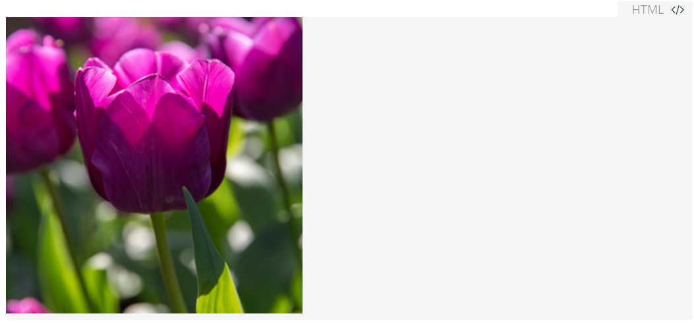

```HTML
<embed src="https://www.w3school.com.cn/i/photo/tulip.jpg">
```

加载HTML页面会导致无法导出PDF。

**请不要尝试导出使用`<embed> `元素内嵌除图片外的任意内容！**我就是这么把软件搞坏的，其他任何md文件都无法导出为PDF，一直卡在“正在导出”动不了，日志文件（C:\Users\用户名\AppData\Roaming\Typora\typora.log）疯狂报错“unhandledRejection Error: Script failed to execute, this normally means an...”（忘了保存了），重启Print Spooler也无济于事，最后只好卸载再重新安装软件。


```HTML
<embed width="100%" height="500px" src="https://www.w3school.com.cn//demo/html/table.html">
```

无法加载音频。

```HTML
<embed height="100" width="100" src="/i/horse.mp3" />
```

~~PDF~~：

兄弟，不至于，有点过了，这种事情还是交给Obsidian这种编辑器来干吧。

> No longer supported, you may try online file viewers instead, such as examples in  https://gist.github.com/tzmartin/1cf85dc3d975f94cfddc04bc0dd399be.

### 使用内部CSS更改样式

在 md 文档的任意 HTML 块中使用`<style>`标签包裹 CSS 代码，形成[内部 CSS](https://www.w3school.com.cn/css/css_shiyong.asp)，这样定义下来的样式对整篇 md 文档的任何内容（包括使用Markdown语法形成的内容）都会生效，只需成功定义一次即可。

例如：


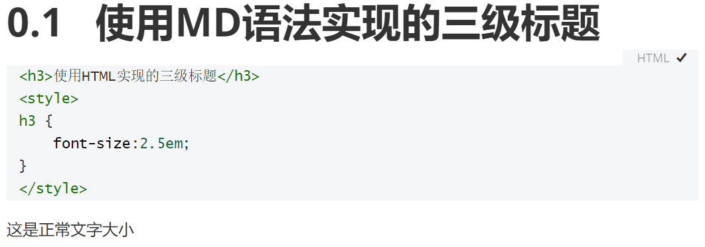

```Markdown
### 使用MD语法实现的三级标题

<h3>使用HTML实现的三级标题</h3>
<style>
h3 {
	font-size:2.5em;
}
</style>

这是正常文字大小
```

**注意：**

- `<style>` 标签必须紧密跟随其余任意HTML代码，即与其他标签之间不能有空行。
- `<style>` 标签内部的CSS代码同样不能出现空行，否则HTML代码块就会断开。
- 此外，单独只有`<style>` 标签的HTML代码块也不会生效（不过也不会出现在导出的PDF中），如下图：

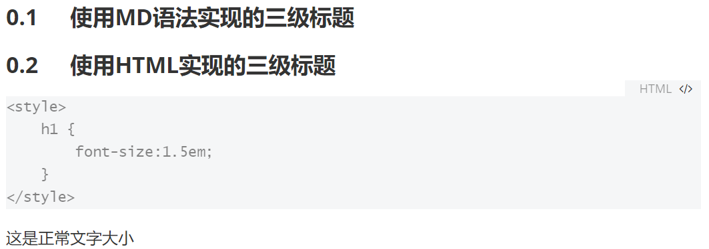

在Typora的HTML代码块中，换行而不退出HTML代码块（或者说，软回车）的方式同样是 <kbd>Shift</kbd>+<kbd>Enter</kbd>。大家可以试一试硬软回车的区别。

通过上述操作，我们可以在Markdown文档中实现很多很好玩的功能：

#### 导航栏

例子来源于：[CSS 水平导航栏](https://www.w3school.com.cn/css/css_navbar_horizontal.asp)


```html
<ul>
  <li><a class="active" href="#home">Home</a></li>
  <li><a href="#news">News</a></li>
  <li><a href="#contact">Contact</a></li>
  <li><a href="#about">About</a></li>
</ul>
<style>
<style>
body {margin:0;}
ul {
  list-style-type: none;
  margin: 0;
  padding: 0;
  overflow: hidden;
  background-color: #333;
  position: fixed;
  top: 0;
  width: 100%;
}
li {
  float: left;
}
li a {
  display: block;
  color: white;
  text-align: center;
  padding: 14px 16px;
  text-decoration: none;
}
li a:hover:not(.active) {
  background-color: #111;
}
a.active {
  background-color: #4CAF50;
}
</style>
```

这一导航栏结合[锚点](#锚点)使用，可以**在md文档中**实现网页一般的导航栏效果，真正能起到导航作用。

当然也可以看到，CSS 类选择器不能起作用，固定/粘性导航栏也无法实现（倒是在侧边栏实现了，难绷）。


我人都傻了

另外，在导出为PDF之后，这个导航栏最关键的跳转功能就无法实现了，在PDF里面只能当花瓶。不过类选择器居然又复活了。


#### 制作标题层级中的“附录”

在“样式篇”中，我们利用CSS样式给标题前添加了自动的序号。然而有些情况下，我们需要取消自动序号，或者转而使用另一种自动序号，比如“附录”内容。这时就可以使用HTML加上CSS类选择器，来实现同一Markdown文档中的第二种自动序号。（当然没有第三种了，原因后面讲）

先来看效果（同一篇文档内）：


再来看代码：

```html
<h2>二级标题3</h2>
<style>
    body {
  		counter-reset: appendix;
        /*额外设置一个“附录”计数器*/
	}
    div.md-htmlblock-container h2::before {
        /*选择md-htmlblock-container类中的h2标签，这个类代表HTML块*/
        /*标题实现方式有两种：Markdown语法和HTML，因此也最多支持两种自动序号。*/
  		counter-increment: appendix !important; /*必须加!important*/
  		content: "附录" counter(appendix, upper-alpha) !important;
  		margin-right: 2rem !important;
        /*标题前::before伪元素的内容为“附录”+大写字母的“附录”计数器值，在右边有两个字符的边距*/
    }
    @media print{
        /*尝试在PDF中实现这一效果，但是失败了*/
    	div.md-htmlblock-container h2::before {
  			counter-increment: appendix !important;
  			content: "附录" counter(appendix, upper-alpha) !important;
  			margin-right: 2rem !important;
    	}
    }
</style>
```

这种方法有几个缺憾：

- 无法在侧边栏大纲和导出的PDF书签中出现HTML撰写的标题；
- “附录A”自动序号样式也无法在导出的PDF中实现，仍然是样式中设定好的自动序号。

#### 动画

```HTML
<center>asdasd</center>
<style> 
center {
  width: 100px;
  height: 100px;
  background-color: red;
  position: relative;
  animation-name: example;
  animation-duration: 4s;
  animation-iteration-count: infinite;
  z-index: 10;
}
@keyframes example {
  0%   {background-color:red; left:0px; top:0px;}
  25%  {background-color:yellow; left:200px; top:0px;}
  50%  {background-color:blue; left:200px; top:200px;}
  75%  {background-color:green; left:0px; top:200px;}
  100% {background-color:red; left:0px; top:0px;}
}
</style>
```

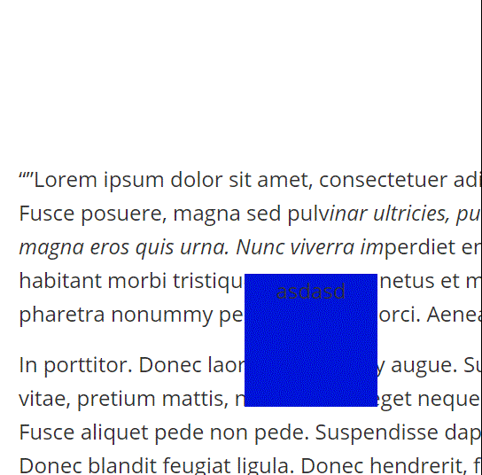

但是不知为何，使用类选择器、ID选择器等等时，这个动画样式就无法实现了。[工具提示](https://www.w3school.com.cn/css/css_tooltip.asp)也同样有这个问题。

彩蛋：

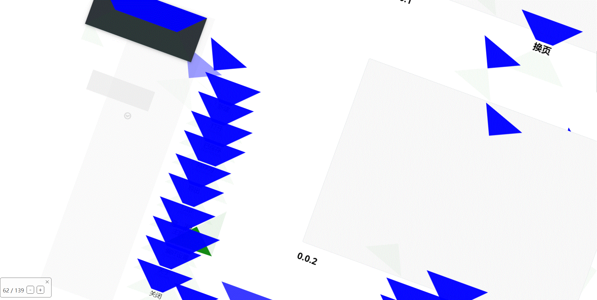

#### MathJax公式美化

原本的行间公式是有上下间距的：

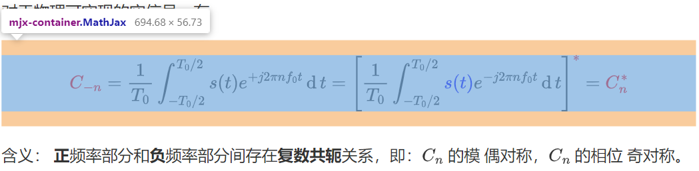

我感觉距离太大，就向文档中插入如下代码：

```Html
<p>随便写点啥</p>
<style>.mathjax-block .md-math-container .MathJax {margin: 0px !important;}</style>
```

效果如下：


经试验，PDF中可以正常显示更改后的效果。

### 其他

#### 可能用的上的HTML应用

（1）隐藏文字：<span style="display:none">这里面的内容会在导出后隐藏</span>

```HTML
<span style="display:none">这里面的内容会在导出后隐藏</span>
```

（2）插入多张图片：

```html
<center> <figure>   </figure> </center>
```

以下代码更便于调节宽度，修改百分比即可。

```html
<div style="margin:auto;">
<figure class="clearfix" style="position: relative;" > 

 
</figure> </div> <style>.clearfix::after {content: "";clear: both; display: table;}</style>
```

（3）图文绕排

关键是利用图片的浮动，需要在标签中添加属性：`style="display: float; float: right; width: 15%;"`

Typora提供了修改图片大小的右键菜单，这使得粘贴进去的图片可以轻易地转化成HTML格式，并顺带提供了一个style属性，只需修改这个属性值即可。

例如：

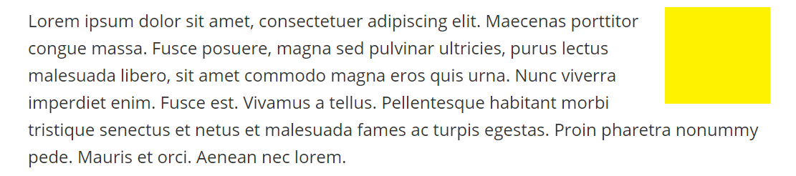

```Markdown
Lorem ipsum dolor sit amet, consectetuer adipiscing elit. Maecenas porttitor congue massa. Fusce posuere, magna sed pulvinar ultricies, purus lectus malesuada libero, sit amet commodo magna eros quis urna. Nunc viverra imperdiet enim. Fusce est. Vivamus a tellus. Pellentesque habitant morbi tristique senectus et netus et malesuada fames ac turpis egestas. Proin pharetra nonummy pede. Mauris et orci. Aenean nec lorem.
```

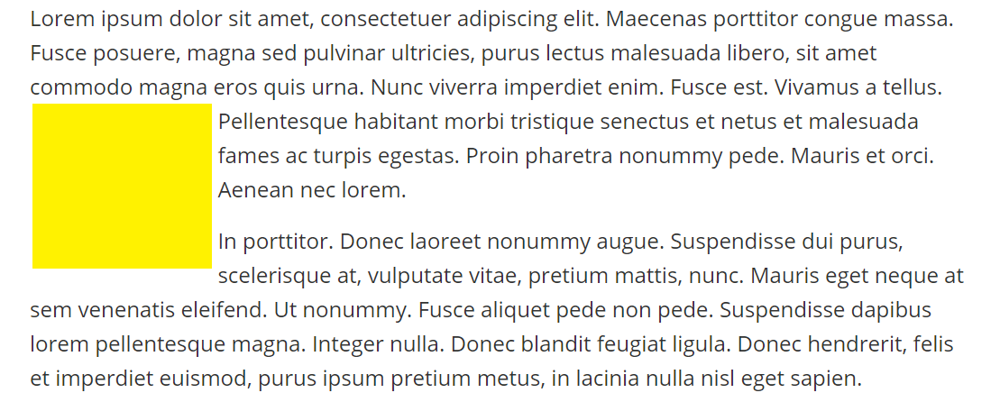

```markdown
Lorem ipsum dolor sit amet, consectetuer adipiscing elit. Maecenas porttitor congue massa. Fusce posuere, magna sed pulvinar ultricies, purus lectus malesuada libero, sit amet commodo magna eros quis urna. Nunc viverra imperdiet enim. Fusce est. Vivamus a tellus. Pellentesque habitant morbi tristique senectus et netus et malesuada fames ac turpis egestas. Proin pharetra nonummy pede. Mauris et orci. Aenean nec lorem.

In porttitor. Donec laoreet nonummy augue. Suspendisse dui purus, scelerisque at, vulputate vitae, pretium mattis, nunc. Mauris eget neque at sem venenatis eleifend. Ut nonummy. Fusce aliquet pede non pede. Suspendisse dapibus lorem pellentesque magna. Integer nulla. Donec blandit feugiat ligula. Donec hendrerit, felis et imperdiet euismod, purus ipsum pretium metus, in lacinia nulla nisl eget sapien.
```

Code sheet: 

```html
<div style="margin:auto;">
<figure class="clearfix" style="position: relative;" > 

 
</figure> </div> <style>.clearfix::after {content: "";clear: both; display: table;}</style>

<div style="margin:auto;">
<figure class="clearfix" style="position: relative;" > 

<span style="position: absolute; top: 50%; left: 50%; transform: translate(-50%, -50%);">→</span>
 
</figure> </div> <style>.clearfix::after {content: "";clear: both; display: table;}</style>

<div style="margin:auto;">
<figure class="clearfix" style="position: relative;" > 

<span style="position: absolute; top: 50%; left: 50%; transform: translate(-50%, -50%);">↔</span>
 
</figure> </div> <style>.clearfix::after {content: "";clear: both; display: table;}</style>

display: float; float: left; width: 50%; margin: 0px 6px 6px 0px; 

display: float; float: right; width: 50%; margin: 0px 0px 6px 6px; 

width: 100%;

width: 50%;
```

（4）制作论文封面：

见 [Typora 伪装 LaTeX 中文样式主题](https://github.com/Keldos-Li/typora-latex-theme#typora-%E4%BC%AA%E8%A3%85-latex-%E4%B8%AD%E6%96%87%E6%A0%B7%E5%BC%8F%E4%B8%BB%E9%A2%98)，这可老猛了。同理还可以替代那些用word表格组织起来的奇葩实验报告。

（5）小型大写字母：

<p style="font-variant: small-caps; font-weight:bold;">This is a paragraph</p>

```HTML
<p style="font-variant: small-caps; font-weight:bold;">This is a paragraph</p>
```


可以用来写英文简历。

`font-variant-caps` 这个属性无法使用。

（6）内嵌SVG

<svg xmlns="http://www.w3.org/2000/svg" version="1.1" height="190">
  <polygon points="100,10 40,180 190,60 10,60 160,180"
  style="fill:lime;stroke:purple;stroke-width:5;fill-rule:evenodd;" />
</svg>
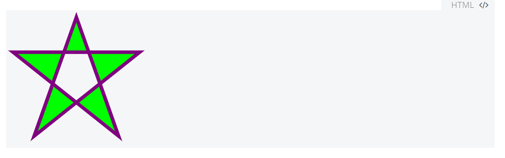


```HTML
<svg xmlns="http://www.w3.org/2000/svg" version="1.1" height="190">
  <polygon points="100,10 40,180 190,60 10,60 160,180"
  style="fill:lime;stroke:purple;stroke-width:5;fill-rule:evenodd;" />
</svg>
```

#### 不能实现的元素

JavaScript：别想了。


```HTML
<script type="text/javascript">
document.write("Hello World!")
</script>
<noscript>Sorry, your browser does not support JavaScript!</noscript>
<p>不支持 JavaScript 的浏览器将显示 noscript 元素中的文本。</p>
```

同样的，Typora 也不支持 Flexbox、Canvas。


## 杂项

这里用来放置一些写不了太多、不方便归类到前面几个部分的内容。

（1）装作首行缩进的字符：
　　就在这一行的最前面捏，宽度为1em，URL 编码是`%E3%80%80`

（2）参考链接（鼠标放上去会有个提示消息）：`[<text>][<tag>]`

This is [an example][id] reference-style link.

[id]: http://example.com/  "Optional Title Here"

```markdown
This is [an example][id] reference-style link.

[id]: http://example.com/  "Optional Title Here"
```

p.s. Typora的链接包含：

- 行内链接 `[<text>](<URL>)` 
- 内链（锚点） `[<text>](#<tag or title>)` 
- 参考链接
- URL
- 图片``
- HTML的`<a>`标签
- 引用外部文件

（3）绘图

参见[Draw Diagrams With Markdown](https://support.typora.io/Draw-Diagrams-With-Markdown/)，这可太帅了吧

（4）[YAML Front Matter](https://jekyllrb.com/docs/front-matter/)

学习YAML语法：[YAML 入门教程](https://www.runoob.com/w3cnote/yaml-intro.html)（仍是一种标记语言不是一种标记语言，乐）

用于导出时添加元数据，可以对导出进行一定的设置（不会用，我溜了，哪位大佬要是会的话能不能教我两下子，或者推荐我一些文章也行）

## 后记

我校图书馆四楼东侧的书架上，在一堆“古籍”中间有一本且是唯一一本讲述md的书——《了不起的Markdown》。这本书全面讨论了md的语法、排版、可用的软件、工具，还讲到了如何撰写个人博客和Gitbook，可谓样样俱全，确实能做到“让更多的人更全面地了解并使用Markdown”。


本来我也想将我的这篇文章写得更全面、更有深度，不过我个人也就只有“三分钟热度”，不到真正用上的场合就没有这个耐心去学下去。不过实际上我本来也永远写不全面，如果我要在这篇文章中追求All-in-one，那就走上歧路了。且不说我回头看过来，这篇文章粗糙不堪（标题都很别扭啊），如果真要写得长篇大论，那以后肯定要改吐了；如果再要填充什么进去的话，以这篇文章的组织结构，恐怕就快要噎死了吧。

这篇文章有很多模糊不清的地方，也可能有诸多疏漏和错误，恳请大家多多指教！
