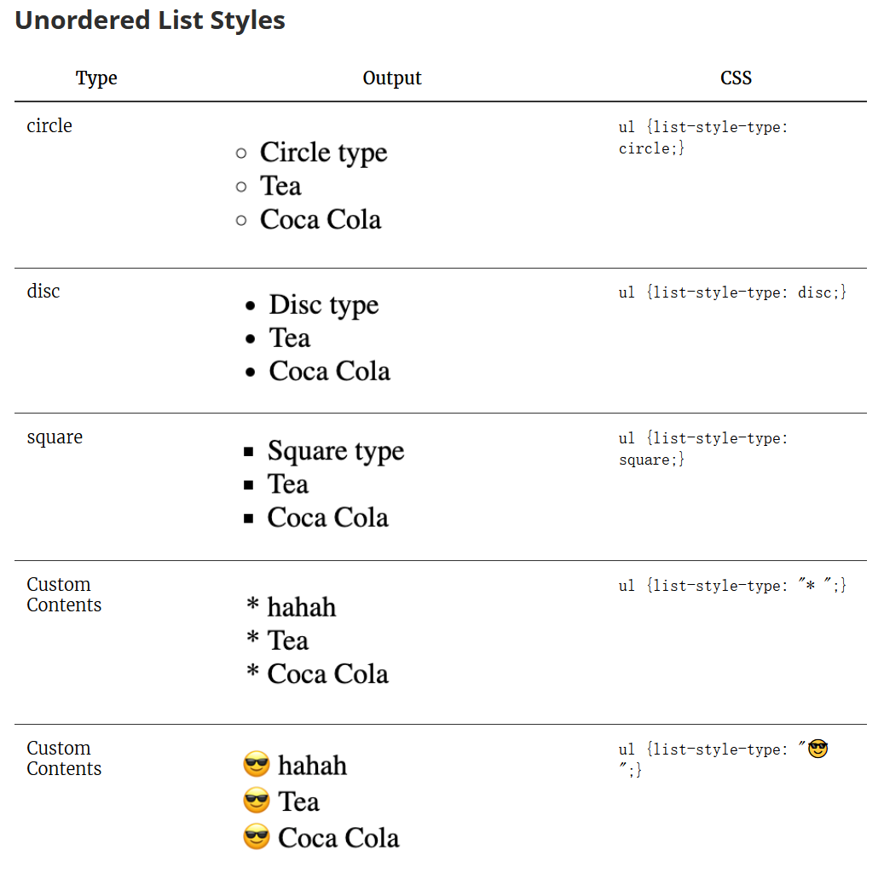
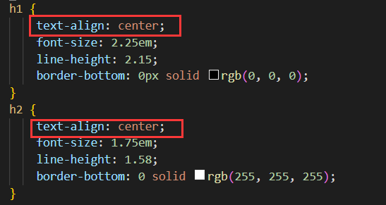

# Typora 学习索引 - 样式篇

为了便于阅览，我将该文章分成若干部分，汇总如下：

<!-- 知乎 -->
[Typora 有点儿深度使用的学习索引 - 知乎](https://zhuanlan.zhihu.com/p/596847931)

<!-- github -->
[Typora 有点儿深度使用的学习索引 - 前言、索引与目录 | Recogeta's Blog](https://r3c0ger.github.io/2025/01/typora-tricks-0/)

---

第一次接触修改主题样式是在我使用 [Typora 伪装 LaTeX 中文样式主题](https://github.com/Keldos-Li/typora-latex-theme#typora-%E4%BC%AA%E8%A3%85-latex-%E4%B8%AD%E6%96%87%E6%A0%B7%E5%BC%8F%E4%B8%BB%E9%A2%98) 时开始尝试的，这个样式目前小问题有点多，但是不耽误使用，而且还是很好看的，反正我已经 star 了。不过后来我还是换回了 github 主题，但是我也稍微添加了一些修改，以适应我的个人需求。

接下来我要说的就是我的一些比较重点的魔改的地方。这些魔改是在上面提到的伪装 LaTeX 主题及其 [个性化设置](https://github.com/Keldos-Li/typora-latex-theme/wiki/%E4%B8%AA%E6%80%A7%E5%8C%96%E8%AE%BE%E7%BD%AE) 之外我自己摸索的。

## 标题自动序号

CSS 代码参见 [Auto Numbering for Headings](https://support.typora.io/Auto-Numbering/)，我在这也贴出来。请注意，下面的代码可能并不完善，请大家在写文章时，尽量使标题符合层级次序，否则可能会有 bug。

如果有新手好奇这些代码该贴在哪里的话，请看下一小节 [列表](#列表)。

### 文本内容中

```css
/** initialize css counter */
#write {
    counter-reset: h1
}

h1 {
    counter-reset: h2
}

h2 {
    counter-reset: h3
}

h3 {
    counter-reset: h4
}

h4 {
    counter-reset: h5
}

h5 {
    counter-reset: h6
}

/** put counter result into headings */
#write h1:before {
    counter-increment: h1;
    content: counter(h1) ". "
}

#write h2:before {
    counter-increment: h2;
    content: counter(h1) "." counter(h2) ". "
}

#write h3:before,
h3.md-focus.md-heading:before /** override the default style for focused headings */ {
    counter-increment: h3;
    content: counter(h1) "." counter(h2) "." counter(h3) ". "
}

#write h4:before,
h4.md-focus.md-heading:before {
    counter-increment: h4;
    content: counter(h1) "." counter(h2) "." counter(h3) "." counter(h4) ". "
}

#write h5:before,
h5.md-focus.md-heading:before {
    counter-increment: h5;
    content: counter(h1) "." counter(h2) "." counter(h3) "." counter(h4) "." counter(h5) ". "
}

#write h6:before,
h6.md-focus.md-heading:before {
    counter-increment: h6;
    content: counter(h1) "." counter(h2) "." counter(h3) "." counter(h4) "." counter(h5) "." counter(h6) ". "
}

/** override the default style for focused headings */
#write>h3.md-focus:before,
#write>h4.md-focus:before,
#write>h5.md-focus:before,
#write>h6.md-focus:before,
h3.md-focus:before,
h4.md-focus:before,
h5.md-focus:before,
h6.md-focus:before {
    color: inherit;
    border: inherit;
    border-radius: inherit;
    position: inherit;
    left:initial;
    float: none;
    top:initial;
    font-size: inherit;
    padding-left: inherit;
    padding-right: inherit;
    vertical-align: inherit;
    font-weight: inherit;
    line-height: inherit;
}
```

### TOC 中

```css
/* No link underlines in TOC */
.md-toc-inner {
    text-decoration: none;
}
 
.md-toc-content {
    counter-reset: h1toc
}
 
.md-toc-h1 {
    margin-left: 0;
    font-size: 1.5rem;
    counter-reset: h2toc
}
 
.md-toc-h2 {
    font-size: 1.1rem;
    margin-left: 2rem;
    counter-reset: h3toc
}
 
.md-toc-h3 {
    margin-left: 3rem;
    font-size: .9rem;
    counter-reset: h4toc
}
 
.md-toc-h4 {
    margin-left: 4rem;
    font-size: .85rem;
    counter-reset: h5toc
}
 
.md-toc-h5 {
    margin-left: 5rem;
    font-size: .8rem;
    counter-reset: h6toc
}
 
.md-toc-h6 {
    margin-left: 6rem;
    font-size: .75rem;
}
 
.md-toc-h1:before {
    color: black;
    counter-increment: h1toc;
    content: counter(h1toc) ". "
}
 
.md-toc-h1 .md-toc-inner {
    margin-left: 0;
}
 
.md-toc-h2:before {
    color: black;
    counter-increment: h2toc;
    content: counter(h1toc) ". " counter(h2toc) ". "
}
 
.md-toc-h2 .md-toc-inner {
    margin-left: 0;
}
 
.md-toc-h3:before {
    color: black;
    counter-increment: h3toc;
    content: counter(h1toc) ". " counter(h2toc) ". " counter(h3toc) ". "
}
 
.md-toc-h3 .md-toc-inner {
    margin-left: 0;
}
 
.md-toc-h4:before {
    color: black;
    counter-increment: h4toc;
    content: counter(h1toc) ". " counter(h2toc) ". " counter(h3toc) ". " counter(h4toc) ". "
}
 
.md-toc-h4 .md-toc-inner {
    margin-left: 0;
}
 
.md-toc-h5:before {
    color: black;
    counter-increment: h5toc;
    content: counter(h1toc) ". " counter(h2toc) ". " counter(h3toc) ". " counter(h4toc) ". " counter(h5toc) ". "
}
 
.md-toc-h5 .md-toc-inner {
    margin-left: 0;
}
 
.md-toc-h6:before {
    color: black;
    counter-increment: h6toc;
    content: counter(h1toc) ". " counter(h2toc) ". " counter(h3toc) ". " counter(h4toc) ". " counter(h5toc) ". " counter(h6toc) ". "
}
 
.md-toc-h6 .md-toc-inner {
    margin-left: 0;
}
```

来自 http://pastebin.com/NYugSbXk。

### 侧边栏大纲中

```css
.sidebar-content {
    counter-reset: h1
}
 
.outline-h1 {
    counter-reset: h2
}
 
.outline-h2 {
    counter-reset: h3
}
 
.outline-h3 {
    counter-reset: h4
}
 
.outline-h4 {
    counter-reset: h5
}
 
.outline-h5 {
    counter-reset: h6
}
 
.outline-h1>.outline-item>.outline-label:before {
    counter-increment: h1;
    content: counter(h1) ". "
}
 
.outline-h2>.outline-item>.outline-label:before {
    counter-increment: h2;
    content: counter(h1) "." counter(h2) ". "
}
 
.outline-h3>.outline-item>.outline-label:before {
    counter-increment: h3;
    content: counter(h1) "." counter(h2) "." counter(h3) ". "
}
 
.outline-h4>.outline-item>.outline-label:before {
    counter-increment: h4;
    content: counter(h1) "." counter(h2) "." counter(h3) "." counter(h4) ". "
}
 
.outline-h5>.outline-item>.outline-label:before {
    counter-increment: h5;
    content: counter(h1) "." counter(h2) "." counter(h3) "." counter(h4) "." counter(h5) ". "
}
 
.outline-h6>.outline-item>.outline-label:before {
    counter-increment: h6;
    content: counter(h1) "." counter(h2) "." counter(h3) "." counter(h4) "." counter(h5) "." counter(h6) ". "
}
```

来自 https://pastebin.com/XmYgBbaz。

## 列表

本节于 2025.01.04 重新编写。

### 如何修改样式？例：控制列表序号前间距

OK，我们现在有这么一段内容：


我感觉标号前的间距有点小了，该咋改呢？

按下组合键 <kbd>Shift</kbd> + <kbd>F12</kbd>（Windows/Linux）或 <kbd>Shift</kbd> + <kbd>Command</kbd> + <kbd>F12</kbd>（macOS），就能启动开发者工具窗口。点击下图右上的那个按钮，再把鼠标放到想要查看的元素上，就能显示出内外边距等信息。再点击一下就可以查看相应的样式（右下角）：


我们点击下图中的加号，就可以写 CSS 代码，临时修改编辑器与文章的样式：

```css
ol.ol-list {
  margin-left: 20px;
}
```

这段代码的含义是，给所有的有序列表添加一个左边距，这个左边距是 20px。效果如下：


可以看到每层列表前面的空白都变大了。现在试验成功，我们可以把这段代码加到我们的 CSS 文件中，这样就可以永久生效了。

在 Typora 中点击左上角“文件”-“偏好设置”-“外观”-“打开主题文件夹”就能找到所有的 CSS 文件了。在“外观”界面中也可以看到现在选用的是什么主题文件。打开相应的文件，把上面的代码加进去，重新打开 Typora 就能看到效果了。


### 有序列表序号

当然，列表的序号也是可以修改的，这里不再赘述，直接搬过来吧：


```
Numbers (default style)     ol {list-style-type: decimal;}
Numbers (with leading 0)    ol {list-style-type: decimal-leading-zero;}
Chinese Numbers             ol {list-style-type: cjk-ideographic;}
Hiragana                    ol {list-style-type: hiragana;}
Katakana                    ol {list-style-type: katakana;}
Alphabet                    ol {list-style-type: lower-alpha;}
Alphabet (uppercase)        ol {list-style-type: upper-alpha;}
Greek                       ol {list-style-type: lower-greek;}
Roman numerals (lowercase)  ol {list-style-type: lower-roman;}
Roman numerals (uppercase)  ol {list-style-type: upper-roman;}
```

### 无序列表序号



### 嵌套列表序号修改

```css
ol {
  list-style-type: decimal;
}

ol ol {
  list-style-type: lower-alpha;
}

ol ol ol{
  list-style-type: lower-roman;
}
```

在 CSS 中，选择器 `ol ol ol` 用于定位嵌套三层的有序列表（`<ol>`）：

- 第一个 `ol` 表示任何 `<ol>` 元素。
- 第二个 `ol` 表示直接或间接位于第一个 `<ol>` 内的另一个 `<ol>` 元素。
- 第三个 `ol` 则表示位于前两个 `<ol>` 内的第三个 `<ol>` 元素。

空格（也称为 **后代组合符** 或 **后代选择器**）用于分隔两个或多个选择器，表示后面的选择器是前面选择器的后代元素。被选中的元素不一定是它的直接子元素，可以是任何级别的嵌套元素。

空格不仅仅匹配直接子元素，而是匹配所有级别的后代元素。如果只想选择直接子元素，则应该使用 **子选择器** `>`。

## 下划线

默认的下划线样式就好像一条舔狗，死死地咬着文本不放，所以我给改了。我偶然发现这么一篇文章：[自定义 Typora 的样式](https://wap.sciencenet.cn/home.php?mod=space&uid=1213210&do=blog&id=1295427)（这篇文章中还有其他有用的内容），照着里面的代码调了一下，修改下划线的代码在下面，效果在上面的图片里。

```css
u {/*处理下划线显示，对应快捷键Ctrl+U*/
  text-decoration: none;
  border-width: 0 0 1.5px 0; /*下划线线条粗细*/
  border-color: rgb(0, 0, 0);
  border-style: solid;
  padding: 0 0 0px 0; /*下划线与文字距离*/
} 
```

<u>Lorem ipsum dolor sit amet, consectetur adipisicing elit, sed do eiusmod tempor incididunt ut labore et dolore magna aliqua.</u>


上图为 `padding` 那一行第三个数据调为 0px 和 1px 的区别，文字是对齐的。下划线的粗细设成 1.5px 是很对我的口味的。另外，修改超链接的下划线和修改文本下划线实际上是一样的，只要改 `border-xxx` 就行了。

## 文字对齐与打断

首先是标题的对齐，一二级整了个居中，如下图：



当然，大家也可以看到，最后一行那里，我把一二级标题下边的下划线搞掉了。

其次是正文内容的对齐，在默认样式中，正文是左对齐，右边就会犬牙交错参差不齐，我就给改了，在 css 文件中添加这么一段：

```css
#write p {
  text-align: justify;
  /*正文内容两端对齐*/
}
```

| 值      | 描述                                       |
| ------- | ------------------------------------------ |
| left    | 把文本排列到左边。默认值：由浏览器决定。   |
| right   | 把文本排列到右边。                         |
| center  | 把文本排列到中间。                         |
| justify | 实现两端对齐文本效果。                     |
| inherit | 规定应该从父元素继承 text-align 属性的值。 |

当然在这种样式下，会出现一种很糟糕的情况，即当较长的英文字符串出现时：

Subterranean Animism Phantasmagoria of Flower View Undefined Fantastic Object Phantasmagoria of Flower View
一得阁拉米娜 thequickbrownfoxjumpsoveralazydogthequickbrownfoxjumpsoveralazydogthequickbrownfoxjumpsoveralazydog

就会有如下情况：


很久很久以前，当我还对排版一无所知时，我第一次在秀米里面遇见了如此严重的情况，当时我找到的解决办法是给文本框设置“**西文打断**”。然而当我在编辑 md 文档中一而再再而三遇到这个问题时，我的感受就是上面那被拉成了 super 面筋人的六个大字。

不过幸好，解决方法也和秀米一样简单：

```CSS
#write p {
  text-align: justify; /* 正文内容两端对齐 */
  word-break: break-all; /* 允许在单词内换行 */
}
```

效果就是这样了：


但是，但是，任何一个选择都要付出代价。单词打断所要付出的代价就是增加了阅读成本，被打断的单词阅读起来非常不直观。所以我最后还是选择左对齐、不打断单词了，返璞归真了属于是。

## 图片对齐

其实和文字对齐差不多，参见 [Typora 学习索引 - 快捷键和图片篇 | Recogeta's Blog](https://r3c0ger.github.io/2025/01/typora-tricks-2/#图片对齐) 或 [Typora 学习索引 - 快捷键和图片篇 - 知乎](https://zhuanlan.zhihu.com/p/642434340/#图片对齐)

## 目录相关

首先，我把目录的 padding-bottom 给敲掉了：

```css
.md-toc { 
  margin-top:20px;
  /*padding-bottom:20px;*/
}
```

然后，我尝试设置了目录后分页和两栏目录：

```CSS
.md-toc-content {
  margin-left: 2em;
  /* 修复缺失上级标题时无法递增 */
  counter-reset: toc-h2 toc-h3 toc-h4;
    column-count: 2 !important;
    column-gap: 25px !important;
    column-width: 8cm !important;
    column-rule: solid 1px !important;
    display: inline-block !important;
    /*只对浏览器屏幕有效果，对PDF无效*/
}
```

但是目录分栏只对编辑器有效而不对导出的 PDF 有效，同样分页也无效。下图是预期效果。


所以，这个.md-toc-content 到底该怎么修改？进入开发者模式（Shift+F12）可以看到：


难道……用列表生成的目录没法改样式？

2023.1.19 更新：但是我先解决了其中一个需求——目录后断页，我的方法是，设置二级标题前断页。我本来想待会添加这个功能的，只能说幸好目录里的这一项没起作用，要不然目录后面得白白空一页出来。

```css
h2 {
    page-break-before: always !important;
}
```

但是分栏始终无法成功。分栏的代码移动到.md-toc 块中也不行，这样编辑器中目录的第一项还会空一行。

2023.1.22 更新：**成功了！**

上述分栏代码中 `column-width` 一项，不能过宽，一旦过宽无论是浏览器还是 PDF 都无法正常显示双栏。铸币的是，我修改的 CSS 样式里面 screen 和 print 的左右边距并不同，margin、paddings 已经被我改得乱七八糟，算了半天没算出来 column-width 该设多少，inherit 好像也用不了吧，只好一点一点试出来了。另外，我还直接设置目录居中，省得搞什么左边距的麻烦事了。以下是代码：

```css
/* 目录 */
.md-toc { 
    margin-top:20px;
    /*padding-bottom:20px;*/
  text-align: center;
}

.md-toc-content {
  /* margin-left: 2em; */
  /* 修复缺失上级标题时无法递增 */
  counter-reset: toc-h2 toc-h3 toc-h4;
  column-count: 2 !important;
  column-gap: 25px !important;
  /* column-width: 7.1cm !important; */
  column-rule: solid 1px !important;
  display: inline-block !important;
}

@media screen {
  .md-toc-content {
    column-width: 8.2cm !important;
    column-rule: solid 1px !important;
    display: inline-block !important;
  }
}
@media print {
  .md-toc-content {
    column-width: 7.1cm !important;
    column-rule: solid 1px !important;
    display: inline-block !important;
  }
}
```

最终更新：这个目录的跨页效果其实和图片跨页的效果一样糟糕……


## 尾注

尾注字体搞成和正文一样的了；尾注的分割线我也去掉了。

很明显那个返回按钮的 emoji 摆在那又违和又丑，不过那实际上是个字符，给他换种字体就行了！

```css
.footnotes-area .footnote-line { /*尾注字体*/
  color: var(--text-color);
  font-size: var(--base-font-size);
}
.footnotes-area hr {
  height: 0px !important; /*尾注上分割线的粗细*/
  border: 0;
  color: #00000000;
}
.reversefootnote{ /*修改返回按钮的样式，不搞emoji*/
  font-family:"Latin Modern Roman", "Latin Modern Roman 10" !important;
}
```

## 标题前自动分页

[Page Breaks](https://support.typora.io/Page-Breaks/) 这里面讲的挺清晰的了其实，我再多提一嘴吧。<span id='autopagebreak'> </span>

标题的分页在 Typora 和 Word 中都算是比较简单的了，Word 里面需要找一找，而 Typora 直接改一行代码就行了。


```css
h2 {
    page-break-before: always !important;
}
```

在 [Page Breaks](https://support.typora.io/Page-Breaks/) 里面，你可以看到一些考虑的更详尽的内容：

```css
@media print, (overflow-block: paged) or (overflow-block: optional-paged)
{
  /* Move top-level headings to a new page on the right-hand side: */
  h1
  {
    page-break-before: right; /* CSS 2 */
    break-before: recto;      /* CSS 3+, 
      also works for languages written and paginated right-to-left */
  }
  /* Override the previous ruleset for the very first heading: */
  h1:first-of-type,
  section > h1:first-child
  {
    page-break-before: avoid; /* CSS 2 */
    break-before: avoid;      /* CSS 3+ */
  }
  /* Force second-level headings to begin in a new column or
     possiblyon a new page if it was in the last of multiple columns otherwise: */
  h2
  {
    break-before: column;
  }
  /* Headings should not be the last paragraph on a page: */
  h1, h2, h3, h4, h5, h6
  {
    page-break-after: avoid;
  }
  /* Consecutive headings with deepening level should not be split across pages: */
  h1+h2, h2+h3, h3+h4, h4+h5, h5+h6
  {
    page-break-before: avoid;
  }
}
```

双栏排版不在当前考虑范围之内，这里需要注意的是 **与下段同页** 这个功能，这是我之前没考虑到的。


---

上面讲到的方法只能实现标题前的自动分页，而要手动分页的话，则需要使用 HTML 来完成了，参见 [HTML 篇](https://zhuanlan.zhihu.com/p/642771075)。

其余杂七杂八的内容可以去这份文档的 GitHub 仓库中下载 CSS 代码了解（我写的贼烂，纯整活的）。

## 彩蛋


- 彩蛋图片：
  - 作者：咲崎さきp (X: @sakipee36)
  - 来源：sakipee36/status/1616081462654308363