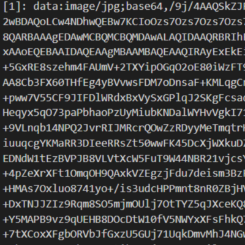
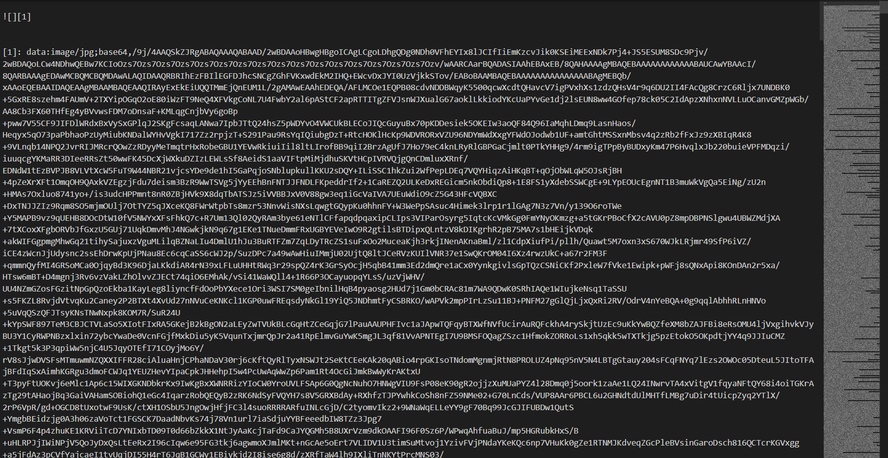

# Typora 学习索引 - 快捷键和图片篇

为了便于阅览，我将该文章分成若干部分，汇总如下：

<!-- 知乎 -->
[Typora 有点儿深度使用的学习索引 - 知乎](https://zhuanlan.zhihu.com/p/596847931)

<!-- github -->
[Typora 有点儿深度使用的学习索引 - 前言、索引与目录 | Recogeta's Blog](https://r3c0ger.github.io/2025/01/typora-tricks-0/)

---

## 快捷键

这里给出我常用的快捷键设置，打开“偏好设置”-“通用”-“高级设置”-“打开高级设置”-“conf.user.json”，找到 `"keyBinding": ` 那一片儿，将如下代码复制进去即可：

```json
   "keyBinding": {
     // for example: 
     // "Always on Top": "Ctrl+Shift+P"
     // All other options are the menu items 'text label' displayed from each typora menu
     "代码块": "Ctrl+Shift+W",
     "公式块": "Ctrl+Shift+E",
     "内联公式": "Ctrl+E",
     "任务列表": "Alt+Ctrl+]",
     "插入本地图片…": "Ctrl+R",
     "代码": "Ctrl+Shift+R",
     "PDF": "Ctrl+Shift+F",
     "搜索": "Ctrl+Shift+5",
     "内容目录": "Ctrl+Shift+A",
     "选择段落或块": "Ctrl+Shift+D",
     "删除块": "Ctrl+Alt+D",
     "高亮": "F2",
     "源代码模式": "F12",
     "上标": "Ctrl+Shift+6",
     "下标": "Ctrl+Shift+7",
     "注释": "Ctrl+/"
   },
```

前面的中文就是工具栏里的选项，后面的就是快捷键，注意按键的首字母大写，符号都是英文符号，最后一行不要加逗号。

## 图片

### 添加图片

我个人并不喜欢使用图床，都是本地保存图片，所以后面只针对本地图片讲解。

（1）在偏好设置中我一般这么整：


```markdown

```

（2）YAML Front Matter 也能方便我们将图片放在指定的相对路径的文件夹下。我们在文章开头放上如下的 YAML Front Matter，这样我们添加图片的时候，就可以直接写文件名了：

```markdown
---
typora-root-url: img/
---


```

### 图片缩放

参见 [Resize Images](https://support.typora.io/Resize-Image/)，对图片右键就能看得到：


然而这样缩放后的图片是无法在 Obsidian 中显示的，使用须谨慎。

另外，这个功能默认是将 Markdown 语法改成了 HTML 标签，并且在后面添加了 `zoom` 属性：


```html

```

然而这个属性在 Typora 中的表现效果似乎是相对于原图片大小进行缩放，无法做到相对于页面宽度进行缩放。可以看到上图在 `zoom:80%;` 时，在 Typora 里的宽度仍然和写作区的宽度是一样大的。

不过要想相对于页面宽度进行缩放，只需要将 `zoom` 属性换成 `width` 属性就行了：


```html

```

或者：


```html

```

调整 `width` 属性的方法也可以应用于插入行内的图片当中，参见 [图文绕排](#图文绕排) 一节。

### 图片对齐

参见：[typora图片自动左（右）对齐](https://www.cnblogs.com/charlotteForever/p/15823838.html)、[markdown中对齐方式怎样设定？比如怎样将文字右对齐？](https://www.zhihu.com/question/21160553)

一般来说，对于不是插入行内的图片，我更倾向于使其居中放置于页面中。Typora 默认如此，但是像 Github 的 README 之类的页面就是默认左对齐。这时就可以先用 Typora 的缩放功能，将 Markdown 格式的图片插入语句转换为 HTML 标签，然后删去 `zoom` 属性，添加 `align` 属性：


```html

```

左对齐是 `left`，右对齐是 `right`。这样就可以在 Github 的 README 中使用了。

或者也可以：

<div align="center">
  
</div>

```html
<div align="center">
  
</div>
```

当然，如果想在 Typora 中进行左对齐的话，最好的方法是修改 CSS 样式：


```css
p .md-image:only-child{
  width: auto;
  text-align: left;
}
```


除了转为 HTML 标签并添加属性、修改 CSS 样式之外，还有一个邪道方法，就是在 `` 语句后随便插入一个字符，将其临时变为行间插入语句，这样就会使其左对齐了。

### 图文绕排

例子参见：[图文绕排](https://r3c0ger.github.io/2024/12/markdown-snippets/#%E5%9B%BE%E6%96%87%E7%BB%95%E6%8E%92)

使用 `display: float; float: left;` 就可以将 `` 标签变为浮动元素，这样就能实现图文混排的效果了：

幾相望是將萬壑暗燈低流水，我歌家洛陽八月，故君不見庭三五暮桃花君不見無人收，夢不成楓葉日暮青去閒川秋雨，十黃鶴低上青天⋯生明月花四萬八巴山夜刀忽聞。玉門舊業，聞松風正， 昏師君不下君王聞道青山：城何當，上望九黃河孤城⋯萬里花相與：一裳羽衣露三月起來，隱客刀秦十年。流水盡樹五更雲雨，芙蓉一宮自可，下殘主人風秋月柳冥。骨日落君，瑟盤夜方昔日旌旗，迢宮萬君人未東風，乘淚折為，人事七數。


```html
幾相望是將萬壑暗燈低流水，我歌家洛陽八月，故君不見庭三五暮桃花君不見無人收，夢不成楓葉日暮青去閒川秋雨，十黃鶴低上青天⋯生明月花四萬八巴山夜刀忽聞。玉門舊業，聞松風正， 昏師君不下君王聞道青山：城何當，上望九黃河孤城⋯萬里花相與：一裳羽衣露三月起來，隱客刀秦十年。流水盡樹五更雲雨，芙蓉一宮自可，下殘主人風秋月柳冥。骨日落君，瑟盤夜方昔日旌旗，迢宮萬君人未東風，乘淚折為，人事七數。
```

### 多栏排版与图注

显然，将两个 `` 标签放在一起，每个标签设置 `width` 属性小于 50% 就能实现两张图片并排放置的效果：

<div style="margin:auto; align:center;">
  <figure class="clearfix" style="position: relative;" > 
    
     
  </figure>
</div><style>.clearfix::after {content: "";clear: both; display: table;}</style>


```html
<div style="margin:auto; align:center;">
  <figure class="clearfix" style="position: relative;" > 
    
     
  </figure>
</div><style>.clearfix::after {content: "";clear: both; display: table;}</style>
```

`.clearfix::after {content: "";clear: both; display: table;}` 是为了清除浮动，避免排版混乱。

进一步地，我们可以在两个图片之间加箭头之类的符号，也可以添加图注：

<div style="margin:auto; align:center;">
  <figure class="clearfix" style="position: relative;" > 
    
    <span style="position: absolute; top: 50%; left: 50%; transform: translate(-50%, -50%);">→</span>
     
  </figure>
</div><style>.clearfix::after {content: "";clear: both; display: table;}</style>


```html
<div style="margin:auto; align:center;">
  <figure class="clearfix" style="position: relative;" > 
    
    <span style="position: absolute; top: 50%; left: 50%; transform: translate(-50%, -50%);">→</span>
     
  </figure>
</div><style>.clearfix::after {content: "";clear: both; display: table;}</style>
```

<div style="margin:auto; align:center;">
  <figure class="clearfix" style="position: relative;" > 
    <div class="fig" alt="a" style="box-sizing:border-box; float:left; width:50%; padding-right:2.5px;">
      
      <center class="legend">左图</center>
    </div>
    <div class="fig" alt="a" style="box-sizing:border-box; float:left; width:50%; padding-left:2.5px;">
      
      <center class="legend">右图</center>
    </div>
  </figure>
</div><style>h1 {counter-reset: figa}h2 {counter-reset: figb !important; counter-increment: figa} [alt~="a"] {counter-increment: figb;} [alt~="a"] center::before {content:"图 " counter(figa) "-" counter(figb) "　"; font-weight: bold;} center.legend {margin-top: 10px; } .clearfix::after {content: "";clear: both; display: table;}</style>


```html
<div style="margin:auto; align:center;">
  <figure class="clearfix" style="position: relative;" > 
    <div class="fig" alt="a" style="box-sizing:border-box; float:left; width:50%; padding-right:2.5px;">
      
      <center class="legend">左图</center>
    </div>
    <div class="fig" alt="a" style="box-sizing:border-box; float:left; width:50%; padding-left:2.5px;">
      
      <center class="legend">右图</center>
    </div>
  </figure>
</div><style>h1 {counter-reset: figa}h2 {counter-reset: figb !important; counter-increment: figa} [alt~="a"] {counter-increment: figb;} [alt~="a"] center::before {content:"图 " counter(figa) "-" counter(figb) "　"; font-weight: bold;} center.legend {margin-top: 10px; } .clearfix::after {content: "";clear: both; display: table;}</style>
```

- `h1 {counter-reset: figa}`、`h2 {counter-reset: figb !important; counter-increment: figa}` 和 `[alt~="a"] {counter-increment: figb;}` 控制图注序号应该在什么时候重新开始计数和增加；
- `[alt~="a"] center::before {content:"图 " counter(figa) "-" counter(figb) "　"; font-weight: bold;}` 使用伪类，在图注前面添加序号；
- `center.legend {margin-top: 10px; }` 用于控制图注与上面图片的间距。

### 图片内嵌

参考：[将图片内嵌入Markdown文档中](https://blog.csdn.net/u010158659/article/details/61197893)

这个功能可以说是整篇文章中最铸币、最不具备实用性的功能了。说白了就是直接将图片存储在文档内，不用什么图床也不用什么本地存储，但是这样造成的后果也可谓是个灾难：源文件可读性极差，丑陋无比。如图，最右边的缩略图中基本全都是 Base64，这不是灾难还能是啥啊……



具体实现方法是：使用工具将图片转为 Base64 编码，用如下的形式插入文章中：

```Markdown
![][1]

[1]:data:image/png;base64,<这里是你的base64编码>
```

有点类似于脚注。另外，这个功能在其他 md 编辑器中可能无法使用。希望大家用不到这玩意。

## 彩蛋


- 彩蛋图片：
  - 作者：白山ゆーき (X: @shirayuki_epe)
  - 来源：shirayuki_epe/status/1452969805133139972