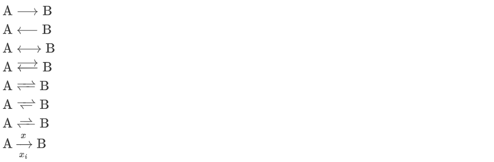

# Typora 学习索引 - 公式篇

**本篇文章为了避免格式崩坏，不再直接呈现绝大部分的数学公式，只保留在 Typora 中的效果截图以及源代码。**

为了便于阅览，我将该文章分成若干部分，汇总如下：

<!-- 知乎 -->
[Typora 有点儿深度使用的学习索引 - 知乎](https://zhuanlan.zhihu.com/p/596847931)

<!-- github -->
[Typora 有点儿深度使用的学习索引 - 前言、索引与目录 | Recogeta's Blog](https://r3c0ger.github.io/2025/01/typora-tricks-0/)

---

## 底色、边框


边框在 Typora 中似乎无法显示，悲。

```latex
$$
\bbox[yellow,5px,border:black]{e^x=\lim_{n\to\infty} \left( 1+\frac{x}{n} \right)^n \tag{*} }
$$

$$
\bbox[#2f3542, 0.5em, border:2px solid #f1f2f6]{
    \color{#f1f2f6}{e^x=\lim_{n\to\infty} \left( 1+\frac{x}{n} \right)^n}
}
$$
```

## 引用


点击公式中的蓝色链接就可以跳转到相应的式子，不过用起来很奇怪，而且不是很稳定，一修改就会变成问号。

```latex
$$
\textbf{一得阁拉米}1\label{flag}\tag{f}
$$

$a+y^3 \stackrel{\eqref{flag}\ref{flag}} = x^2$
```

## 宏定义（不推荐使用）

使用 `\def` 命令定义宏，我之前的使用方式就是把所有宏定义全部放在文件第一个普通段落的开头，这样后面的公式都能使用这些宏定义了。

显然这样做是不推荐的，因为这样会导致文件的可读性变差，容易出现冲突，公式代码也不便于单独拿出来。还是老老实实写完整的命令吧。

在我的 Hexo 博客中使用宏定义，则会直接让后半截文章直接消失（悲）


```latex
$\def\ds{\displaystyle}
\def\BOX#1{\fbox{$\ds #1$}}
\def\pt#1{\phantom{#1}}$当你下载本篇文章的源文件并使用 Typora 查看时，光标放在这一行的最左边就会显示宏定义的代码了。这些都是能在 Typora 里面实现的嗷。
```


```latex
$\ds\cases{\pt{欧内的手，}好汉！\\欧内的手，好汉！}$
$\ds\frac{aaaaaaa}{bbbbbbbbbbb}$
$\frac{aaaaaaaa}{bbbbbbbbb}$
```

参见 [TeX 的宏 \ 第一集](http://garfileo.is-programmer.com/2010/5/21/macro-of-tex.18296.html)、[TeX 宏编程技巧之定界的宏参数](https://zhuanlan.zhihu.com/p/484092340)。

## 定义新命令（不推荐使用）

`\newcommand` 也能用，那就很好玩了。和宏定义一样可以插在文章开头之类的部分，然后在之后的写作中就不用写长长的命令了。当然还是要慎用的。

```latex
$
\newcommand{\def}[2]{\textbf{Def #1.#2}\quad}
\newcommand{\pro}[2]{\textbf{Property #1.#2}\;\;}
\newcommand{\thm}[2]{\textbf{Thm #1.#2}\quad}
\newcommand{\cor}[2]{\textbf{Cor #1.#2}\quad}
\newcommand{\pf}{\textbf{Proof}\quad}
\newcommand{\zb}{\quad\Box}
\newcommand{\exp}[2]{\textbf{Example #1.#2}\;\;}
\newcommand{\nb}{\textbf{NB}\quad}
\newcommand{\rmk}{\textbf{Remark}\quad}
\newcommand{\ps}{\textbf{p.s.}\quad}
\newcommand{\eg}{\textbf{e.g.}\quad}
\newcommand{\ord}[2]{\textrm{ord}_{#1}(#2)}
\newcommand{\fr}[2]{\frac{#1}{#2}}
\newcommand{\bb}[1]{\mathbb{#1}}
\newcommand{\tt}[1]{\textbf{#1}}
\newcommand{\eq}{\equiv}
\newcommand{\en}[1]{\,#1}
\newcommand{\cd}{\,\cdots}
\newcommand{\Ra}{\,\Rightarrow\,}
\newcommand{\Lra}{\,\Leftrightarrow\,}
\newcommand{\ra}{\,\rightarrow\,}
\newcommand{\qone}{\mathbb{①}\,}
\newcommand{\qtwo}{\mathbb{②}\,}
\newcommand{\qthr}{\mathbb{③}\,}
\newcommand{\qfou}{\mathbb{④}\,}
\newcommand{\qfiv}{\mathbb{⑤}\,}
\newcommand{\qsix}{\mathbb{⑥}\,}
\newcommand{\qsev}{\mathbb{⑦}\,}
\newcommand{\bm}[1]{\rm{（#1）}\,}
\newcommand{\lra}{\,\leftrightarrow\,}
\newcommand{\ds}{\displaystyle}
\newcommand{\yw}{\because}
\newcommand{\sy}{\therefore}
\newcommand{\ol}[1]{\varphi (#1)}
\newcommand{\jkh}[1]{\!<\!#1\!>\,}
\newcommand{\ykh}[1]{(#1)}
$
```


```latex
$\def{1}{2} \ps \yw \sy \exp{a}{五}$
```

## 括号


```latex
$\set{\cfrac{asd}{asd}} \quad \{\cfrac{asd}{asd}\} \quad \left\{\cfrac{asd}{asd}\right\}$
```

## 盒子们


```latex
$$
\Box \BOX{sdadasd\frac{asd}{sad}} \bbox[yellow]{asdas} \fbox{adsw} \hbox{ when $x > 2$}
$$
```

`\BOX{}` 是前文中使用宏定义新添的命令。

## \require{}


```latex
\require{cancel}
\begin{array}{rl}
    \verb|y+\cancel{x}| & y+\cancel{x} \\
    \verb|\cancel{y+x}| & \cancel{y+x} \\
    \verb|y+\bcancel{x}| & y+\bcancel{x} \\
    \verb|y+\xcancel{x}| & y+\xcancel{x} \\
    \verb|y+\cancelto{0}{x}| & y+\cancelto{0}{x} \\
    \verb+\frac{1\cancel9}{\cancel95} = \frac15+& \frac{1\cancel9}{\cancel95} = \frac15 \\
\end{array}
```


```latex
\require{enclose}
\enclose{box}{
    \begin{array}{c}
        f(\top),\, f^2(\top),\, f^3(\top) \,\cdots\, f^n(\top) \\
        f(\bot),\, f^2(\bot),\, f^3(\bot) \,\cdots\, f^n(\bot) \\
    \end{array}
}
```


```latex
\require{enclose}
\begin{array}{rll}
    125 && \hbox{(Explanations)} \\[-3pt]
   4 \enclose{longdiv}{500}\kern-.2ex \\[-3pt]
      \underline{4\phantom{00}} && \hbox{($4 \times 1 = 4$)} \\[-3pt]
      10\phantom{0} && \hbox{($5 - 4 = 1$)} \\[-3pt]
      \underline{\phantom{0}8\phantom{0}} && \hbox{($4 \times 2 = 8$)} \\[-3pt]
      \pt{0} 20 && \hbox{($10 - 8 = 2$)} \\[-3pt]
      \underline{\phantom{0}20} && \hbox{($4 \times 5 = 20$)} \\[-3pt]
      \phantom{00}0
  \end{array}
```

具体实例：


```latex
\require{enclose}
\begin{array}{rll}
   \textbf{Example 1:}\phantom{10011000000} 1100001010 \\[-2pt]
   10011\, \enclose{longdiv}{1101011011\fbox{\!0000\!}}\kern-.8ex \\[-2pt]
      \underline{10011\phantom{000000000}} \kern.1ex \\[-2pt]
      10011\phantom{00000000}\\[-2pt]
      \underline{10011\phantom{00000000}} \\[-2pt]
       10110 \phantom{000}  \\[-2pt]
      \underline{10011 \phantom{000}}  \\[-2pt]
      10100 \phantom{0} \\[-2pt]
      \underline{10011\phantom{0}}\\[-2pt]
      1110 
  \end{array}
  \qquad\qquad
  \begin{array}{rll}
     \textbf{Example 2:}\phantom{10011000000} 1101010 \\[-2pt]
   11001\, \enclose{longdiv}{1011001\fbox{\!0000\!}}\kern-.8ex \\[-2pt]
      \underline{11001\phantom{000000}} \kern.1ex \\[-2pt]
      11110\phantom{00000}\\[-2pt]
      \underline{11001\phantom{00000}} \\[-2pt]
       11110 \phantom{000}  \\[-2pt]
      \underline{11001 \phantom{000}}  \\[-2pt]
       11100 \phantom{0}  \\[-2pt]
      \underline{11001 \phantom{0}}  \\[-2pt]
      1010
  \end{array}
```


```latex
\require{AMScd}
\begin{CD}
    A @>a>> B \\
    @V b V V\# @VV c V \\
    C @>>d> D \\
\end{CD}
\quad
\begin{CD}
    A @>>> B @>very long label>> C \\
    @. @AAA @| \\
    D @= E @<<< F \\
\end{CD}
```


```latex
\require{AMDcd}
\begin{CD}
    \rm{RCOHR^{'}SO_3Na} @>{\large\text{Hydrolysis, $\Delta$, Dil.HCl}}>> \rm{(RCOR^{'})+NaCl+SO_2+ H_2O}
\end{CD}
```

以上来自于 [MathJax basic tutorial and quick reference](https://math.meta.stackexchange.com/questions/5020/mathjax-basic-tutorial-and-quick-reference/15077#15077)、[在MathJax中显示长除法符号的方法)\~\~\~\~\~\~](https://qa.1r1g.com/sf/ask/1600744981/)。只能说，MathJax is **not** LaTeX，这效果一言难尽（知乎效果有时反而比 Typora 好……）。

## 化学

Typora 支持 [mhchem](https://mhchem.github.io/MathJax-mhchem/) 书写化学表达式，同样不再赘述，只摘录一点使用例，让大家看看效果：


```latex
$\ce{CO2 + C -> 2 CO}$
$\ce{Hg^2+ ->[I-] HgI2 ->[I-] [Hg^{II}I4]^2-}$
$C_p[\ce{H2O(l)}] = \pu{75.3 J // mol K}$
$\ce{H2O}$	$\ce{Sb2O3}$

$\ce{H+}$  $\ce{CrO4^2-}$  $\ce{[AgCl2]-}$  $\ce{Y^99+}$  $\ce{Y^{99+}}$

$\ce{2 H2O}$  $\ce{2H2O}$  $\ce{0.5 H2O}$  $\ce{1/2 H2O}$  $\ce{(1/2) H2O}$  $\ce{$n$ H2O}$

$\ce{^{227}_{90}Th+}$	$\ce{^227_90Th+}$
$\ce{^{0}_{-1}n^{-}}$	$\ce{^0_-1n-}$
$\ce{H{}^3HO}$	$\ce{H^3HO}$
```



```latex
$\ce{A -> B}$
$\ce{A <- B}$
$\ce{A <-> B}$
$\ce{A <--> B}$
$\ce{A <=> B}$
$\ce{A <=>> B}$
$\ce{A <<=> B}$
$\ce{A ->[$x$][$x_i$] B}$
```


```latex
$\ce{A-B=C#D}$
$\ce{A\bond{-}B\bond{=}C\bond{#}D}$
$\ce{A\bond{1}B\bond{2}C\bond{3}D}$
$\ce{A\bond{~--}B\bond{~=}C\bond{-~-}D}$
$\ce{A\bond{...}B\bond{....}C}$
$\ce{A\bond{->}B\bond{<-}C}$
```


```latex
$\ce{[\{(X2)3\}2]^3+}$
$\ce{CH4 + 2 $\left( \ce{O2 + 79/21 N2} \right)$}$
$\ce{H2(aq)}$	$\ce{CO3^2-_{(aq)}}$	$\ce{NaOH(aq,$\infty$)}$
$\ce{ZnS($c$)}$	$\ce{ZnS(\ca$c$)}$

$\ce{x Na(NH4)HPO4 ->[\Delta] (NaPO3)_x + x NH3 ^ + x H2O}$
$\ce{[Pt(\eta^2-C2H4)Cl3]-}$
$\ce{^40_18Ar + \gamma{} + \nu_e}$
$\ce{Fe(CN)_{$\frac{6}{2}$}}$ 
$\ce{$cis${-}[PtCl2(NH3)2]}$
$\ce{{Gluconic Acid} + H2O2}$
```


```latex
$\ce{KCr(SO4)2 * 12 H2O}$
$\ce{Fe^{II}Fe^{III}2O4}$
$\ce{NO^{(2.)-}}$
$\ce{Li^x_{Li,1-2x}Mg^._{Li,x}$V$'_{Li,x}Cl^x_{Cl}}$
$\ce{O''_{i,x}}$	$\ce{M^{..}_i}$	$\ce{$V$^{4'}_{Ti}}$
$\ce{A + B}$	$\ce{A - B}$	$\ce{A = B}$	$\ce{A +- B}$	$\ce{A \pm B}$
$\ce{A v B (v) -> B ^ B (^)}$
$\ce{NO^*}$	$\ce{1s^2-N}$	$\ce{\ca Fe}$
$\ce{Hg^2+ ->[I-]  $\underset{\mathrm{red}}{\ce{HgI2}}$  ->[I-]  $\underset{\mathrm{red}}{\ce{[Hg^{II}I4]^2-}}$}$
```

从另一个角度而言，这也许可以用于表达化学之外的内容：


当然本来也可以使用 `\xrightarrow[a,b]{c,d}` 来作为长箭头：$\xrightarrow[\textrm{text below}]{\textrm{text above}}$

另外一个我想单列出来的内容是物理单位：


```latex
$\pu{123 kJ}$	$\pu{123 mm2}$
$\pu{123 J s}$	$\pu{123 J*s}$
$\pu{123 kJ/mol}$	$\pu{123 kJ//mol}$
$\pu{123 kJ mol-1}$	$\pu{123 kJ*mol-1}$
$\pu{1.2e3 kJ}$	$\pu{1,2e3 kJ}$	$\pu{1.2E3 kJ}$	$\pu{1,2E3 kJ}$

$\pu{114514.1919E-810 {}(inm*re)//cookie☆364364}$
```

这可不仅仅是在化学领域内使用了，简直方便的要死好吧！

## 彩蛋


- 彩蛋图片：
  - 作者：カンパ (user-id: 2520952)
  - 来源：pixiv ID: 111986348