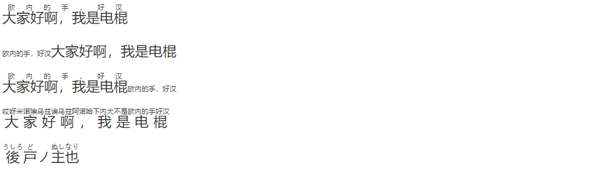

# Typora 学习索引 - HTML 篇

为了便于阅览，我将该文章分成若干部分，汇总如下：

<!-- 知乎 -->
[Typora 有点儿深度使用的学习索引 - 知乎](https://zhuanlan.zhihu.com/p/596847931)

<!-- github -->
[Typora 有点儿深度使用的学习索引 - 前言、索引与目录 | Recogeta's Blog](https://r3c0ger.github.io/2025/01/typora-tricks-0/)

---

## 可使用的 HTML 标签

以下 HTML 标签可直接内联显示在 Typora 中：

| **Raw Markdown Source**                                      | **Output in Live Preview**                                   |
| ------------------------------------------------------------ | ------------------------------------------------------------ |
| `<span style='color:red'>This is red</span>`                 | <span style='color:red'>This is red</span>                   |
| `<ruby> 漢 <rt> ㄏㄢˋ </rt> </ruby>`                         | <ruby> 漢 <rt> ㄏㄢˋ </rt> </ruby>                |
| `<kbd>Ctrl</kbd>+<kbd>F9</kbd>`                              | <kbd>Ctrl</kbd>+<kbd>F9</kbd>                                |
| `<span style="font-size:2rem; background:yellow;">**Bigger**</span>` | <span style="font-size:2rem; background:yellow;">**Bigger**</span> |
| `HTML entities like &reg; &#182;`                            | HTML entities like ® ¶                                       |


## 手动 / 强制断页

<span id='pagebreak'>标题前自动断页请看</span> [Typora 学习索引 - 样式篇 - 标题前自动分页](https://zhuanlan.zhihu.com/p/642431857)。

那么，如何实现像 $\LaTeX$ 里面的 `\newpage` 那样手动断页呢？

<div style="page-break-after: always; break-after: page;"></div>

```html
<div style="page-break-after: always; break-after: page;"></div>
```

上面这一行就可以搞定了。这一段 HTML 在编辑器里会显示空白，但是导出为 PDF 之后，PDF 就会在这里另起一页。

另外，官方文档中还提到很多其他的手动强制分页方式，个人觉得作用不大，就先贴在这里吧：

> ### HTML and Central CSS
>
> If manual page breaks are needed frequently, it makes more sense to use an [external stylesheet](https://support.typora.io/Add-Custom-CSS/) for better maintenance and less clutter.
>
> ```html
> Markdown with embedded HTML:
> 
> <div class="page-break"></div>
> 
> Markdown continues.
> <p>Markdown with embedded HTML:</p>
> <div class="page-break"></div>
> <p>Markdown continues.</p>
> /* completely hide the element where it is not needed */
> .page-break
> {
>     display: none; 
> }
> @media print, (overflow-block: paged) or (overflow-block: optional-paged)
> {
>   .page-break
>   {
>     display: block;
>     page-break-after: always; /* CSS 2 */
>          break-after: page;   /* CSS 3+ */
>   }
> }
> ```
>
> ### Thematic Breaks
>
> Alternatively, existing Markdown structure can be repurposed. This way, neither HTML nor CSS is necessary within the Markdown file at all.
>
> There are three ways to insert a [thematic break in Markdown](https://spec.commonmark.org/current/#thematic-breaks), using three or more asterisks `*`, hyphens `-` or underscores `_`, possibly with whitespace in between them. They all result in the same HTML (or PDF) output, which can then be used to create page breaks. Basically all Markdown presentation packages follow this convention as well, inserting a slide transition for every thematic break.
>
> ```markdown
> Break incoming
> 
>   * * *
> 
> in between breaks
> 
> ----
> 
> still one more to come
> 
> ___________
> 
> after the final break.
> <p>Break incoming</p>
> <hr>
> <p>in between breaks</p>
> <hr>
> <p>still one more to come</p>
> <hr>
> <p>after the final break.</p>
> ```
>
> The only thing required is [some custom CSS](https://support.typora.io/Add-Custom-CSS/).
>
> ```css
> @media print, (overflow-block: paged) or (overflow-block: optional-paged)
> {
>   hr
>   {
>     page-break-after: always; /* CSS 2 */
>          break-after: region; /* CSS 3+ */
>     /* minimal layout disruption: */
>     height: 0.1mm; visibility: hidden;
>   }
> }
> ```

## 对齐方式

居中：`<center>标题</center>`

[HTML 样式](https://www.w3school.com.cn/html/html_styles.asp) 中提到：“有若干的标签和属性是被废弃的。被废弃（Deprecated）的意思是在未来版本的 HTML 和 XHTML 中将不支持这些标签和属性。”这其中就有 `<center>`。因此我们可以使用 `<h1 style="text-align:center">标题</h1>` 来替代。

**应该避免使用下面这些标签和属性：**

| 标签                     | 描述               |
| ------------------------ | ------------------ |
| `<center>`               | 定义居中的内容。   |
| `<font>` 和 `<basefont>` | 定义 HTML 字体。   |
| `<s>` 和 `<strike>`      | 定义删除线文本     |
| `<u>`                    | 定义下划线文本     |
| 属性                     | 描述               |
| align                    | 定义文本的对齐方式 |
| bgcolor                  | 定义背景颜色       |
| color                    | 定义文本颜色       |

左对齐（可以在 Typora 设置首行缩进时使用）：`<div style="text-align: left">敬礼！</div>`

右对齐：`<div style="text-align: right">2023年1月5日</div>`

## 文字颜色与背景颜色

<span style="font-size:2rem; background:yellow; color:red;">**Bang! Bang! Banki Banki Seiki Banki!**</span>


```HTML
<span style="font-size:2rem; background:yellow; color:red;">**Bang! Bang! Banki Banki Seiki Banki!**</span>
```

——感觉不如 Obsidian 的“增强编辑”插件方便。

## 锚点

锚点是 Typora 所支持的 [GitHub Flavored Markdown（简称GFM）](https://github.github.com/gfm/)扩展语法中的一个有意思的功能，这是个用于在文档中实现 **跳转** 的操作，非常实用。在导出的 PDF 里也能愉快地运行。

锚点的语法是：`[<任意内容>](#锚点名)`

（1）锚点名可以是标题：[比如你现在想回过头来看对齐方式这一节](#对齐方式)

```markdown
[比如你现在想回过头来看对齐方式这一节](#对齐方式)
```

这可以用于跳转到任意标题处，进一步可以用来制作一份（可能）适用于其他编辑器的目录 TOC（反正 Obsidian 不行）。

（2）除跳转到标题之外，锚点还可以用于跳转到任意位置，这就需要借助 HTML 中的 `id` 属性了：

<span id="tag1">tag1：这里你想 **写啥就写** 啥，就连 ==md语法== 也能给 <u>你一并实</u> 现</span>

<b id="tag2">tag2：重点是要设置一个 id 键值对，标签是啥无所谓</b>

<center id="tag3">tag3：自己动手试试吧！</center>

```html
<span id="tag1">tag1：这里你想 **写啥就写** 啥，就连 ==md语法== 也能给 <u>你一并实</u> 现</span>

<b id="tag2">tag2：重点是要设置一个 id 键值对，标签是啥无所谓</b>

<center id="tag3">tag3：自己动手试试吧！</center>
```

然后使用锚点：[跳转到tag1](#tag1)  [跳转到tag2](#tag2)  [跳转到tag3](#tag3)

```markdown
[跳转到tag1](#tag1)  [跳转到tag2](#tag2)  [跳转到tag3](#tag3)
```

不好意思，HTML 块标签在 Typora 中无法参与跳转……但是导出的 PDF 和 Hexo 中都可以实现 tag3 的跳转，很神奇。

（3）同样可以使用 HTML 来设置锚点：<a href="#tag2">tag2</a> `<a href="#tag2">tag2</a>`

难受的是 Obsidian 和知乎应该都没法使用这个操作……

## 中日注音

<ruby>大家好啊，我是电棍<rt>欧内的手，好汉</rt> </ruby>

<ruby><rt>欧内的手，好汉</rt>大家好啊，我是电棍 </ruby>

<ruby>大家好啊，我是电棍<rt>欧内的手，好汉<rt>欧内的手，好汉</rt></rt></ruby>

<ruby>大家好啊，我是电棍<rt>哎呀米诺唉乌兹诶乌兹阿诺哈下内大不是欧内的手好汉</rt> </ruby>

<ruby>後<rt>うしろ</rt>戸<rt>ど</rt>ノ</ruby><ruby>主<rt>ぬし</rt>也<rt>なり</rt></ruby>



```
<ruby>大家好啊，我是电棍<rt>欧内的手，好汉</rt> </ruby>

<ruby><rt>欧内的手，好汉</rt>大家好啊，我是电棍 </ruby>

<ruby>大家好啊，我是电棍<rt>欧内的手，好汉<rt>欧内的手，好汉</rt></rt></ruby>

<ruby>大家好啊，我是电棍<rt>哎呀米诺唉乌兹诶乌兹阿诺哈下内大不是欧内的手好汉</rt> </ruby>

<ruby>後<rt>うしろ</rt>戸<rt>ど</rt>ノ</ruby><ruby>主<rt>ぬし</rt>也<rt>なり</rt></ruby>
```

## kbd

当你想更直观清晰地展示某一操作要按哪些键时，可以使用 `<kbd>` 标签，效果如下：<kbd>Ctrl</kbd>。当然这个也可以更改样式，原生的样式我感觉有点靠下，我就在 CSS 主题文件中添加了这么一段：

```css
kbd {
  vertical-align: text-bottom !important;
}
```

## HTML 实体

参见 [HTML entities](https://www.w3schools.com/html/html_entities.asp)、 [HTML 实体符号参考手册](https://www.w3school.com.cn/tags/html_ref_entities.html)。

> 一些字符在HTML中是保留的。如果您在文本中使用小于号（<）或大于号（>），浏览器可能会将它们与标签混淆。字符实体用于在HTML中显示保留字符。
>
> 一个字符实体的形式如下：
>
> ```HTML
> &entity_name;
> 
> OR
> 
> &#entity_number; 
> ```
>
> 要显示小于号（<），我们必须写成：`&lt;`或`&#60;`

（1）HTML 实体可以用来表示分数和多种符号（当然人家建议直接用 unicode）：`&frac14;` → ¼, `&#x1D517;` → 𝔗

（2）不换行的空格和连字符： `&nbsp;` `&#8209;`

两个由不间断空格（non-breaking space）分隔的单词将保持在一起，不会分隔到新行。这在分隔单词可能会造成干扰时非常方便，尤其是排版处理 `§ 10、10 km/h、10 PM` 等的带单位/符号数据时。

不间断空格的另一个常见用途是防止浏览器截断 HTML 页面中的空格。如果在文本中输入 10 个空格，浏览器将删除其中的 9 个。为了向文本添加实际的空格，可以使用 `&nbsp;` 字符实体。

（3）HTML 实体还能提供一些变音符号，至于是否有汉语拼音的一声和三声我暂且未知，这勉强有点用吧……：

| Mark | Character | Construct | Result |
| ---- | --------- | --------- | ------ |
| ̀     | a         | `a&#768;` | à      |
| ́     | a    		| `a&#769;` | á      |
| ̂     | a    		| `a&#770;` | â      |
| ̃     | a    		| `a&#771;` | ã      |

## HTML 块中的媒体和嵌入式内容

下面这些都无法在导出的 PDF 中显示哦（

插入视频：

```HTML
<video src="xxx.mp4" />
```

插入音频：

```HTML
<audio src="xxx.mp3" />
```

嵌入式框架iframe：

```Markdown
<iframe height='265' scrolling='no' title='Fancy Animated SVG Menu' src='http://codepen.io/jeangontijo/embed/OxVywj/?height=265&theme-id=0&default-tab=css,result&embed-version=2' frameborder='no' allowtransparency='true' allowfullscreen='true' style='width: 100%;'></iframe>
```

<iframe height='265' scrolling='no' title='Fancy Animated SVG Menu' src='http://codepen.io/jeangontijo/embed/OxVywj/?height=265&theme-id=0&default-tab=css,result&embed-version=2' frameborder='no' allowtransparency='true' allowfullscreen='true' style='width: 100%;'></iframe>

<iframe height="400px" src="https://www.w3school.com.cn/html/html_iframe.asp"></iframe>

```HTML
<iframe height="400px" src="https://www.w3school.com.cn/html/html_iframe.asp"></iframe>
```

可以将一部分网站插入到 Markdown 文档中（知乎的网页好像不行）。

`<object>` 元素无法使用。

```html
<object data="https://www.w3school.com.cn/i/photo/tulip.jpg"></object>
```

`<embed>` 元素可以使用。如果加载了图片的话，还可以打印在 PDF 中。

<embed src="https://www.w3school.com.cn/i/photo/tulip.jpg">


```HTML
<embed src="https://www.w3school.com.cn/i/photo/tulip.jpg">
```

加载 HTML 页面会导致无法导出 PDF。

**请不要尝试导出使用 `<embed>` 元素内嵌除图片外的任意内容！** 我就是这么把软件搞坏的，其他任何 md 文件都无法导出为 PDF，一直卡在“正在导出”动不了，日志文件（C:\Users\用户名\AppData\Roaming\Typora\typora.log）疯狂报错“unhandledRejection Error: Script failed to execute, this normally means an...”（忘了保存了），重启 Print Spooler 也无济于事，最后只好卸载再重新安装软件。


```HTML
<embed width="100%" height="500px" src="https://www.w3school.com.cn//demo/html/table.html">
```

无法加载音频。

```HTML
<embed height="100" width="100" src="/i/horse.mp3" />
```

~~PDF~~：这种事情还是交给 Obsidian 这种编辑器来干吧。

> No longer supported, you may try online file viewers instead, such as examples in  https://gist.github.com/tzmartin/1cf85dc3d975f94cfddc04bc0dd399be.

## 使用内部 CSS 更改样式

在 md 文档的任意 HTML 块中使用 `<style>` 标签包裹 CSS 代码，形成 [内部 CSS](https://www.w3school.com.cn/css/css_shiyong.asp)，这样定义下来的样式对整篇 md 文档的任何内容（包括使用 Markdown 语法形成的内容）都会生效，只需成功定义一次即可。

例如：


```Markdown
### 使用MD语法实现的三级标题

<h3>使用HTML实现的三级标题</h3>
<style>
h3 {
  font-size:2.5em;
}
</style>

这是正常文字大小
```

**注意：**

- `<style>` 标签必须紧密跟随在其余任意 HTML 代码之后，即与其他标签之间不能有空行。
- `<style>` 标签内部的 CSS 代码同样不能出现空行，否则 HTML 代码块就会断开。
- 此外，单独只有 `<style>` 标签的 HTML 代码块也不会生效（不过也不会出现在导出的 PDF中），如下图：


在 Typora 的 HTML 代码块中，换行而不退出 HTML 代码块（或者说，输入软回车）的方式同样是 <kbd>Shift</kbd> + <kbd>Enter</kbd>。大家可以试一试硬软回车的区别。

通过上述操作，我们可以在 Markdown 文档中实现很多很好玩的功能：

### 导航栏

例子来源于：[CSS 水平导航栏](https://www.w3school.com.cn/css/css_navbar_horizontal.asp)


```html
<ul>
  <li><a class="active" href="#home">Home</a></li>
  <li><a href="#news">News</a></li>
  <li><a href="#contact">Contact</a></li>
  <li><a href="#about">About</a></li>
</ul>
<style>
<style>
body {margin:0;}
ul {
  list-style-type: none;
  margin: 0;
  padding: 0;
  overflow: hidden;
  background-color: #333;
  position: fixed;
  top: 0;
  width: 100%;
}
li {
  float: left;
}
li a {
  display: block;
  color: white;
  text-align: center;
  padding: 14px 16px;
  text-decoration: none;
}
li a:hover:not(.active) {
  background-color: #111;
}
a.active {
  background-color: #4CAF50;
}
</style>
```

这一导航栏结合 [锚点](#锚点) 使用，可以 **在 md 文档中** 实现网页一般的导航栏效果，看着很酷炫。

当然也可以看到，CSS 类选择器不能起作用，固定 / 粘性导航栏也无法实现（倒是在侧边栏实现了，难绷）。


另外，在导出为 PDF 之后，这个导航栏最关键的跳转功能就无法实现了，在 PDF 里面只能当花瓶。不过类选择器居然又复活了。


### 制作标题层级中的“附录”

在“样式篇”中，我们利用 CSS 样式给标题前添加了自动的序号。然而有些情况下，我们需要取消自动序号，或者转而使用另一种自动序号，比如“附录”内容。这时就可以使用 HTML 加上 CSS 类选择器，来实现同一 Markdown 文档中的第二种自动序号。（当然没有第三种了，原因后面讲）

先来看效果（同一篇文档内）：


再来看代码：

```html
<h2>二级标题3</h2>
<style>
    body {
      counter-reset: appendix;
        /*额外设置一个“附录”计数器*/
  }
    div.md-htmlblock-container h2::before {
        /*选择md-htmlblock-container类中的h2标签，这个类代表HTML块*/
        /*标题实现方式有两种：Markdown语法和HTML，因此也最多支持两种自动序号。*/
      counter-increment: appendix !important; /*必须加!important*/
      content: "附录" counter(appendix, upper-alpha) !important;
      margin-right: 2rem !important;
        /*标题前::before伪元素的内容为“附录”+大写字母的“附录”计数器值，在右边有两个字符的边距*/
    }
    @media print{
        /*尝试在PDF中实现这一效果，但是失败了*/
      div.md-htmlblock-container h2::before {
        counter-increment: appendix !important;
        content: "附录" counter(appendix, upper-alpha) !important;
        margin-right: 2rem !important;
      }
    }
</style>
```

这种方法有几个缺憾：

- 无法在侧边栏大纲和导出的 PDF 书签中出现 HTML 撰写的标题；
- “附录A”自动序号样式也无法在导出的 PDF 中实现，仍然是样式中设定好的自动序号。

### 动画

```HTML
<center>asdasd</center>
<style> 
center {
  width: 100px;
  height: 100px;
  background-color: red;
  position: relative;
  animation-name: example;
  animation-duration: 4s;
  animation-iteration-count: infinite;
  z-index: 10;
}
@keyframes example {
  0%   {background-color:red; left:0px; top:0px;}
  25%  {background-color:yellow; left:200px; top:0px;}
  50%  {background-color:blue; left:200px; top:200px;}
  75%  {background-color:green; left:0px; top:200px;}
  100% {background-color:red; left:0px; top:0px;}
}
</style>
```


但是不知为何，使用类选择器、ID 选择器等等时，这个动画样式就无法实现了。[工具提示](https://www.w3school.com.cn/css/css_tooltip.asp) 也同样有这个问题。

彩蛋：


### MathJax 公式美化

原本的行间公式是有上下间距的：


我感觉距离太大，就向文档中插入如下代码：

```Html
<p>随便写点啥</p>
<style>.mathjax-block .md-math-container .MathJax {margin: 0px !important;}</style>
```

效果如下：


经试验，PDF 中可以正常显示更改后的效果。

## 其他

### 可能用的上的 HTML 应用

（1）隐藏文字：<span style="display:none">这里面的内容会在导出后隐藏</span>

```HTML
<span style="display:none">这里面的内容会在导出后隐藏</span>
```

（2）**各类图片操作**：图像缩放、图文绕排、多图并列、图注，参见 [Typora 学习索引 - 快捷键和图片篇 - 知乎](https://zhuanlan.zhihu.com/p/642434340) 或 [Typora 学习索引 - 快捷键和图片篇 | Recogeta's Blog](https://r3c0ger.github.io/2025/01/typora-tricks-2/)。

（3）制作论文封面：

见 [Typora 伪装 LaTeX 中文样式主题](https://github.com/Keldos-Li/typora-latex-theme#typora-%E4%BC%AA%E8%A3%85-latex-%E4%B8%AD%E6%96%87%E6%A0%B7%E5%BC%8F%E4%B8%BB%E9%A2%98)，这可老猛了。同理还可以替代那些用 Word 表格组织起来的奇葩实验报告。

（4）小型大写字母：

<p style="font-variant: small-caps; font-weight:bold;">This is a paragraph</p>

```HTML
<p style="font-variant: small-caps; font-weight:bold;">This is a paragraph</p>
```


可以用来写英文简历。

`font-variant-caps` 这个属性无法使用。

（5）内嵌 SVG

<svg xmlns="http://www.w3.org/2000/svg" version="1.1" height="190">
  <polygon points="100,10 40,180 190,60 10,60 160,180"
  style="fill:lime;stroke:purple;stroke-width:5;fill-rule:evenodd;" />
</svg>


```HTML
<svg xmlns="http://www.w3.org/2000/svg" version="1.1" height="190">
  <polygon points="100,10 40,180 190,60 10,60 160,180"
  style="fill:lime;stroke:purple;stroke-width:5;fill-rule:evenodd;" />
</svg>
```

### 不能实现的元素

JavaScript：别想了。


```HTML
<script type="text/javascript">
document.write("Hello World!")
</script>
<noscript>Sorry, your browser does not support JavaScript!</noscript>
<p>不支持 JavaScript 的浏览器将显示 noscript 元素中的文本。</p>
```

同样的，Typora 也不支持 Flexbox、Canvas。

## 彩蛋


- 彩蛋图片：
  - 作者：山中梅 (user-id: 12873498)
  - 来源：pixiv ID: 112356833